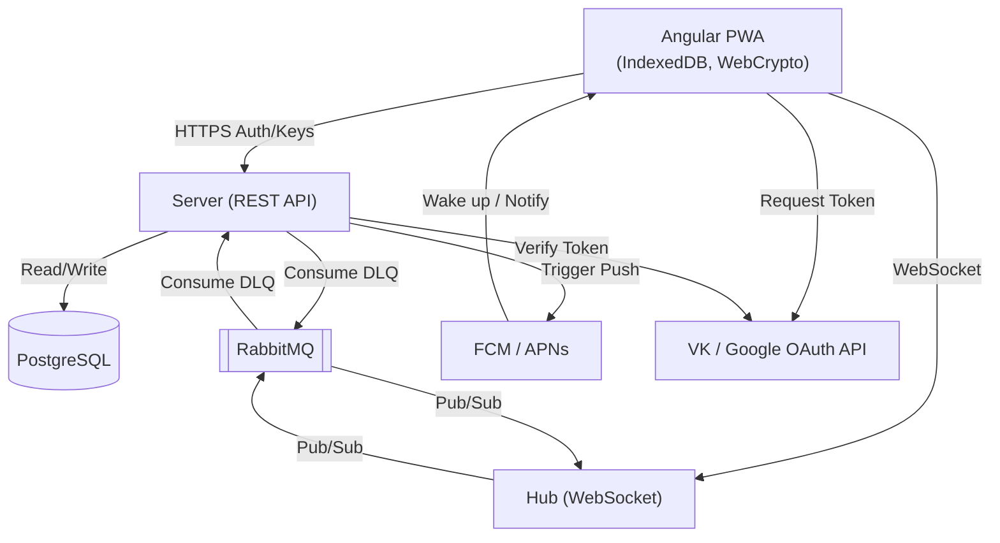
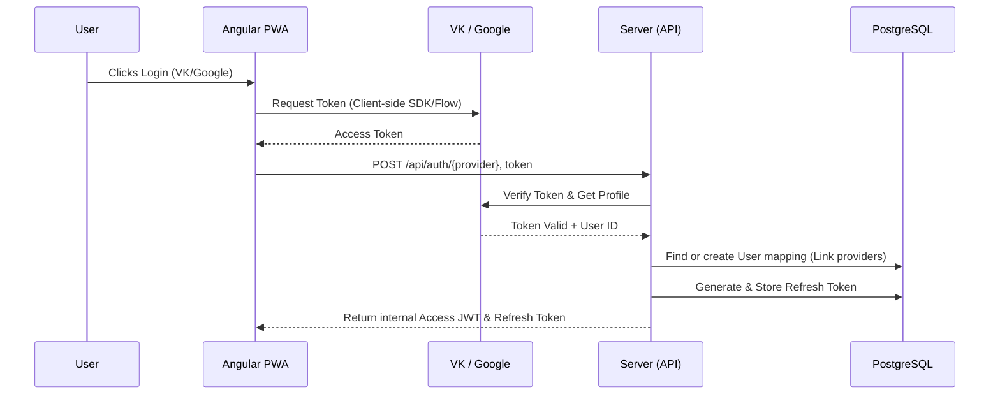
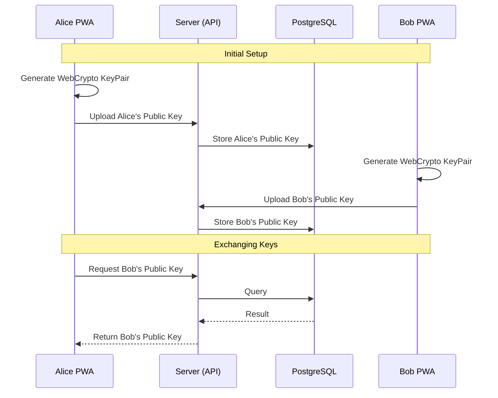
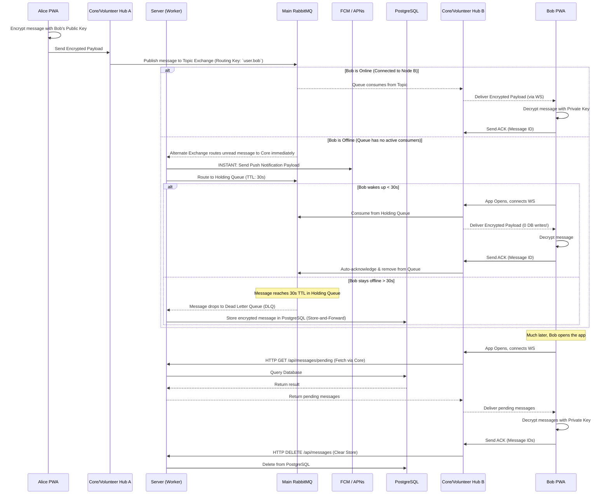
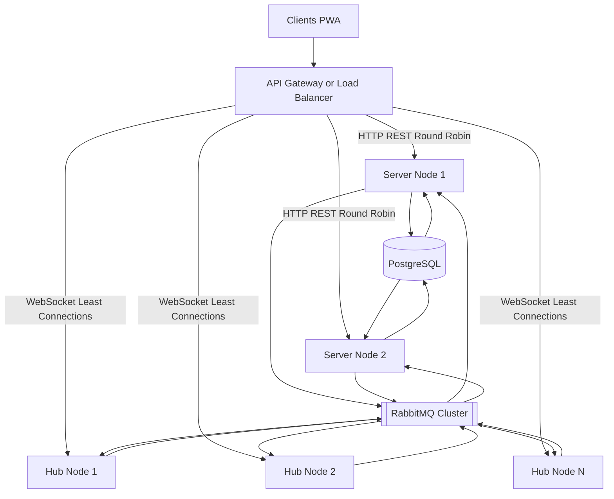
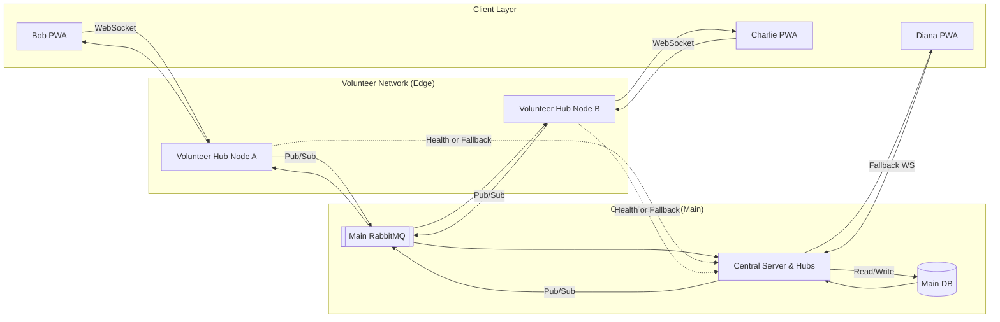

# fourletters Architecture

This document outlines the architectural components and communication patterns for **fourletters**, a simple, reliable, end-to-end (E2E) encrypted PWA messenger.

## 1. Component Overview

The system consists of a frontend Progressive Web App (PWA), a Server for authentication and state, lightweight Hubs for WebSocket routing, a PostgreSQL relational database, and RabbitMQ for reliable asynchronous message queuing.

### Components
*   **Angular PWA:** The user interface. Uses WebCrypto for E2E encryption and IndexedDB for local storage of messages and keys.
*   **Server (Spring Boot):** The control plane. Handles OAuth linking, validates identity, manages public keys, stores offline messages (store-and-forward), and triggers push notifications.
*   **Hub (Lightweight Spring Boot):** The data plane. A blind proxy that evaluates stateless JWTs (using the Server's public key) to authorize connections. Routes E2E encrypted WebSocket payloads directly into RabbitMQ. Has no database access, which minimizes resource consumption and attack surface.
*   **PostgreSQL:** Stores user accounts, OAuth linking, Public Keys, and acts as the persistent store for the "Store-and-Forward" offline message mechanism.
*   **RabbitMQ:** Message broker for resilient, asynchronous internal message delivery and buffering.

---

## 2. Communication Scenarios

### 2.1 Authentication & Identity (Token Validation Flow)

The client performs the OAuth login natively via third-party providers (VK/Google) to obtain an access token. The Server acts strictly as a token validator to confirm the user's identity and prevent spoofing before issuing an internal session.

### 2.2 Token Refresh Flow (Double Token Pattern)

For a detailed block diagram of the token refresh and authentication lifecycle, please refer to [algorithms/auth.md](algorithms/auth.md).

The architecture utilizes a **Double Token Pattern** to minimize database inquiries and reduce API latency:
1. **Stateless Access JWT**: Short-lived (e.g., 15 minutes). The server verifies the token cryptographically without executing a database query.
2. **Stateful Refresh Token**: Long-lived (e.g., 30 days) and stored securely in the PostgreSQL database.

The refresh backend is called at the every first start of app and upon or just before expiration of the short-lived Access JWT, the PWA silently submits the long-lived Refresh Token to obtain a new Access JWT. The server validates the Refresh Token against the database during this transaction, providing a mechanism for account restriction or revocation.

### 2.3 E2E Encryption & Key Exchange

Messages are encrypted on the client side. The server acts as a Public Key directory.

### 2.4 Message Sending & Receiving (Store-and-Forward)

To guarantee message delivery across unreliable network conditions while minimizing database writes, the system implements a **Holding Queue Pattern** utilizing RabbitMQ's Alternate Exchange, TTL, and Dead Letter Queue (DLQ) mechanics. When a receiving client is offline, a push notification is triggered instantly, but the encrypted payload is held temporarily in RabbitMQ for 30 seconds. It is only persisted to the database if the user fails to open the app within that grace period.

## 3. Storage Strategy

*   **Client (Angular):** **IndexedDB** is used for storing the user's private key, cached public keys of contacts, and decrypted chat history. (System storage quotas allow for significant data capacity compared to LocalStorage limits).
*   **Server (PostgreSQL):** Stores relational data for Accounts, OAuth identities, and Web Push Subscriptions (the unique browser/device endpoints required to target FCM/APNs). Encrypted message payloads are stored *temporarily* in a table and deleted strictly upon receiving an `ACK` from the client.

---

## 4. Scalability & Deployment Models

### 4.1 Horizontal Scaling & Load Balancing (Centralized)
The split architecture naturally dictates two distinct load balancing strategies for the Control Plane (Server) and Data Plane (Hub):

1. **Server (REST HTTP Traffic):** The Server instances are stateless HTTP nodes. An API Gateway or standard Load Balancer (like Nginx, HAProxy, or AWS ALB) routes `/api/*` traffic across the Server cluster using Round-Robin.
2. **Hub (WebSocket Traffic):** Hubs maintain long-lived stateful TCP connections. The Load Balancer terminates SSL and routes WebSocket upgrade requests to backend Hub instances. Since RabbitMQ acts as the unified backplane, sticky sessions are NOT required. A "Least Connections" load balancing algorithm is seamlessly supported and highly recommended here to evenly distribute long-lived WebSocket connections as nodes scale up or down.

### 4.2 Volunteer Hubs (Hybrid Distributed Architecture)
To further scale and reduce infrastructure costs, this architecture supports a **Volunteer Relay Network**. Users can host lightweight volunteer nodes that seamlessly integrate into the main network to help route live WebSocket traffic, distributing the connection load.

*(Note: The "Central Server & Hubs" below represents the load-balanced Spring Boot clusters from section 4.1).*

**Separation of Concerns:**
*   **Core Infrastructure:** Hosts the PostgreSQL database, `Server` application (Auth, Key Directory, Store-and-Forward), Main RabbitMQ cluster, and at least some fallback `Hub` instances.
*   **Volunteer Infrastructure:** Volunteers run only the `fourletters-hub` application. It only requires connection credentials to the Main RabbitMQ cluster. It does not require database access or secrets. To validate a user's JWT, they verify the cryptographic signature using a shared public key (Stateless validation).

Because messages are strictly E2E encrypted and hubs lack DB credentials, volunteer nodes act purely as blind data proxies, shielding both the volunteer (from liability/database setup) and the users (from data snooping).

*   **Bootstrapping:** PWA clients log in with the Server. The Server returns a list of healthy "Volunteer Hubs."
*   **Routing:** Bob connects via WebSocket to Volunteer Hub A. Charlie connects to Node B. When Bob messages Charlie, Node A publishes the encrypted data directly to the Main RabbitMQ. Node B consumes it from the queue and pushes it to Charlie. The Volunteer Hubs never communicate directly with each other.
*   **Resilience (Fallback):** If a volunteer turns off Node A, Bob's WebSocket disconnects. Bob's app instantly and silently reconnects to either another Volunteer Hub or directly to the Hub to guarantee uninterrupted communication.
