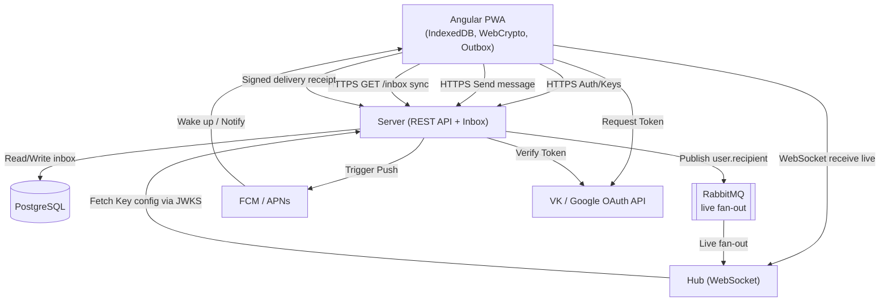
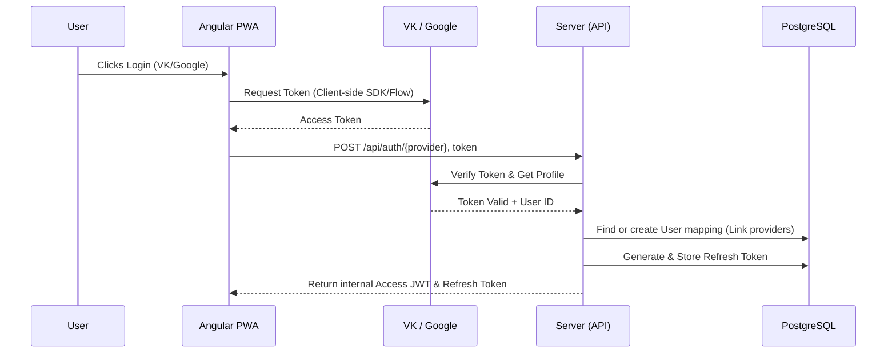
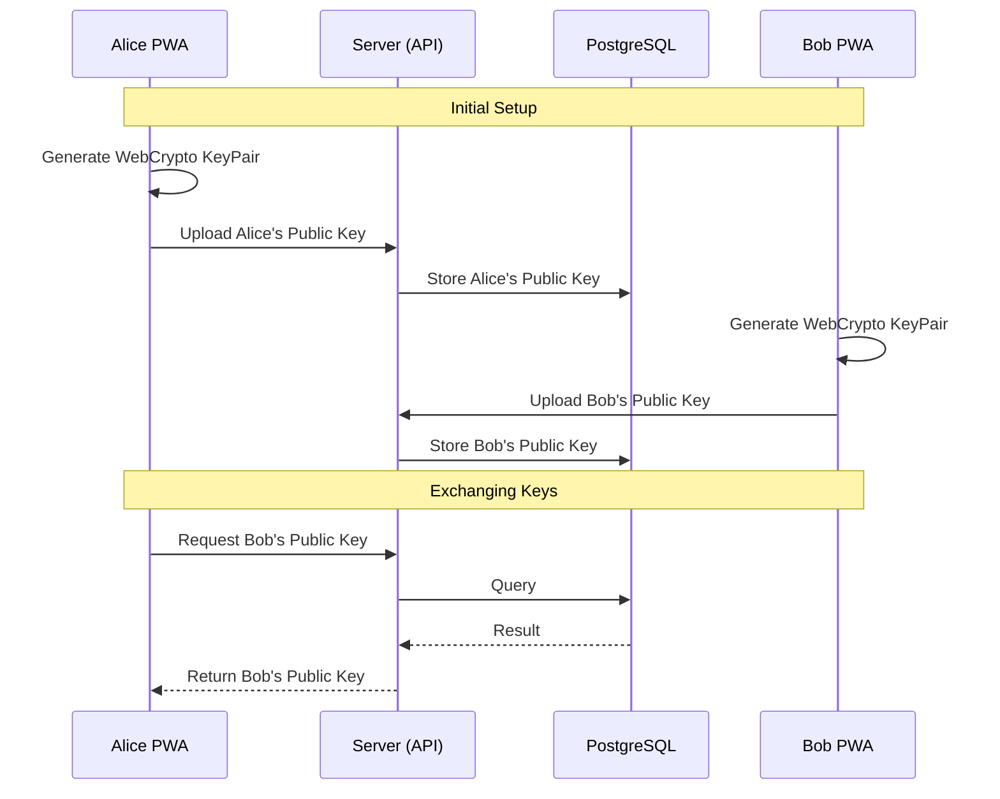
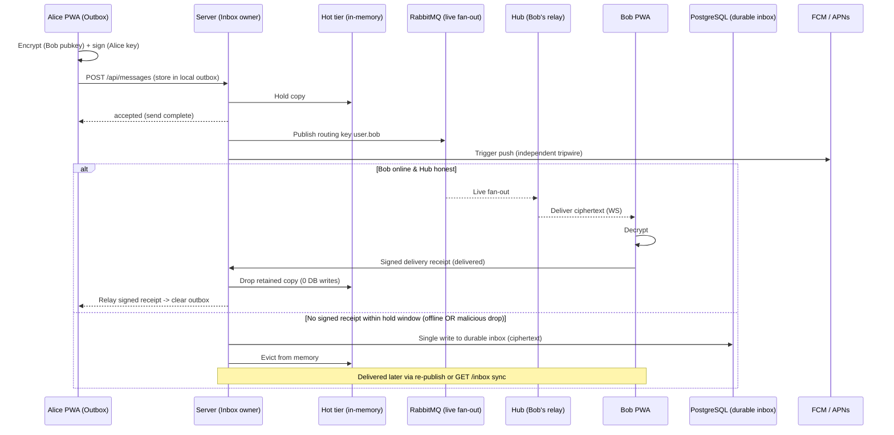
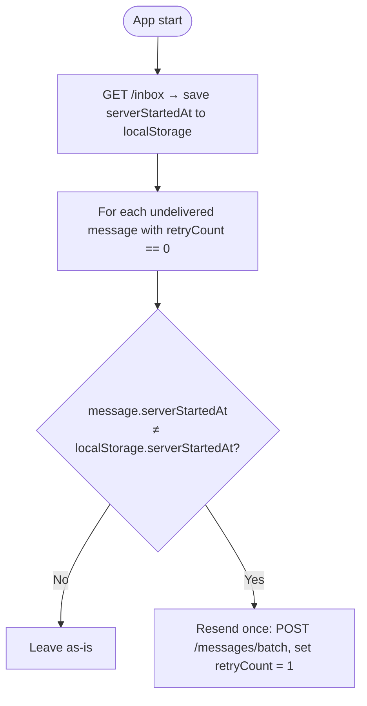
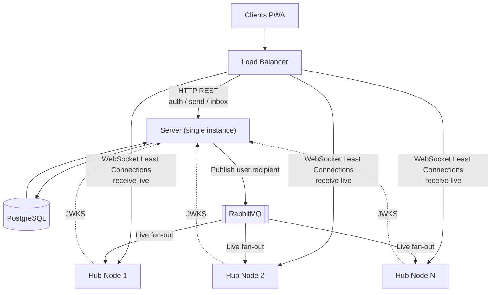

# fourletters Architecture

This document outlines the architectural components and communication patterns for **fourletters**, a simple, reliable, end-to-end (E2E) encrypted PWA messenger.

> **Scope — Phase 1 (first version).** This document describes the architecture as it is built for the first release: a **single Server instance**, an in-heap message hot tier, trusted Hubs, **no Redis**, and **no volunteer relays**. Deferred capabilities — volunteer Hubs, the untrusted-Hub hardening (detection, route scoping), and multi-instance Server scaling with Redis — are described separately in [FUTURE_EXTENSIONS.md](FUTURE_EXTENSIONS.md). The Phase 1 design deliberately keeps the client wire format and send path forward-compatible with those extensions, so they can be added later without a redesign.

## 1. Component Overview

The system consists of a frontend Progressive Web App (PWA), a **Server** that owns authentication and the durable message inbox, lightweight **Hubs** that deliver live messages over WebSocket, a PostgreSQL relational database, and RabbitMQ used purely as a live fan-out bus.

A defining principle of the architecture is an **asymmetric message path**:

*   **Sending is durable:** the PWA submits every outgoing message over HTTPS to the **Server**, which is the sole authority for accepting and durably owning a message. Clients never send through a Hub.
*   **Receiving is best-effort:** a Hub only pushes already-accepted messages to recipients that are online *right now*. A Hub is a disposable relay and is never responsible for durability.

### Components
*   **Angular PWA:** The user interface. Uses WebCrypto for E2E encryption and IndexedDB for local storage of messages and keys. Maintains an **outbox**: an outgoing message is held locally until the sender receives a cryptographically **signed delivery receipt** from the recipient, which makes the client tolerant of an unreliable relay without any blind retry loop.
*   **Server (Spring Boot):** The control plane **and the trusted owner of the message inbox**. Handles OAuth linking, validates identity, manages the public-key directory, accepts outgoing messages, holds them durably until a signed receipt arrives, publishes them to RabbitMQ for live delivery, exposes the `/inbox` sync API, and triggers push notifications. The Server is the only component trusted for delivery (never for content — payloads are E2E encrypted).
*   **Hub (Lightweight Spring Boot):** The **live delivery relay**. It holds the long-lived WebSocket connections of online users and forwards already-accepted, E2E-encrypted payloads from RabbitMQ to the recipient. It evaluates stateless JWTs (fetching the Server's public keys via the JWKS endpoint) only to authorize *which user's* live stream a connection may receive. It has **no database access** and holds no durable state — the delivery guarantee never depends on it. In Phase 1 the Hub runs in the trusted environment alongside the Server; it is nonetheless built as a blind, replaceable relay so that untrusted third-party ("volunteer") Hubs can be enabled later without a redesign (see [FUTURE_EXTENSIONS.md](FUTURE_EXTENSIONS.md)).
*   **PostgreSQL:** Stores user accounts, OAuth linking, public keys, and the **durable inbox** (cold tier) of accepted-but-not-yet-confirmed messages.
*   **RabbitMQ:** A **non-durable live fan-out bus**. It routes accepted payloads to whichever Hub a recipient is currently connected to. It is explicitly *not* a durability mechanism — losing a message in RabbitMQ is harmless because the Server retains the source of truth.

---

## 2. Communication Scenarios

### 2.1 Authentication & Identity (Token Validation Flow)

The client performs the OAuth login natively via third-party providers (VK/Google) to obtain an access token. The Server acts strictly as a token validator to confirm the user's identity and prevent spoofing before issuing an internal session.

### 2.2 Token Refresh Flow (Double Token Pattern)

For a detailed block diagram of the token refresh and authentication lifecycle, please refer to [algorithms/auth.md](algorithms/auth.md).

The architecture utilizes a **Double Token Pattern** to minimize database inquiries and reduce API latency:
1. **Stateless Access JWT**: Short-lived (e.g., 15 minutes). Both the Server and Hub verify the token cryptographically without executing a database query.
2. **Stateful Refresh Token**: Long-lived (e.g., 30 days) and stored securely in the PostgreSQL database.

The refresh backend is called at the every first start of app and upon or just before expiration of the short-lived Access JWT, the PWA silently submits the long-lived Refresh Token to obtain a new Access JWT. The server validates the Refresh Token against the database during this transaction, providing a mechanism for account restriction or revocation.

### 2.3 E2E Encryption & Key Exchange

Messages are encrypted on the client side. The server acts as a Public Key directory.

### 2.4 Message Sending & Receiving (Server-Owned Inbox)

For a detailed block diagram of the live fan-out topology, refer to [algorithms/rabbitmq-exchange.md](algorithms/rabbitmq-exchange.md).

The delivery model separates the **send path** (trusted, durable) from the **receive path** (untrusted, best-effort), so that an untrusted Hub can never cause permanent message loss and the sender never has to blindly retry.

**Send path (always through the Server):**
1. Alice encrypts the message with Bob's public key and **signs** it with her identity key.
2. Alice's PWA `POST`s it to the **Server** and keeps a copy in its local **outbox**.
3. The Server holds the message in its **hot tier** (in-memory pending map; see [3](#3-storage-strategy)) and **publishes** it to RabbitMQ with routing key `user.bob`. The Server returns an **`accepted`** response — Alice's send call is now complete (fire-and-forget; no client retry loop).

**Receive path (best-effort live, via whatever Hub Bob is on):**
1. RabbitMQ fans the payload out to whichever Hub currently holds Bob's binding; the Hub pushes it over the WebSocket.
2. Bob's device decrypts it and returns a **signed delivery receipt** (`delivered`) to the Server.
3. On the signed receipt, the Server **drops its retained copy** and relays the receipt to Alice, who clears her outbox. If both users are online this completes with **zero database writes**.

**If no signed receipt arrives within the hold window** (Bob is offline *or* a malicious Hub is withholding — the two are indistinguishable and need not be told apart), the Server performs a **single write** of the message to the durable **PostgreSQL inbox** (cold tier) and stops holding it in memory. Bob receives it later via live re-publish or via the `/inbox` sync API.

### 2.5 Delivery Guarantee (Server-Retained Copy + Signed Receipt)

The delivery guarantee does **not** rest on RabbitMQ (a relay may consume a message without ever forwarding it, and a recipient may simply be offline). Instead it rests on the **Server's retained copy plus an end-to-end signed receipt**:

*   The Server **publishes `user.bob` once** as a best-effort live attempt and keeps the copy (hot tier, then DB). If a **signed** `delivered` receipt arrives, the Server drops the copy. If none arrives within the hold window, it does **not** re-publish — the copy simply flushes to the DB and waits.
*   During the in-memory hold window the **sender's outbox is the durable backup**, so the hot tier is allowed to be non-durable.
*   **Backstop (the redelivery mechanism):** whenever Bob's app (re)connects it calls `GET /api/inbox` directly on the Server to pull anything it missed live. This HTTP sync path is independent of any Hub and returns the union of the hot and cold tiers, so a message is always eventually delivered even if the live attempt was missed.

> Receipts are **signed by the recipient's identity key** and verified against the key directory. In Phase 1 (trusted Hubs) an unsigned receipt would functionally suffice, but the signed form is a deliberate forward-compatible contract: it is what lets untrusted volunteer Hubs be enabled later without changing the wire format. Active *detection* of a misbehaving Hub (inbox state polling, automatic Hub-switching) is deferred — see [FUTURE_EXTENSIONS.md](FUTURE_EXTENSIONS.md).

### 2.6 Send-Side Reconciliation (Outbox Resync)

> Beyond Phase 1: this signal is retired once the hot tier moves to a persistent Redis store, which survives restarts (see [FUTURE_EXTENSIONS.md](FUTURE_EXTENSIONS.md)).

A freshly `accepted` message lives only in the hot tier until the hold-window flush, so a Server **restart** within that window loses any copy not yet delivered. Recovery is a single idempotent resend, keyed by `messageId` (the Server upserts — never a duplicate). The trigger is the Server's `serverStartedAt`, returned on every `accepted` and `/inbox` response: if it changed since a message was sent, that message's instance is gone and the message is resent **once**.

**Algorithm:**
1. **On app start** — call `GET /inbox` and save `serverStartedAt` to `localStorage`.
2. **After `GET /inbox`** — for each `undelivered` message with `retryCount == 0`, compare the `serverStartedAt` stored *on the message* (captured from its `accepted` response) against the one in `localStorage`.
3. **If they differ** — mark for resync and resend all not delivered once (`POST /messages/batch`), set `retryCount = 1`; otherwise leave it.

## 3. Storage Strategy

*   **Client (Angular):** **IndexedDB** is used for storing the user's private key, cached public keys of contacts, decrypted chat history, and the **outbox** of unconfirmed outgoing messages.
*   **Server — two-tier inbox:** The Server owns the message inbox as the source of truth, split into a hot and a cold tier to keep database operations low:
    *   **Hot tier (in-memory pending map):** holds messages only during the short post-accept hold window, keyed by message id. It is **discardable** — durability during the window is provided by the **sender's outbox**, so the hot tier is plain **JVM heap** in the single Server instance. The hold window length `N` is a tunable knob that trades memory for database writes: messages confirmed by a signed receipt within `N` cost **zero** DB writes; lowering `N` reduces memory at the cost of writing sooner. (Sharing this tier across multiple Server instances via Redis is a deferred concern — see [FUTURE_EXTENSIONS.md](FUTURE_EXTENSIONS.md).)
    *   **Cold tier (PostgreSQL `inbox`):** the durable store. A message is written here **once**, only if it is not confirmed within the hold window. Rows are deleted strictly upon a verified **signed delivery receipt**. PostgreSQL is required (not a queue) because the inbox needs random access by message id, repeated re-publish of the same message, and `GET /inbox` reads — none of which a FIFO queue provides.
*   **Reading the inbox (`GET /inbox`):** the Server returns the **union of the hot and cold tiers**, in arrival order; the client de-duplicates by message id. Because the flush from hot to cold is *insert-into-DB then remove-from-memory*, a message in transit is present in **both** tiers (a harmless duplicate) and never in **neither** (no gap).
*   **PostgreSQL (relational):** also stores Accounts, OAuth identities, the public-key directory, and Web Push subscriptions.

---

## 4. Deployment Model (Phase 1)

Phase 1 runs a **single Server instance**, a single PostgreSQL database, a single RabbitMQ broker, and one or more **Hubs** in the trusted environment. The Server and Hub scale differently and are deliberately split:

1. **Server (REST HTTP traffic):** A **single instance** handles auth, message **send**, `/inbox` sync, and signed-receipt intake. Its per-message work is just *accept + publish*, so a single vertically-scaled instance handles substantial throughput. (Running multiple Server instances requires a shared hot tier and is a deferred concern — see [FUTURE_EXTENSIONS.md](FUTURE_EXTENSIONS.md).)
2. **Hub (WebSocket traffic):** Hubs maintain the long-lived connections used **only for live delivery to recipients** (clients never send through a Hub). The expensive resource — holding many idle connections — lives here, and **Hubs scale horizontally independently of the single Server**. The Load Balancer terminates SSL and distributes WebSocket connections (e.g. "Least Connections"); sticky sessions are NOT required because RabbitMQ is the unified fan-out backplane.

*   **Routing:** To message Charlie, Bob `POST`s to the **Server**, which publishes `user.charlie` to RabbitMQ; whichever Hub Charlie is connected to consumes it and pushes it to Charlie. Hubs never talk to each other and never carry the send path.
*   **Resilience:** If a Hub goes down, the recipient's WebSocket disconnects and the app silently reconnects to another Hub; its `user.<id>` binding moves with it, and any messages missed while disconnected are pulled via `GET /api/inbox`. Durability never depends on a Hub.

> **Beyond Phase 1.** Offloading connection-holding to untrusted third-party **volunteer Hubs**, and scaling the Server horizontally with **Redis**, are described in [FUTURE_EXTENSIONS.md](FUTURE_EXTENSIONS.md). Both are designed to drop in without changing the Phase 1 client wire format or send path.
