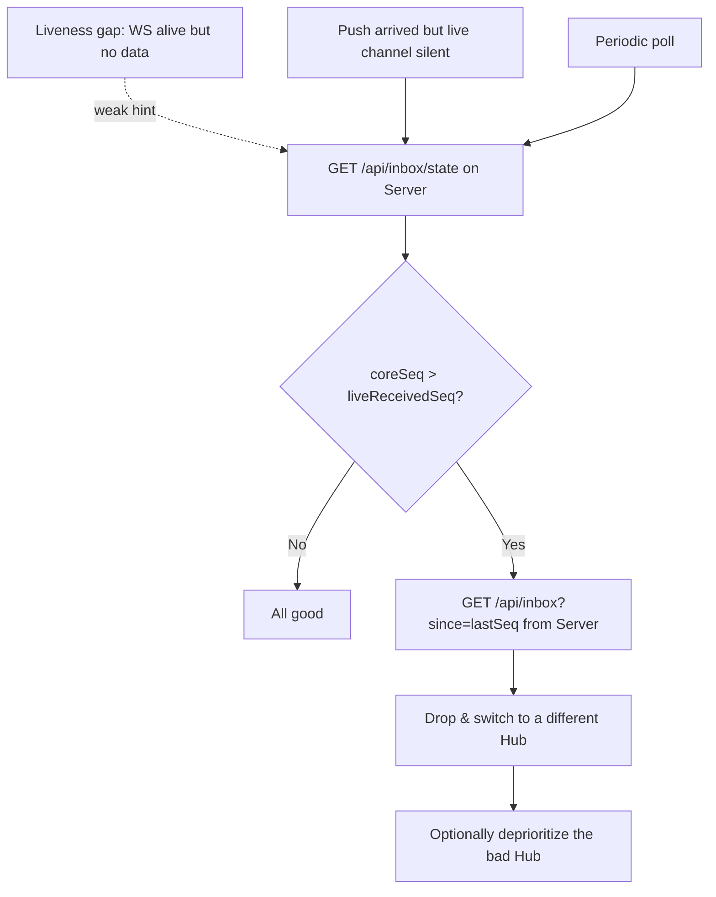
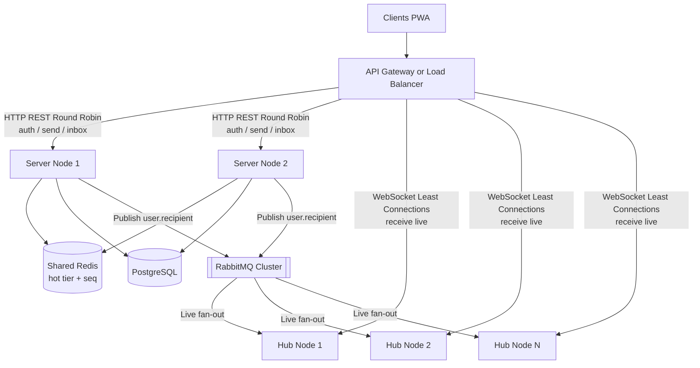
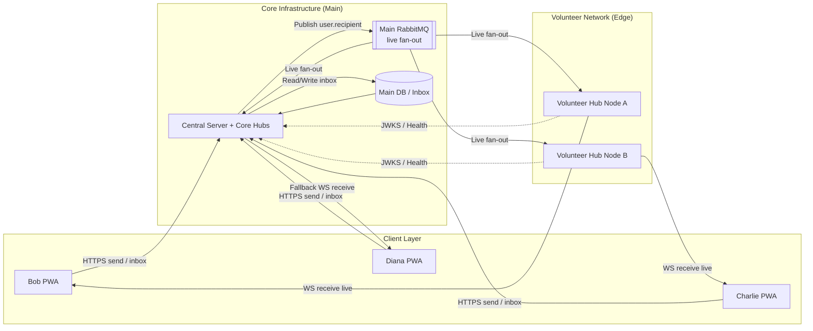

# fourletters — Future Extensions

This document collects capabilities that are **intentionally deferred** beyond the first version. The first version is described in [ARCHITECTURE.md](ARCHITECTURE.md) (Phase 1: a single Server instance, an in-heap hot tier, trusted Hubs, no Redis, no volunteer relays).

Everything here builds on Phase 1 **without changing the client wire format or the send path** — that forward-compatibility is the whole reason these features can be added later rather than designed in from the start. The two main extension tracks are:

1. **Volunteer Hubs** — letting untrusted third parties run relay nodes to offload connection-holding load (sections 1–4).
2. **Server horizontal scaling** — running more than one Server instance behind a shared hot tier (section 5).

---

## 1. The Untrusted-Hub Trust Model

In Phase 1 the Hub runs in the trusted environment alongside the Server. The volunteer extension lets **third parties** run Hubs on hardware the project does not control. Because the project is open source, **it is impossible to prove that a Hub runs the genuine, unmodified application** (this is the remote-attestation problem; on hardware an operator controls, any self-check can be replayed or patched out). The extension therefore does **not** attempt to verify Hub authenticity. Instead the system is designed so that a malicious Hub **cannot cause harm beyond a bounded, detectable, and recoverable nuisance.**

A malicious Hub is assumed to be able to attempt any of the following:

| Threat | Mitigation |
| --- | --- |
| **Read message content** | E2E encryption — the Hub only ever sees ciphertext. |
| **Intercept the whole network's live streams** (bind `user.*`) | **Route scoping:** a Hub may only receive `user.<id>` for a user who has proven identity (valid JWT) on that connection. Enforced by the broker / a Server-mediated binding, never by Hub code. One rogue Hub is contained to *its own* connected users. See [4](#4-route-scoping--scoped-transport-tokens). |
| **Spoof an outgoing message** (`senderId`) | Sending never goes through a Hub — it goes to the Server. Additionally, payloads/receipts are **signed by the sender's identity key** and verified against the key directory, so a relay cannot forge or alter them. |
| **Silently drop / withhold messages** (consume-and-ack, never forward) | The Server is the durable owner and re-publishes until it receives a **signed delivery receipt**. The recipient detects withholding via an **independent reference** (Server inbox high-water-mark + push tripwire) and **switches Hubs**. See [3](#3-malicious-hub-detection--recovery). |
| **Over-delegation** (reuse a user's token elsewhere) | The client presents only a **narrowly scoped, short-lived transport token** (`aud=mq`, scoped to its own `user.<id>`) to the Hub/live layer — never the full-power access JWT. |

**Core principle:** *the component that performs an action is never trusted to authorize it.* Delivery durability lives in the Server; route authorization lives in the broker/Server; content and authenticity live in client-side cryptography. A Hub is only ever a blind, replaceable pipe for live delivery.

---

## 2. Design-Now vs. Deploy-Later (Volunteer Readiness)

The Volunteer Hub is intentionally **not** required for the system to be complete or secure. The system is fully functional and safe running **only the trusted Hubs of Phase 1**. The volunteer layer is an **optional horizontal scaling tier** that offloads exactly one expensive-but-safe resource: holding large numbers of long-lived, mostly-idle WebSocket connections. Everything stateful, trusted, or write-heavy (auth, send, sequencing, durable inbox) stays on the Server and is **never** offloaded.

The reason the Phase 1 Hub is already designed as a blind relay — even though it initially runs only in a trusted location — is to make enabling volunteers a **deployment decision, not a code change**. If the Hub were trusted (durable state, accepted sends, self-authorized routing), a Volunteer Hub would be a different security class and rolling it out later would force a redesign of the Hub exactly when the system is under scaling pressure. Because trust was removed from the start, a trusted Hub and a Volunteer Hub are the **identical artifact**, differing only in *where* they run and *who* runs them.

To keep this option real without paying full cost upfront, the work is split by what is expensive to change after release:

*   **Shipped in Phase 1 (contracts — expensive to change later):** these define the wire format and client behavior and are correct from the first release, because they cannot be altered without breaking compatibility.
    *   Sending always goes **PWA → Server** (never through a Hub).
    *   Every accepted message carries a per-recipient monotonic **`seq`**.
    *   Delivery/read receipts are **signed end-to-end** by the recipient's identity key.
    *   The two-tier Server-owned inbox and `/inbox?since=<seq>` sync API.
    *   **Baseline RabbitMQ credential permissions** (see [4](#4-route-scoping--scoped-transport-tokens)) — the Hub credential is minimally scoped from the first release, so the artifact is already safe regardless of where it runs.
*   **Deferred to this document (enforcement / UX — cheap to enable later):** these are only load-bearing once an *actually* untrusted Hub exists, and can be switched on the day volunteers are deployed without touching the schema or send path.
    *   Active inbox high-water-mark polling and the push tripwire cross-check ([3](#3-malicious-hub-detection--recovery)).
    *   Automatic Hub-switching on a detected discrepancy ([3](#3-malicious-hub-detection--recovery)).
    *   **Per-identity binding enforcement** ([4](#4-route-scoping--scoped-transport-tokens)).

**Net effect:** the message/receipt schema and the client's send path are **volunteer-ready from day one**, so turning volunteers on later is a matter of publishing a Hub bootstrap list, issuing scoped consume credentials, and enabling the deferred enforcement flags — with zero changes to storage, message format, or client send logic.

---

## 3. Malicious-Hub Detection & Recovery

A Hub that consumes `user.bob` and acknowledges it to the broker but never forwards it to Bob leaves no trace at the broker layer (the alternate-exchange fallback does **not** fire, because a consumer *did* exist). Therefore the guarantee cannot rest on the broker — it rests on the **Server's retained copy plus an end-to-end signed receipt** (already present in Phase 1), and *detection* relies on a reference channel the Hub does not control.

**Detection (how Bob learns his Hub is bad):** Bob cannot trust the Hub to reveal that the Hub is misbehaving, so he uses **two independent references:**
1. **Server inbox high-water-mark (pull):** Bob's client periodically calls `GET /api/inbox/state` directly on the Server and compares the Server's highest accepted `seq` for him against the highest `seq` he actually received live. `coreSeq > liveReceivedSeq` ⇒ his Hub is withholding messages.
2. **Push tripwire (server-push):** the Server fires a content-free push (FCM/APNs) on accept. A push arriving while the live channel delivered nothing is the same contradiction, over a channel the Hub cannot suppress.

**Recovery = the same action as detection:** Bob fetches the missing range via `GET /api/inbox?since=<lastSeq>` directly from the Server (the always-available backstop, independent of any Hub) and **switches to a different Hub**. Even if Bob never switches, the HTTP sync path still delivers every message. A weak liveness/heartbeat hint (Hub heartbeats fine but zero data for a long time) may be used only to *raise the frequency* of the high-water-mark check, never as an action trigger on its own.

---

## 4. Route Scoping & Scoped Transport Tokens

RabbitMQ authorization has two distinct layers. The coarse layer ships in Phase 1; the fine-grained layer is the deferred enforcement that must be enabled before any untrusted Volunteer Hub goes live.

> **RabbitMQ auth is never disabled.**
> **(A) Coarse credential permissions are always on, from Phase 1:** the Hub credential has **`write` denied on `messages.exchange`** (Hubs never publish — only the Server does), and its `configure`/`read`/`write` are restricted by name regex to **its own** `hub.queue.*`. A Hub therefore *cannot* publish to the messages exchange or touch queues outside its own namespace — it can only declare its own exclusive queue and consume.
> **(B) Per-identity binding enforcement is the deferred part:** it stops a Hub holding a *shared* credential from binding *another* user's routing key (`user.<victim>`) to its own legitimate queue. While only trusted Hubs exist this is not a live threat; it must be enabled before any Volunteer (untrusted) Hub is deployed.

Per-identity binding enforcement can be implemented either way:

*   **RabbitMQ OAuth2 backend + scoped transport tokens:** each live connection authenticates to the broker with a **narrow, short-lived transport token** (`aud=mq`, scoped to its own `user.<id>`) instead of the full access JWT. The broker derives topic permissions from the token, so a connection can only bind/consume `user.<its-own-id>`. Enforcement lives in the broker — the one component the volunteer does not control.
*   **Server-mediated bindings:** the Hub's credential has `read` on `messages.exchange` denied (so it cannot self-bind). When a user connects, the Hub asks the Server to bind `user.<id>`; the Server validates the user's JWT and creates the binding with its admin rights, releasing it on disconnect (or via a short binding lease).

---

## 5. Server Horizontal Scaling & The Shared Hot Tier (Redis)

In Phase 1 the in-memory hot tier is **instance-local state**, which is exactly why Phase 1 runs as a **single Server instance**. Because a client's requests are spread across instances by the load balancer, three things break if the hot tier stays local *and* more than one Server instance exists:

*   **`/inbox` read gap:** a `GET /inbox` landing on `S2` reads `S2`'s hot tier + the DB, but a message still held in `S1`'s heap is in *neither* from `S2`'s view — violating the "never in neither" no-gap invariant of the inbox.
*   **`/inbox/state` mismatch:** the high-water-mark used for malicious-Hub detection ([3](#3-malicious-hub-detection--recovery)) would differ per instance.
*   **`seq` collisions:** the per-recipient monotonic `seq` cannot be assigned correctly by independent instances without a shared counter.

Horizontal Server scaling therefore requires moving the hot tier into **Redis** (and sourcing `seq` from a shared counter). This restores all three properties at once: any instance can serve a `/inbox` read or process a receipt against the shared pending map, the high-water-mark is global, and `seq` is collision-free. Redis is **not optional** at this point — it is the enabler of multi-instance, not a mere optimization. The hot tier stays non-durable (the sender's outbox remains the window's durability) and the client contract is unchanged.

> **Rule of thumb:** number of Server instances > 1 ⟹ Redis. Stay single-instance and heap-only for as long as possible; introduce Redis exactly when you need a second Server instance — typically driven by Server CPU/availability, long after Hubs have absorbed the connection-holding load.

The Hub tier scales horizontally **independently of the Server** — a single Server instance can drive many Hubs. WebSocket traffic uses a "Least Connections" algorithm; sticky sessions are not required because RabbitMQ is the unified fan-out backplane.

---

## 6. Volunteer Hub Deployment Topology

To further scale and reduce infrastructure costs, the architecture supports a **Volunteer Relay Network**. Users host lightweight volunteer nodes that integrate into the network to help deliver **live** WebSocket traffic, distributing the connection load. Volunteer and trusted ("Core") Hubs run **identical code** and differ only by deployment location and trust assumptions; to the PWA they are interchangeable (see [1](#1-the-untrusted-hub-trust-model)).

**Separation of Concerns:**
*   **Core Infrastructure:** Hosts the PostgreSQL database, the `Server` application (Auth, Key Directory, **durable inbox**), the Main RabbitMQ cluster, and at least some fallback **Core Hub** instances. Sending and durability live exclusively here.
*   **Volunteer Infrastructure:** Volunteers run only the `fourletters-hub` application. It requires only RabbitMQ connection credentials scoped to **consume live fan-out** — no database access, no secrets, no send/publish authority over arbitrary users. It fetches the Server's public keys via the JWKS endpoint to authorize *which user's* live stream a connection may receive (route scoping, [4](#4-route-scoping--scoped-transport-tokens)), and never sees plaintext (E2E).

Because the send path bypasses Hubs entirely, durability lives in the Server, and a Hub is route-scoped to its own connected users, a Volunteer Hub is a **blind, replaceable live relay**: it can at most delay live delivery for its own users (detectable and recoverable per [3](#3-malicious-hub-detection--recovery)), never read content, never spoof a sender, and never cause permanent loss.

*   **Bootstrapping:** PWA clients log in with the Server. The Server returns a list of healthy Hubs (Volunteer and/or Core) for the client to connect to for live delivery.
*   **Routing:** Bob and Charlie connect to Hubs only to *receive*. To message Charlie, Bob `POST`s to the **Server**, which publishes `user.charlie` to RabbitMQ; whichever Hub Charlie is on consumes it and pushes it to Charlie. Hubs never talk to each other and never carry the send path.
*   **Resilience (Fallback):** If a volunteer turns off Node A, Bob's WebSocket disconnects and his app silently reconnects to another Volunteer Hub or a Core Hub. Independently, if Bob's current Hub silently withholds messages, the malicious-Hub detection in [3](#3-malicious-hub-detection--recovery) triggers a Hub switch and an `/inbox` resync, so delivery is never permanently lost.
