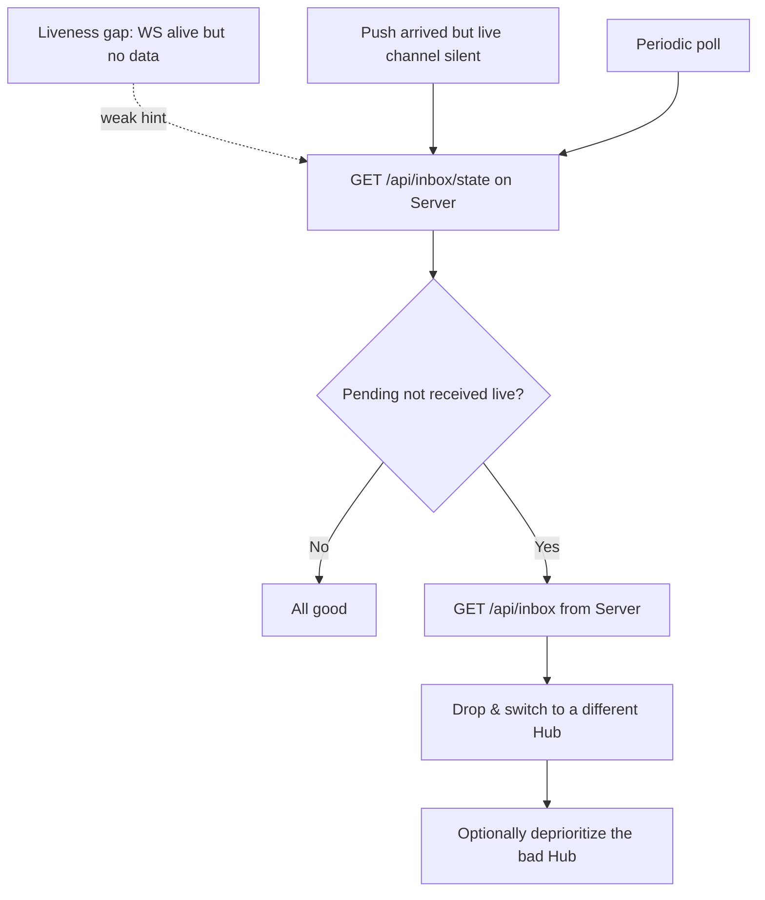
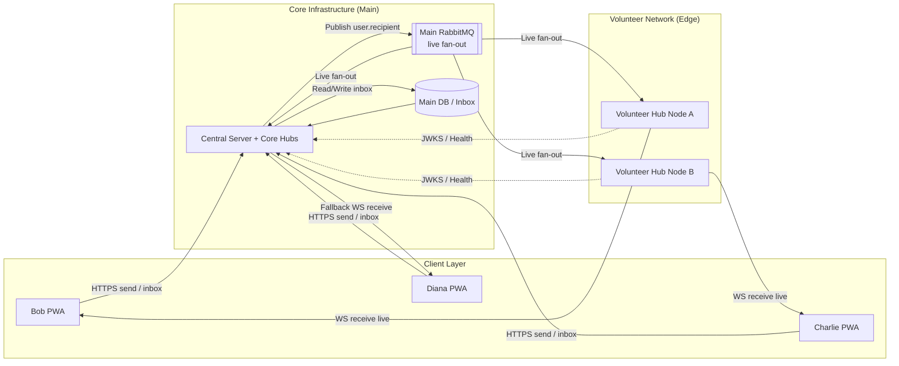

# fourletters — Future Extensions

This document collects capabilities that are **intentionally deferred** beyond the first version. The first version is described in [ARCHITECTURE.md](ARCHITECTURE.md) (Phase 1: a single Server instance, an in-heap hot tier, trusted Hubs, no Redis, no volunteer relays).

Everything here builds on Phase 1 **without changing the client wire format or the send path** — that forward-compatibility is the whole reason these features can be added later rather than designed in from the start. The two main extension tracks are:

1. **Volunteer Hubs** — letting untrusted third parties run relay nodes to offload connection-holding load (sections 1–4, plus registration & identity in section 7).
2. **Server horizontal scaling** — running more than one Server instance behind a shared hot tier (section 5).

---

## 1. The Untrusted-Hub Trust Model

In Phase 1 the Hub runs in the trusted environment alongside the Server. The volunteer extension lets **third parties** run Hubs on hardware the project does not control. Because the project is open source, **it is impossible to prove that a Hub runs the genuine, unmodified application** (this is the remote-attestation problem; on hardware an operator controls, any self-check can be replayed or patched out). The extension therefore does **not** attempt to verify Hub authenticity. Instead the system is designed so that a malicious Hub **cannot cause harm beyond a bounded, detectable, and recoverable nuisance.**

A malicious Hub is assumed to be able to attempt any of the following:

| Threat | Mitigation |
| --- | --- |
| **Read message content** | E2E encryption — the Hub only ever sees ciphertext. |
| **Intercept the whole network's live streams** (bind `user.*`) | **Route scoping:** a Hub may only receive `user.<id>` for a user who has proven identity (valid JWT) on that connection. Enforced by the broker / a Server-mediated binding, never by Hub code. One rogue Hub is contained to *its own* connected users. See [4](#4-route-scoping--scoped-transport-tokens). |
| **Spoof an outgoing message** (`senderId`) | Sending never goes through a Hub — it goes to the Server. Additionally, message payloads are protected by the **Double Ratchet** (which authenticates them end-to-end) and receipts are **signed by the recipient's identity key**, so a relay cannot forge or alter them. |
| **Silently drop / withhold messages** (consume-and-ack, never forward) | The Server is the durable owner and re-publishes until it receives a **signed delivery receipt**. The recipient detects withholding via an **independent reference** (Server inbox state + push tripwire) and **switches Hubs**. See [3](#3-malicious-hub-detection--recovery). |
| **Over-delegation** (reuse a user's token elsewhere) | The client presents only a **narrowly scoped, short-lived transport token** (`aud=mq`, scoped to its own `user.<id>`) to the Hub/live layer — never the full-power access JWT. |

**Core principle:** *the component that performs an action is never trusted to authorize it.* Delivery durability lives in the Server; route authorization lives in the broker/Server; content and authenticity live in client-side cryptography. A Hub is only ever a blind, replaceable pipe for live delivery.

---

## 2. Design-Now vs. Deploy-Later (Volunteer Readiness)

The Volunteer Hub is intentionally **not** required for the system to be complete or secure. The system is fully functional and safe running **only the trusted Hubs of Phase 1**. The volunteer layer is an **optional horizontal scaling tier** that offloads exactly one expensive-but-safe resource: holding large numbers of long-lived, mostly-idle WebSocket connections. Everything stateful, trusted, or write-heavy (auth, send, durable inbox) stays on the Server and is **never** offloaded.

The reason the Phase 1 Hub is already designed as a blind relay — even though it initially runs only in a trusted location — is to make enabling volunteers a **deployment decision, not a code change**. If the Hub were trusted (durable state, accepted sends, self-authorized routing), a Volunteer Hub would be a different security class and rolling it out later would force a redesign of the Hub exactly when the system is under scaling pressure. Because trust was removed from the start, a trusted Hub and a Volunteer Hub are the **identical artifact**, differing only in *where* they run and *who* runs them.

To keep this option real without paying full cost upfront, the work is split by what is expensive to change after release:

*   **Shipped in Phase 1 (contracts — expensive to change later):** these define the wire format and client behavior and are correct from the first release, because they cannot be altered without breaking compatibility.
    *   Sending always goes **PWA → Server** (never through a Hub).
    *   Delivery/read receipts are **signed end-to-end** by the recipient's identity key.
    *   The two-tier Server-owned inbox and `/inbox` sync API.
    *   **Baseline RabbitMQ credential permissions** (see [4](#4-route-scoping--scoped-transport-tokens)) — the Hub credential is minimally scoped from the first release, so the artifact is already safe regardless of where it runs.
*   **Deferred to this document (enforcement / UX — cheap to enable later):** these are only load-bearing once an *actually* untrusted Hub exists, and can be switched on the day volunteers are deployed without touching the schema or send path.
    *   Active inbox state polling and the push tripwire cross-check ([3](#3-malicious-hub-detection--recovery)).
    *   Automatic Hub-switching on a detected discrepancy ([3](#3-malicious-hub-detection--recovery)).
    *   **Per-identity binding enforcement** ([4](#4-route-scoping--scoped-transport-tokens)).

**Net effect:** the message/receipt schema and the client's send path are **volunteer-ready from day one**, so turning volunteers on later is a matter of publishing a Hub bootstrap list, issuing scoped consume credentials, and enabling the deferred enforcement flags — with zero changes to storage, message format, or client send logic.

---

## 3. Malicious-Hub Detection & Recovery

A Hub that consumes `user.bob` and acknowledges it to the broker but never forwards it to Bob leaves no trace at the broker layer (the alternate-exchange fallback does **not** fire, because a consumer *did* exist). Therefore the guarantee cannot rest on the broker — it rests on the **Server's retained copy plus an end-to-end signed receipt** (already present in Phase 1), and *detection* relies on a reference channel the Hub does not control.

**Detection (how Bob learns his Hub is bad):** Bob cannot trust the Hub to reveal that the Hub is misbehaving, so he uses **two independent references:**
1. **Server inbox state (pull):** Bob's client periodically calls `GET /api/inbox` directly on the Server and compares the messages the Server still holds pending for him against what he actually received live. Anything the Server is holding that never arrived live ⇒ his Hub is withholding messages.
2. **Push tripwire (server-push):** the Server fires a content-free push (FCM/APNs) on accept. A push arriving while the live channel delivered nothing is the same contradiction, over a channel the Hub cannot suppress.

**Recovery = the same action as detection:** Bob fetches the missing messages via `GET /api/inbox` directly from the Server (the always-available backstop, independent of any Hub) and **switches to a different Hub**. Even if Bob never switches, the HTTP sync path still delivers every message. A weak liveness/heartbeat hint (Hub heartbeats fine but zero data for a long time) may be used only to *raise the frequency* of the inbox-state check, never as an action trigger on its own.

---

## 4. Route Scoping & Scoped Transport Tokens

RabbitMQ authorization has two distinct layers. The coarse layer ships in Phase 1; the fine-grained layer is the deferred enforcement that must be enabled before any untrusted Volunteer Hub goes live.

> **RabbitMQ auth is never disabled.**
> **(A) Coarse credential permissions are always on, from Phase 1:** the Hub credential has **`write` denied on `messages.exchange`** (Hubs never publish — only the Server does), and its `configure`/`read`/`write` are restricted by name regex to **its own** `hub.queue.*`. A Hub therefore *cannot* publish to the messages exchange or touch queues outside its own namespace — it can only declare its own exclusive queue and consume.
> **(B) Per-identity binding enforcement is the deferred part:** it stops a Hub holding a *shared* credential from binding *another* user's routing key (`user.<victim>`) to its own legitimate queue. While only trusted Hubs exist this is not a live threat; it must be enabled before any Volunteer (untrusted) Hub is deployed.

Per-identity binding enforcement can be implemented either way:

*   **RabbitMQ OAuth2 backend + scoped transport tokens:** each live connection authenticates to the broker with a **narrow, short-lived transport token** (`aud=mq`, scoped to its own `user.<id>`) instead of the full access JWT. The broker derives topic permissions from the token, so a connection can only bind/consume `user.<its-own-id>`. Enforcement lives in the broker — the one component the volunteer does not control.
*   **Server-mediated bindings:** the Hub's credential has `read` on `messages.exchange` denied (so it cannot self-bind). When a user connects, the Hub asks the Server to bind `user.<id>`; the Server validates the user's JWT and creates the binding with its admin rights, releasing it on disconnect (or via a short binding lease).

---

## 5. Server Horizontal Scaling & The Shared Hot Tier (Redis)

In Phase 1 the in-memory hot tier is **instance-local state**, which is exactly why Phase 1 runs as a **single Server instance**. Because a client's requests are spread across instances by the load balancer, two things break if the hot tier stays local *and* more than one Server instance exists:

*   **`/inbox` read gap:** a `GET /inbox` landing on `S2` reads `S2`'s hot tier + the DB, but a message still held in `S1`'s heap is in *neither* from `S2`'s view — violating the "never in neither" no-gap invariant of the inbox.
*   **`/inbox/state` mismatch:** the inbox state used for malicious-Hub detection ([3](#3-malicious-hub-detection--recovery)) would differ per instance.

Horizontal Server scaling therefore requires moving the hot tier into **Redis**. This restores both properties at once: any instance can serve a `/inbox` read or process a receipt against the shared pending map, and the inbox state is global. Redis is **not optional** at this point — it is the enabler of multi-instance, not a mere optimization. The hot tier stays non-durable (the sender's outbox remains the window's durability) and the client contract is unchanged.

> **Rule of thumb:** number of Server instances > 1 ⟹ Redis. Stay single-instance and heap-only for as long as possible; introduce Redis exactly when you need a second Server instance — typically driven by Server CPU/availability, long after Hubs have absorbed the connection-holding load.

> **Subsumes send-side reconciliation.** A persistent/HA Redis hot tier survives a Server restart, so the crash-in-hold-window exposure that the Phase 1 [send-side reconciliation](ARCHITECTURE.md#26-send-side-reconciliation-outbox-resync) protects against largely disappears. Outbox resync remains a cheap safety net but stops being load-bearing.

Hub scaling is unchanged from Phase 1 (Hubs already scale horizontally independently of the Server, see [ARCHITECTURE.md §4](ARCHITECTURE.md#4-deployment-model-phase-1)); the only delta this section adds is the shared Redis hot tier that lets the **Server** tier grow past one instance.

---

## 6. Volunteer Hub Deployment Topology

To further scale and reduce infrastructure costs, the architecture supports a **Volunteer Relay Network**. Users host lightweight volunteer nodes that integrate into the network to help deliver **live** WebSocket traffic, distributing the connection load. Volunteer and trusted ("Core") Hubs run **identical code** and differ only by deployment location and trust assumptions; to the PWA they are interchangeable (see [1](#1-the-untrusted-hub-trust-model)).

**Separation of Concerns:**
*   **Core Infrastructure:** Hosts the PostgreSQL database, the `Server` application (Auth, Key Directory, **durable inbox**), the Main RabbitMQ cluster, and at least some fallback **Core Hub** instances. Sending and durability live exclusively here.
*   **Volunteer Infrastructure:** Volunteers run only the `fourletters-hub` application. It requires only RabbitMQ connection credentials scoped to **consume live fan-out** — no database access, no secrets, no send/publish authority over arbitrary users. It fetches the Server's public keys via the JWKS endpoint to authorize *which user's* live stream a connection may receive (route scoping, [4](#4-route-scoping--scoped-transport-tokens)), and never sees plaintext (E2E).

Because the send path bypasses Hubs entirely, durability lives in the Server, and a Hub is route-scoped to its own connected users, a Volunteer Hub is a **blind, replaceable live relay**: it can at most delay live delivery for its own users (detectable and recoverable per [3](#3-malicious-hub-detection--recovery)), never read content, never spoof a sender, and never cause permanent loss.

*   **Bootstrapping:** PWA clients log in with the Server. The Server returns a list of healthy Hubs (Volunteer and/or Core) for the client to connect to for live delivery. A Hub only appears on this list once its operator has registered it and it has authenticated to the Server (see [7](#7-hub-registration--identity-dashboard-issued-tokens)).
*   **Routing:** Bob and Charlie connect to Hubs only to *receive*. To message Charlie, Bob `POST`s to the **Server**, which publishes `user.charlie` to RabbitMQ; whichever Hub Charlie is on consumes it and pushes it to Charlie. Hubs never talk to each other and never carry the send path.
*   **Resilience (Fallback):** If a volunteer turns off Node A, Bob's WebSocket disconnects and his app silently reconnects to another Volunteer Hub or a Core Hub. Independently, if Bob's current Hub silently withholds messages, the malicious-Hub detection in [3](#3-malicious-hub-detection--recovery) triggers a Hub switch and an `/inbox` resync, so delivery is never permanently lost.

---

## 7. Hub Registration & Identity (Dashboard-Issued Tokens)

Phase 1 Hubs run in the trusted environment, so the Hub authenticates to the Server with a **single shared registration secret** carried in config (`Authorization: Bearer <secret>` on `POST /hubs/register`). That is sufficient while the project operates every Hub, but it gives each Hub **no distinct identity** and **no way to revoke one Hub without rotating the secret for all**. Both are required before untrusted **volunteer** Hubs are deployed.

The volunteer onboarding model replaces the single shared secret with **per-Hub, dashboard-issued bearer tokens**, keeping the **same registration endpoint and the same Hub-side code** — only the credential's origin and validation change:

1. A volunteer signs into a **dashboard** (authenticated as a human / account owner).
2. They click **"Register a Hub"**; the Server mints a unique registration token and stores a `Hub` record `{ hubId, ownerId, tokenHash, status, createdAt }`. The **raw token is shown once**; only its **hash** is persisted (treat it like a password).
3. The volunteer places that token in their Hub's config.
4. On boot the Hub calls `POST /hubs/register` with `Authorization: Bearer <token>`. The Server looks up the token by hash, checks `status = active`, provisions `hub.queue.{hubId}`, and returns the queue name.

| Property | Phase 1 shared secret | Dashboard-issued per-Hub token |
| --- | --- | --- |
| Onboarding | edit config (operated by the project) | **self-service, no Server change** |
| Per-Hub identity | none — all Hubs identical | **distinct `hubId` bound to an owner** |
| Revoke one Hub | impossible (rotates everyone) | **flip one DB row to `revoked`** |
| Credential at rest | shared value in config | **only a hash stored server-side** |

**What this does and does not buy.** A registration token authenticates **identity**, not **honesty** — the project hands the volunteer a valid credential, so a volunteer who later turns malicious still presents a valid token. Its value is **accountability and a kill switch**: the Server can attribute every Hub to an owner and revoke a misbehaving Hub independently of all others. The actual protections against a malicious Hub remain the content/delivery defenses already in place: sending bypasses the Hub, payloads are E2E-encrypted and signed, the Server retains the durable copy, and the `/inbox` backstop plus malicious-Hub detection ([3](#3-malicious-hub-detection--recovery)) guarantee delivery and recovery. Per-identity binding enforcement ([4](#4-route-scoping--scoped-transport-tokens)) still governs *which* `user.<id>` a registered Hub may relay.

**Why this likely removes the need for mTLS / a private CA.** mTLS was the other candidate for giving volunteer Hubs an identity and a revocation path, but it requires issuing client certificates, running a CA (the truststore-per-leaf approach does not scale), and operating revocation (CRL/OCSP or short-lived certs). A dashboard token registry delivers the same two properties — **per-Hub identity** and **independent revocation** — as ordinary application state, with no PKI to operate. mTLS can still be added later as a transport-layer second factor, but it is not required for volunteer onboarding.

**Forward-compatibility.** Because Phase 1 already ships the registration call in **bearer-token shape**, enabling volunteers later adds only token *issuance* (the dashboard) and *validation* (lookup by hash + status) plus the `Hub` table — the Hub-side registration client and the `POST /hubs/register` contract are unchanged.

---

## 8. Per-User At-Rest Key Binding

In Phase 1 the client's at-rest master key is a non-extractable AES-GCM `CryptoKey` in IndexedDB (see [MESSAGE_SECURITY.md §1.2](MESSAGE_SECURITY.md#12-at-rest-encryption-of-the-per-user-db)). Storage is partitioned per **origin**, so the key is safe from other websites and its raw bytes are non-exfiltratable — but it is **not bound to a single account-picker user**: any script on the origin can open another local user's database and *use* its key. This extension binds the master key to a per-user secret so it is usable by **only that user**.

Two variants, differing in where the unlocking secret comes from:

- **PIN / passphrase (offline).** The master key is generated `extractable: true`, **wrapped** with a key derived from a user-entered PIN via PBKDF2/Argon2, and only the wrapped blob is stored. Unlock re-derives the wrapping key from the PIN. Fully **offline** (derivation is local); cost is a PIN prompt on unlock.
- **Server-issued secret (online).** On login the Server returns a per-user unlock secret that wraps the master key; the unwrapped key is held only in `sessionStorage`/memory for the session. Stronger separation (the wrap secret never rests on the device) but **requires connectivity to unlock**, so it trades away offline history access — acceptable only where an online-unlock requirement is tolerable.

Both keep the rest of the model unchanged: messages stay AES-GCM at rest, decrypted plaintext stays in the volatile in-memory cache, and the wrapped/derived key replaces only *how the master key is obtained at unlock time*.

---

## 9. Multi-Device Key Handling

In Phase 1 a user's Signal identity is generated and held on a **single primary device** (see [MESSAGE_SECURITY.md §2](MESSAGE_SECURITY.md#2-keys-created-at-first-authentication)); a second device generating its own identity would publish a competing pre-key bundle and break in-flight sessions. This extension lets one user span several devices. Two approaches:

- **Per-device identities (no transfer).** Each device generates and publishes its **own** Signal identity + pre-key bundle. The directory holds a **set** of bundles per user, and a sender runs a separate **Double Ratchet** session **per recipient device** (fan-out to all of the recipient's current devices). No private key ever leaves a device; revoking a lost device is just removing its bundle from the directory. This is the native Signal multi-device model.
- **Identity transfer.** The single Signal identity **private key** is exported to a new device over a secure channel (e.g. a QR code scanned device-to-device, or an end-to-end-encrypted transfer). Keeps exactly one identity and one directory entry, at the cost of safely transporting a private key off its origin device.

**Directory implication.** Either way `GET /keys/{userId}` returns a **set** of device bundles rather than one, and the client opens a session per device. The per-device model also needs a per-device identifier and a removal (revocation) path in the directory; identity transfer leaves the existing single-bundle directory shape unchanged.

---

## 10. Group Sender-Keys & Rotation — *implemented*

Groups now use **Sender Keys**: a group message is encrypted **once** with the sender's per-group Sender Key and stored a single time by the Server, which fans the one copy out to the roster (see [ARCHITECTURE.md §2.7](ARCHITECTURE.md#27-group-messaging-sender-keys) and [MESSAGE_SECURITY.md §6](MESSAGE_SECURITY.md#6-group-encryption-sender-keys)). Each member owns a ratcheting chain key (forward secrecy per stream) plus a per-group Curve25519 signature key; the key is distributed lazily to each member over their pairwise Double Ratchet as a Sender Key Distribution Message. The Server owns the roster and a server-authoritative **`epoch`** that is bumped on member removal, so a removed member is cut off from future messages. New-device recovery is driven by the `undecryptable` NACK, which prompts the sender to redistribute its current Sender Key. This gives **O(1) ciphertext per message and a single stored copy**.

The following remain deferred:

**Full per-message group ratcheting (MLS / TreeKEM).** Beyond simple sender-key, per-message ratcheting gives forward secrecy at message granularity rather than epoch granularity, at substantially higher cost (tree-based key agreement, per-member state). It can replace the sender-key key-agreement layer without changing roster ownership or the single-copy storage.

Composes with the deferred multi-device work ([§9](#9-multi-device-key-handling)): distributing the Sender Key to **each device** of each member, and richer roster roles (promotable admins) beyond the owner-only model.

---

## 11. Signed Pre-Key Rotation

In Phase 1 the **signed pre-key** is generated once at first authentication with a fixed id and only ever changes when the whole identity is regenerated (new-device reset) — see [MESSAGE_SECURITY.md §2](MESSAGE_SECURITY.md#2-keys-created-at-first-authentication). It is *meant* to be the **medium-lived** key in Signal's design, rotated every few days, but Phase 1 does **not** rotate it, so in practice its lifetime equals the identity's.

The signed pre-key only protects the **initial** message of a session opened while the sender's **one-time pre-key pool is exhausted** (X3DH then falls back to identity + signed pre-key, with no disposable key mixed in). With a one-time pre-key present — the normal case — rotation adds little, and it never affects an **established** session (those are protected by the Double Ratchet). Not rotating therefore widens the exposure window for that narrow fallback case from "a few days" to "forever." This is a **hardening** item, not a correctness gap: messaging is fully E2E-secure without it.

A rollout is **client-driven** (only the client holds the signed pre-key's private half and the identity key needed to sign it) and folds into the existing one-time-pool watermark check on startup:

1. **Rotate on a TTL** (e.g. 2–7 days): generate a fresh signed pre-key with an **incremented id**, store it, record `generatedAt`, and re-upload the bundle with `PUT /keys`.
2. **Retain the previous signed pre-key** for a **grace window** (Signal keeps it ~30 days). `loadSignedPreKey(keyId)` must resolve **both** the current and the retained previous id, because an in-flight `PreKeyWhisperMessage` names the `signedPreKeyId` the sender used. Without retention, every rotation opens a brief window where in-flight session-opens fail → NACK → re-key (recoverable but wasteful).
3. **Cleanup is part of the rotation routine, not a separate cleaner.** When rotating to id *N+1*, keep *N* for the grace window and drop *N−1* via `removeSignedPreKey` — tying deletion to the rotation tick (which already knows ages) is simpler and safer than a sweeper, and never deletes a key an active in-flight open still references.

**No server-side work.** The `public_keys` row holds a **single** signed-pre-key triple that is simply **overwritten** on each `PUT /keys`; the server never accumulates old signed pre-keys, so there is **no DB-cleaner job and no schema change** — all retention/cleanup lives on the client.

