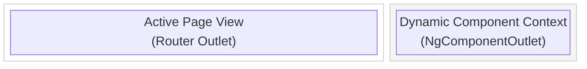
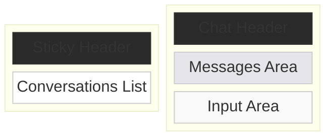
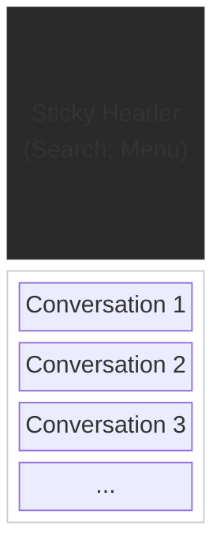
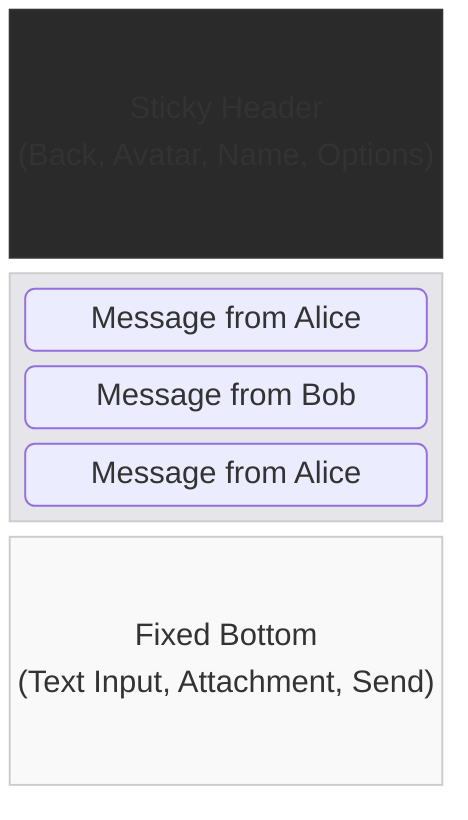
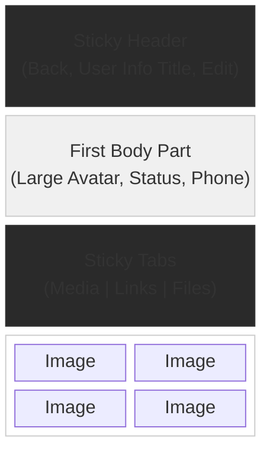

# PWA Messenger Layouts

This document outlines the architectural layouts for the **fourletters** PWA messenger. It focuses on the mobile-first viewport constraints and structural boundaries required for offline-first, performance-minded rendering. Layouts act as strict viewport shells to separate UI behavior from application logic.

## 1. main-layout (Global Application Shell)
The root-level wrapper orchestrating the primary application workspace and dynamic contextual panel. It houses a primary main content area alongside a dynamic side drawer (`mat-sidenav`) that can render auxiliary components fluidly.

* **Context Usage:** App-level shell for main authenticated views.
* **Architectural Boundaries**:
  * **Main Body (`mat-sidenav-content`):** Fluid viewport serving changing page layouts.
  * **Side Panel (`mat-sidenav`):** Expandable over/side container managed globally (`SidePanelService`) to mount dynamic components on demand without leaving the current context.

---

## 2. split-layout (Wide Screens / Desktop View)
A Master-Detail composition designed for wide viewports. It acts as a responsive structural wrapper that concurrently coordinates modular layouts (e.g., standard list and chat interface) into a unified grid.

* **Context Usage:** Main page.
* **Architectural Boundaries**:
  * **Master Pane:** Constraint-bound side orchestration surface.
  * **Detail Pane:** Fluid focal container orchestrating primary interactions.

---

## 3. list-layout (Conversations / List View)
The primary vertical scrolling container. Designed to act as the default document flow for lists, settings, and forms.

* **Context Usage:** Conversations, Contacts, Settings
* **Architectural Boundaries**:
  * **Header Shell:** Persistent top-bound surface for global actions.
  * **Body Shell:** Unbounded vertical flow intended for lists and core content.

---

## 4. chat-layout (Opened-Conversation / Chat View)
An immersive, fixed-height viewport. Strictly bounds the structural grid to the dynamic screen height, preventing standard document scroll and ensuring consistent geometry when native virtual keyboards deploy.

* **Context Usage:** Active messaging sessions.
* **Architectural Boundaries**:
  * **Header Shell:** Contextual focal header.
  * **Body Shell:** Inverse-scrolling layer bridging messages.
  * **Footer Shell:** Fixed input composition area mapped accurately to native device safe-areas.

---

## 5. profile-layout (Account Info / Media View)
A rich detail container orchestrating nested scrolling constraints and sticky surface transitions.

* **Context Usage:** User identity profiles, Group configurations.
* **Architectural Boundaries**:
  * **Header Shell:** Minimal navigational threshold.
  * **Lead Body:** Primary hero context (pictures, bios) shifting with scroll.
  * **Sticky Mid-Shell:** Secondary navigation intercepting the header position on scroll ascent.
  * **Trailing Body:** Flexible space for media grids or additional lists.

