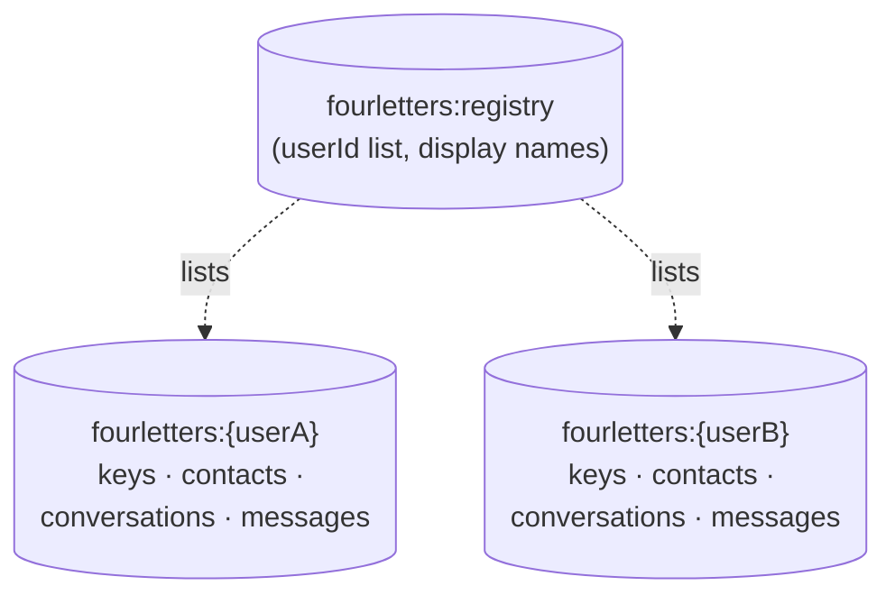
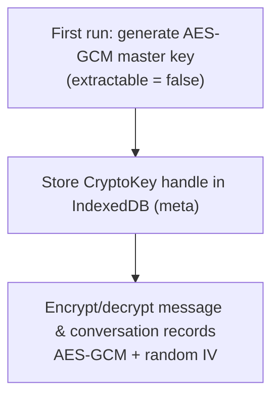
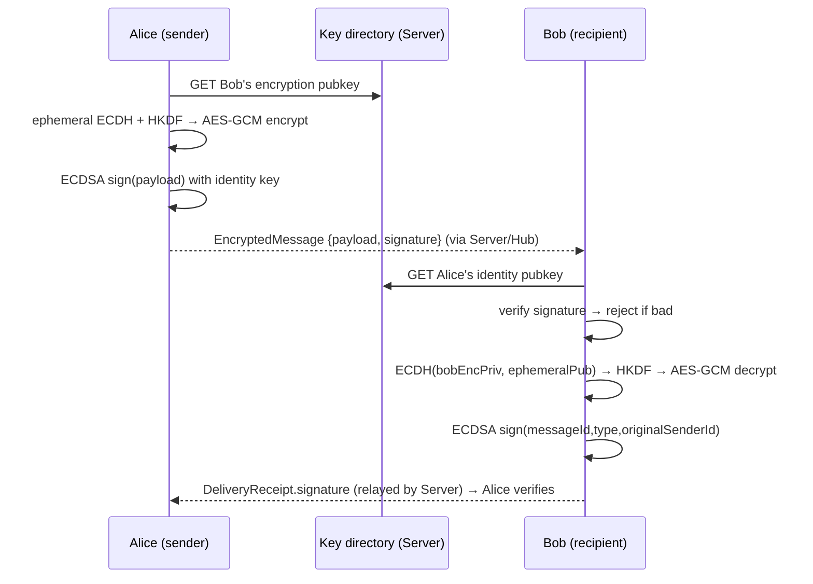
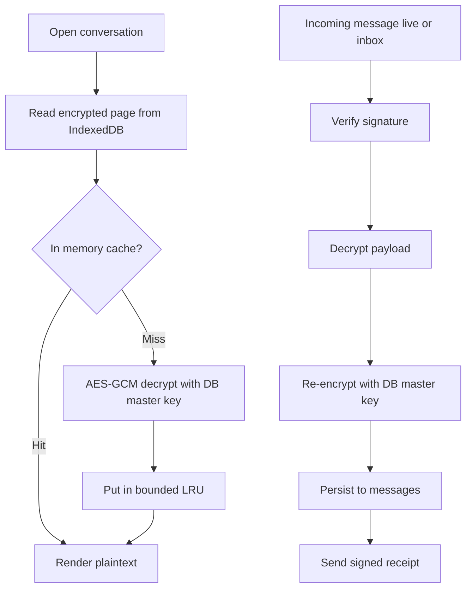

# fourletters — Message Security & Client Data Storage

This document describes the **end-to-end (E2E) cryptography** and the **client-side at-rest storage** model: what keys the PWA creates, how the Server acts as a public-key directory, how messages are encrypted/signed/verified, and how the client stores and loads messages from IndexedDB without leaking plaintext at rest.

It complements the server-side flow in [ARCHITECTURE.md §2.3–§2.6](ARCHITECTURE.md#23-e2e-encryption--key-exchange) and the message lifecycle in [algorithms/messages-lifecycle.md](algorithms/messages-lifecycle.md). The Server and Hub **never see plaintext** — payloads are encrypted on the sender's device and decrypted only on the recipient's.

> **Scope — Phase 1.** Single Server instance, trusted Hubs. The crypto contract here is the same one that makes untrusted volunteer Hubs safe later (see [FUTURE_EXTENSIONS.md](FUTURE_EXTENSIONS.md)).

---

## 1. Client-Side Storage (IndexedDB)

The PWA stores everything locally in **IndexedDB** via [WebCrypto](https://developer.mozilla.org/docs/Web/API/Web_Crypto_API). Plaintext is **never** written to disk: message bodies are stored as ciphertext and decrypted on demand into a volatile in-memory cache.

### 1.1 Per-user databases (multiple users, same browser)

A single browser profile may be shared by several users (e.g. a family device). Each user gets an **isolated IndexedDB database**, named by their Server user id:

```
fourletters:{userId}
```

A small, unencrypted **registry** database (`fourletters:registry`) holds only the list of known `userId`s and display metadata (name, avatar) so the login screen can offer an account picker. It contains **no keys and no message content**.



The **active user** is whichever session is currently authenticated (the access JWT's subject). The app opens only the database matching the authenticated `userId`, so users see separate histories and keys (see the at-rest limitation in [§1.2](#12-at-rest-encryption-of-the-per-user-db)).

Each per-user database has these object stores:

| Object store | Holds | At rest |
| --- | --- | --- |
| `identity` | The user's own key pairs (see [§2](#2-keys-created-at-first-authentication)) | Non-extractable `CryptoKey` handles |
| `contacts` | Cached **public** keys of conversation partners | Plaintext (public keys are not secret) |
| `conversations` | One record per conversation: partner id, last-message preview, unread count, ordering timestamp | **AES-GCM ciphertext** (preview is plaintext-derived) |
| `messages` | Chat history across all conversations, each tagged with its conversation and a delivery `status` | **AES-GCM ciphertext** |
| `meta` | `serverStartedAt`, sync cursors, the DB master key | Mixed (key material is a non-extractable handle) |

There is **no separate outbox store**: an outgoing message is an ordinary `messages` record whose `status` is `pending` or `accepted` until a signed receipt advances it to `delivered`/`read`. Resync and the “unconfirmed outbox” are simply a query over `messages` by `status`.

### 1.2 At-rest encryption of the per-user DB

The at-rest key is a **local, non-extractable AES-GCM master key**, not a server-issued secret — so history decrypts fully **offline**. At first run the client generates a **256-bit AES-GCM master key** with WebCrypto and stores the **`CryptoKey` object itself** in the `meta` store:

- Created with `extractable: false`, so script (including any XSS payload) **cannot read the raw bytes** — it can only *use* the handle to encrypt/decrypt.
- Persisted in IndexedDB and available with **no network**.
- Each `messages` and `conversations` record is encrypted with this key using a fresh random IV (AES-GCM).



> **Known limitation — no cryptographic isolation between users of the same browser profile.** IndexedDB is partitioned per **origin**, not per account-picker user, and a non-extractable `CryptoKey` handle can be *used* by any script on the origin. So the per-user database gives **logical** separation (separate histories and keys, the app opens only the active user's DB) but not a cryptographic barrier: code running on the origin could open another local user's DB and use its master key. The data is still **never plaintext at rest**, **not readable by other origins or websites**, and the raw key bytes are **not exfiltratable** (`extractable: false`). Separate **OS user accounts** *do* provide real isolation — each OS account has its own profile storage, protected by file-system permissions — so the gap applies only to people sharing **one** OS account (or merely separate browser profiles, which are not a security boundary). Binding the master key to a per-user secret so it is usable by **only one** user is deferred — see [FUTURE_EXTENSIONS.md](FUTURE_EXTENSIONS.md#8-per-user-at-rest-key-binding).

Decrypted plaintext lives **only in memory** (a bounded in-RAM cache; see [§5](#5-loading-messages-in-the-gui)) and is dropped on **logout or lock**; the at-rest store stays encrypted. Removing an account from the device deletes its `fourletters:{userId}` database and its registry entry.

---

## 2. Keys Created at First Authentication

On the user's **first** authenticated session on a device, the PWA generates **two distinct key pairs** with WebCrypto (separate keys for separate purposes — never reuse a signing key for encryption):

| Key pair | Algorithm | Purpose | Stored | Published |
| --- | --- | --- | --- | --- |
| **Identity / signing key** | ECDSA P-256 | Sign outgoing messages and delivery/read receipts; verify peers' signatures | Private: non-extractable in `identity`. | Public key → directory |
| **Encryption key** | ECDH P-256 | Derive a shared secret to encrypt/decrypt message payloads | Private: non-extractable in `identity`. | Public key → directory |
| **DB master key** | AES-GCM 256 | At-rest encryption of local stores ([§1.2](#12-encrypting-the-per-user-db--and-staying-readable-offline)) | Non-extractable in `meta`. | **Never** |

Both **private** keys are generated `extractable: false` and stored as `CryptoKey` handles, so they cannot be exfiltrated by script. Both **public** keys are uploaded to the Server's directory (see [§3](#3-server-as-public-key-directory)) so other users can message and verify this user.

### 2.1 Key lifecycle, logout & single-active-device policy

Phase 1 enforces **one active device per user**. The key pairs are generated **only when absent** — the client never regenerates on a login where keys already exist locally. This is what makes the two logout paths behave differently:

| Event | Identity / encryption keys | Messages & conversations | Directory |
| --- | --- | --- | --- |
| **Explicit logout** (user clicks logout) | **Kept** | Kept | Unchanged |
| **Re-login on the same device** (keys present) | Reused | Kept | Unchanged — no upload |
| **First login on a new device / keys absent** | Generated | — | New public keys uploaded (`PUT /keys`), overwriting the previous ones |
| **Forced logout — session revoked** (another device took over) | **Deleted** | **Kept** | Unchanged until next login |

Because a **fresh login revokes the user's other sessions** (see [auth.md](algorithms/auth.md)), signing in on Device B makes Device A's session revoked. On Device A's next refresh the Server reports the session as **revoked**; the client then **deletes only the identity/encryption key pairs** (never the messages, never the DB master key) and returns to the login screen. The user's **local history stays readable** (it is encrypted with the independent DB master key); only the ability to decrypt *new* messages addressed to the old key is gone — those now target Device B's freshly uploaded key.

When the revoked Device A logs in again, it finds **no key pair**, regenerates one, and uploads it (`PUT /keys`) — which in turn revokes Device B. This “latest login wins” ping-pong is the intended single-device UX (one phone/one session, WhatsApp-style).

> **In-flight loss is inherent.** Any message encrypted to the old public key but not yet decrypted before the key rotates is undecryptable by the new device and lost. This is a property of the single-device model, not of the logout flow; spanning one identity across devices is deferred to [FUTURE_EXTENSIONS.md §9](FUTURE_EXTENSIONS.md#9-multi-device-key-handling).

---

## 3. Server as Public-Key Directory

The Server stores and serves public keys only — it is a **directory**, not a key escrow. It never holds any private key. Public keys are not secret; their integrity is what matters (so peers encrypt/verify against the right key).

**Storage (PostgreSQL).** A `public_keys` table keyed by `user_id` holds the signing and encryption public keys (Base64 SPKI) plus timestamps.

**Endpoints** (tag `Keys`):

| Endpoint | Auth | Purpose |
| --- | --- | --- |
| `PUT /keys` | Bearer JWT | Upload/replace the caller's own public keys (`signingPublicKey`, `encryptionPublicKey`). `userId` is taken from the session, never the body. |
| `GET /keys/{userId}` | Bearer JWT | Fetch a user's current public keys to message/verify them. |
| `GET /keys?ids=…` | Bearer JWT | Batch fetch for multiple contacts. |

The client **caches** fetched public keys in its `contacts` store and refreshes on signature/decryption failure (a key may have rotated). Trust-on-first-use in Phase 1; an out-of-band fingerprint check is a later hardening.

> Distinct from the **JWKS** endpoint, which publishes the **Server's** JWT-signing keys for the Hub to validate access tokens — unrelated to user E2E keys.

---

## 4. Signing, Verifying & Decrypting

### Sending (on Alice's device)

1. **Encrypt.** Fetch Bob's **encryption** public key (ECDH P-256) from the directory/cache. Generate an **ephemeral ECDH key pair**, derive a shared secret `ECDH(ephemeralPriv, bobEncPub)`, run it through HKDF to an AES-GCM key, and encrypt the plaintext with a random IV. The wire `payload` (Base64) carries the ephemeral public key + IV + ciphertext.
2. **Sign.** Produce a detached **ECDSA** signature over the `payload` with Alice's **identity private key**. This is `EncryptedMessage.signature` ([models.json](models.json)).
3. **Send.** `POST /messages` to the Server (which stamps `senderId` from the session) and keep the record in `messages` with `status = pending` until the `accepted` response, then `accepted`.

### Receiving (on Bob's device)

1. **Verify signature.** Fetch Alice's **identity** public key; verify the ECDSA signature over `payload`. Reject on failure (forged/altered by a relay).
2. **Decrypt.** Read the ephemeral public key from `payload`, derive `ECDH(bobEncPriv, ephemeralPub)` → HKDF → AES-GCM key, and decrypt with the carried IV.
3. **Acknowledge.** Build a `DeliveryReceipt`: sign `(messageId, type, originalSenderId)` with Bob's **identity private key** and `POST /receipts`. The Server relays this `signature` unaltered to Alice, who verifies it against Bob's identity public key — an E2E, relay-independent delivery/read proof (see [algorithms/messages-lifecycle.md](algorithms/messages-lifecycle.md)).



**Why two operations.** Encryption gives **confidentiality** (only Bob reads it); the signature gives **authenticity/integrity** (it really came from Alice, unaltered) and is what lets the receipt path stay trustworthy even over an untrusted Hub.

---

## 5. Loading Messages in the GUI

Messages are stored **encrypted** and decrypted **lazily**, never eagerly for the whole history. A bounded in-memory cache holds recently viewed plaintext and is cleared on logout/lock.

**Opening a conversation (read path):**
1. Read the **encrypted** records for that conversation from `messages` (paged — only the visible window + a small look-ahead).
2. For each, check the in-memory plaintext cache; on a miss, **AES-GCM decrypt** with the DB master key and insert into the cache (bounded LRU).
3. Render plaintext from the cache. Scrolling pages in older records the same way.

**Incoming message (live or via `GET /inbox`):**
1. **Verify** the sender's signature; **decrypt** the payload ([§4](#4-signing-verifying--decrypting)).
2. **Re-encrypt** with the local DB master key and persist to `messages` (de-dupe by `messageId`).
3. Update the conversation list; if that conversation is open, decrypt-on-demand into the cache and render.
4. Send the signed `delivered` (and later `read`) receipt.



**Properties:**
- **At rest:** only ciphertext and public keys touch disk; private and master keys are non-extractable handles.
- **In memory:** plaintext exists only transiently and is dropped on logout/lock.
- **Offline:** history decrypts with the local master key, no network needed.
- **Lazy:** decryption cost is paid per viewed message, not for the whole archive on load.
