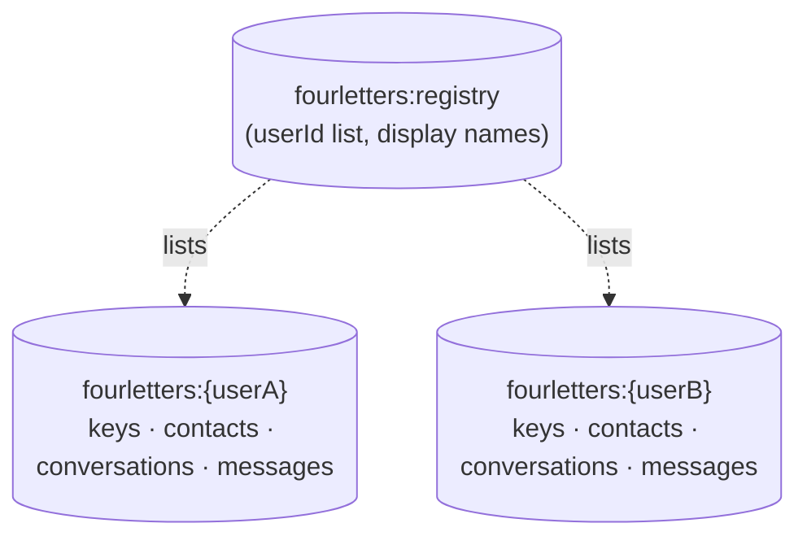
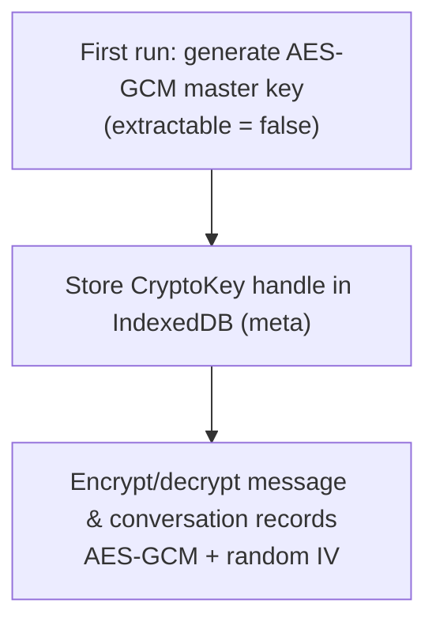
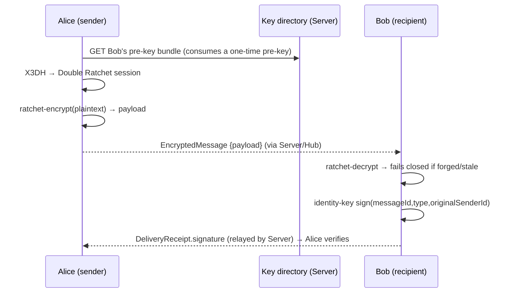
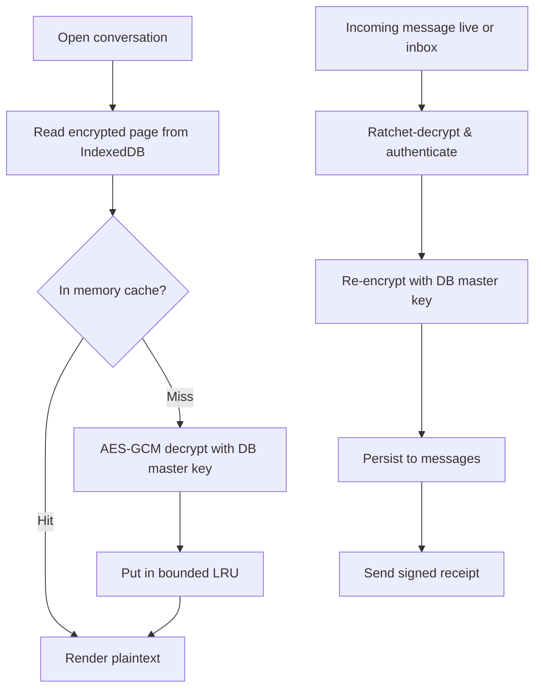

# fourletters — Message Security & Client Data Storage

This document describes the **end-to-end (E2E) cryptography** and the **client-side at-rest storage** model: what keys the PWA creates, how the Server acts as a key directory, how messages are protected with the **Signal protocol**, and how the client stores and loads messages from IndexedDB without leaking plaintext at rest.

fourletters does not invent its own message crypto. 1:1 messaging uses the **Signal protocol** — **X3DH** for the initial key agreement and the **Double Ratchet** for ongoing messages — via the community [`@privacyresearch/libsignal-protocol-typescript`](https://github.com/privacyresearch/libsignal-protocol-typescript) library (Curve25519 · AES-CBC · HMAC-SHA256). Because Signal is a published, widely-audited standard, this document leans on its guarantees (confidentiality, authenticity, forward secrecy, post-compromise security) rather than re-deriving them, and focuses on the parts specific to fourletters: key generation, the directory, key-change detection, group fan-out, and at-rest storage.

It complements the server-side flow in [ARCHITECTURE.md §2.3–§2.6](ARCHITECTURE.md#23-e2e-encryption--key-exchange) and the message lifecycle in [algorithms/messages-lifecycle.md](algorithms/messages-lifecycle.md). The Server and Hub **never see plaintext** — payloads are encrypted on the sender's device and decrypted only on the recipient's.

> **Scope — Phase 1.** Single Server instance, trusted Hubs. The crypto contract here is the same one that makes untrusted volunteer Hubs safe later (see [FUTURE_EXTENSIONS.md](FUTURE_EXTENSIONS.md)).

---

## 1. Client-Side Storage (IndexedDB)

The PWA stores everything locally in **IndexedDB** via [WebCrypto](https://developer.mozilla.org/docs/Web/API/Web_Crypto_API). Plaintext is **never** written to disk: message bodies are stored as ciphertext and decrypted on demand into a volatile in-memory cache.

### 1.1 Per-user databases (multiple users, same browser)

A single browser profile may be shared by several users (e.g. a family device). Each user gets an **isolated IndexedDB database**, named by their Server user id:

```
fourletters:{userId}
```

A small, unencrypted **registry** database (`fourletters:registry`) holds only the list of known `userId`s and display metadata (name, avatar) so the login screen can offer an account picker. It contains **no keys and no message content**.



The **active user** is whichever session is currently authenticated (the access JWT's subject). The app opens only the database matching the authenticated `userId`, so users see separate histories and keys (see the at-rest limitation in [§1.2](#12-at-rest-encryption-of-the-per-user-db)).

Each per-user database has these object stores:

| Object store | Holds | At rest |
| --- | --- | --- |
| `signalIdentity`, `signalSignedPreKeys`, `signalPreKeys`, `signalSessions`, `signalRemoteIdentities` | The user's own Signal identity, signed/one-time pre-keys, and per-contact **Double Ratchet session** state (see [§2](#2-keys-created-at-first-authentication)) | Raw key/session bytes (origin-partitioned; see [§2.2](#22-where-the-signal-keys-live)) |
| `contacts` | Each partner's pinned **public** identity key, registration id and key fingerprint | Plaintext (public keys are not secret) |
| `conversations` | One record per conversation: partner id, last-message preview, unread count, ordering timestamp | **AES-GCM ciphertext** (preview is plaintext-derived) |
| `messages` | Chat history across all conversations, each tagged with its conversation and a delivery `status` | **AES-GCM ciphertext** |
| `meta` | `serverStartedAt`, sync cursors, the DB master key | Mixed (the AES-GCM master key is a non-extractable handle) |

There is **no separate outbox store**: an outgoing message is an ordinary `messages` record whose `status` is `pending` or `accepted` until a signed receipt advances it to `delivered`/`read`. Resync and the “unconfirmed outbox” are simply a query over `messages` by `status`.

### 1.2 At-rest encryption of the per-user DB

The at-rest key is a **local, non-extractable AES-GCM master key**, not a server-issued secret — so history decrypts fully **offline**. At first run the client generates a **256-bit AES-GCM master key** with WebCrypto and stores the **`CryptoKey` object itself** in the `meta` store:

- Created with `extractable: false`, so script (including any XSS payload) **cannot read the raw bytes** — it can only *use* the handle to encrypt/decrypt.
- Persisted in IndexedDB and available with **no network**.
- Each `messages` and `conversations` record is encrypted with this key using a fresh random IV (AES-GCM).



> **Known limitation — no cryptographic isolation between users of the same browser profile.** IndexedDB is partitioned per **origin**, not per account-picker user, and a non-extractable `CryptoKey` handle can be *used* by any script on the origin. So the per-user database gives **logical** separation (separate histories and keys, the app opens only the active user's DB) but not a cryptographic barrier: code running on the origin could open another local user's DB and use its master key. The data is still **never plaintext at rest**, **not readable by other origins or websites**, and the raw key bytes are **not exfiltratable** (`extractable: false`). Separate **OS user accounts** *do* provide real isolation — each OS account has its own profile storage, protected by file-system permissions — so the gap applies only to people sharing **one** OS account (or merely separate browser profiles, which are not a security boundary). Binding the master key to a per-user secret so it is usable by **only one** user is deferred — see [FUTURE_EXTENSIONS.md](FUTURE_EXTENSIONS.md#8-per-user-at-rest-key-binding).

Decrypted plaintext lives **only in memory** (a bounded in-RAM cache; see [§5](#5-loading-messages-in-the-gui)) and is dropped on **logout or lock**; the at-rest store stays encrypted. Removing an account from the device deletes its `fourletters:{userId}` database and its registry entry.

---

## 2. Keys Created at First Authentication

On the user's **first** authenticated session on a device, the PWA generates a fresh **Signal identity** plus an initial set of pre-keys with the Signal library, and an independent at-rest **DB master key** with WebCrypto:

| Material | Type | Purpose | Stored | Published |
| --- | --- | --- | --- | --- |
| **Identity key pair** | Curve25519 | Long-lived identity; roots X3DH, signs the signed pre-key and signs receipts | `signalIdentity` | Public key → directory |
| **Registration id** | int | Signal registration identifier for this device | `signalIdentity` | → directory |
| **Signed pre-key** | Curve25519 + identity signature | Medium-lived key used to set up X3DH sessions | `signalSignedPreKeys` | → directory |
| **One-time pre-keys** | Curve25519 (pool) | One consumed per new inbound session, for forward secrecy | `signalPreKeys` | Pool → directory |
| **DB master key** | AES-GCM 256 | At-rest encryption of local stores ([§1.2](#12-at-rest-encryption-of-the-per-user-db)) | `meta` (non-extractable handle) | **Never** |

The identity key, signed pre-key and one-time pre-keys together form the **pre-key bundle** uploaded to the directory ([§3](#3-server-as-public-key-directory)); a peer fetches it to open a Double Ratchet session. **Per-contact session state** — the ratchet keys that evolve as messages flow — is created on first contact and kept in `signalSessions`; it is **never** uploaded. Signal derives all message keys internally from one identity, so there is no longer a separate signing-vs-encryption key pair as in earlier versions.

The PWA keeps the one-time pre-key pool topped up: on startup it calls `GET /keys/prekeys/count` and, when the remaining count is below a low-watermark, generates a new batch and appends it with `POST /keys/prekeys` ([§3](#3-server-as-public-key-directory)).

### 2.1 Key lifecycle, logout & single-active-device policy

Phase 1 enforces **one active device per user**. The Signal identity is generated **only when absent** — the client never regenerates on a login where local Signal state already exists. This is what makes the two logout paths behave differently:

| Event | Signal identity & session state | Messages & conversations | Directory |
| --- | --- | --- | --- |
| **Explicit logout** (user clicks logout) | **Kept** | Kept | Unchanged |
| **Re-login on the same device** (identity present) | Reused | Kept | Unchanged — no upload |
| **First login on a new device / identity absent** | Generated | — | New pre-key bundle uploaded (`PUT /keys`), overwriting the previous one |
| **Forced logout — session revoked** (another device took over) | **Wiped** (identity, pre-keys, sessions) | **Kept** | Unchanged until next login |

Because a **fresh login revokes the user's other sessions** (see [auth.md](algorithms/auth.md)), signing in on Device B makes Device A's session revoked. On Device A's next refresh the Server reports the session as **revoked**; the client then **wipes all local Signal state** (never the messages, never the DB master key) and returns to the login screen. The user's **local history stays readable** (it is encrypted with the independent DB master key); only the ability to decrypt *new* messages addressed to the old identity is gone — those now target Device B's freshly uploaded bundle.

When the revoked Device A logs in again, it finds **no Signal identity**, regenerates one, and uploads a new bundle (`PUT /keys`) — which in turn revokes Device B. This “latest login wins” ping-pong is the intended single-device UX (one phone/one session, WhatsApp-style).

**What a new-device login does, end to end:**

1. OAuth succeeds → access token issued → the user's **other session is revoked** ([auth.md](algorithms/auth.md)).
2. The device finds **no local Signal identity** and generates a fresh identity + signed pre-key + one-time pre-key pool.
3. It publishes the new bundle with `PUT /keys`, **overwriting** the directory entry.
4. New sessions now target the new identity; the new device has **no history** and cannot read anything sealed to the old identity (accepted trade-off — see below).
5. **On every contact's device,** the next interaction reconciles the changed identity and shows *"X's security code changed"* ([§3.1](#31-key-change-detection-security-code-changed)) — auto-accepted, non-blocking.
6. **Groups:** nothing special. A group message is sent as one independent 1:1 copy per member through that member's *current* session ([ARCHITECTURE.md §2.7](ARCHITECTURE.md#27-group-messaging-client-side-11-fan-out)), so the new device simply receives subsequent group messages under its new identity like any 1:1. As with 1:1, history that lived only on the old device is not carried over.

> **In-flight messages self-heal via a negative ack.** A message already accepted by the Server but sealed to the *old* identity cannot be opened by the new device — the Double Ratchet has no matching session/pre-key, so the decrypt fails. The new device returns a signed **`undecryptable`** receipt, which makes the Server **drop the retained copy** and relay a NACK to the sender; the sender re-fetches the new bundle (re-pinning it, [§3.1](#31-key-change-detection-security-code-changed)) and **resends once** under a fresh session. So such a message is *recovered*, not lost — see [ARCHITECTURE.md §2.5](ARCHITECTURE.md#25-delivery-guarantee-server-retained-copy--signed-receipt) and [messages-lifecycle.md](algorithms/messages-lifecycle.md#undecryptable--the-negative-ack). What is genuinely **lost** is only history that lived solely on the old device (never re-sent) — spanning one identity across devices is deferred to [FUTURE_EXTENSIONS.md §9](FUTURE_EXTENSIONS.md#9-multi-device-key-handling).

### 2.2 Where the Signal keys live

The AES-GCM **DB master key** is a non-extractable WebCrypto `CryptoKey` handle ([§1.2](#12-at-rest-encryption-of-the-per-user-db)). The **Signal** private keys (identity, pre-keys) and ratchet **session** state are different: the library operates on **raw key bytes**, so they are stored as ordinary values in the per-user IndexedDB database, not as non-extractable handles. They are protected by **origin partitioning** (no other website can read them) and never leave the device, but — unlike the master key — their raw bytes are reachable by script running on the origin. This is the same trust boundary as the at-rest data ([§1.2 limitation](#12-at-rest-encryption-of-the-per-user-db)): real isolation comes from separate **OS user accounts**. Binding this material to a per-user secret is deferred — see [FUTURE_EXTENSIONS.md §8](FUTURE_EXTENSIONS.md#8-per-user-at-rest-key-binding).

---


## 3. Server as Public-Key Directory

The Server stores and serves **pre-key bundles** only — it is a **directory**, not a key escrow. It never holds any private key. The bundle contents are public; their integrity is what matters (so peers open sessions against the right identity).

**Storage (PostgreSQL).** A `public_keys` table keyed by `user_id` holds the **identity key** (Base64), the **registration id**, and the current **signed pre-key** (id, public key, identity signature) plus timestamps. A companion `one_time_prekeys` table holds each user's **pool** of one-time pre-keys; the server hands one out per fetch and deletes it.

**Endpoints** (tag `Keys`):

| Endpoint | Auth | Purpose |
| --- | --- | --- |
| `PUT /keys` | Bearer JWT | Upload/replace the caller's whole **pre-key bundle** (`registrationId`, `identityKey`, `signedPreKey`, `oneTimePreKeys`). `userId` is taken from the session, never the body. |
| `GET /keys/{userId}` | Bearer JWT | Fetch a user's bundle to open a session. **Consumes** one one-time pre-key (returned in the response, then deleted). |
| `GET /keys?ids=…` | Bearer JWT | Batch fetch bundles for multiple contacts. |
| `POST /keys/prekeys` | Bearer JWT | Append more one-time pre-keys when the pool runs low. |
| `GET /keys/prekeys/count` | Bearer JWT | How many one-time pre-keys the caller still has, so the client can top up below a threshold. |

The client **caches** a fetched contact's identity key and registration id in its `contacts` store and re-fetches when a session needs rebuilding or a receipt signature fails (the identity may have rotated). Trust-on-first-use in Phase 1; the **key-change detection** below ([§3.1](#31-key-change-detection-security-code-changed)) is the hardening that makes a swapped identity *visible*.

> Distinct from the **JWKS** endpoint, which publishes the **Server's** JWT-signing keys for the Hub to validate access tokens — unrelated to user E2E keys.

### 3.1 Key-change detection ("security code changed")

The Server writes the directory, so a malicious/compromised Server *can* publish a fake identity. E2EE does not prevent that — it makes it **detectable on the clients**. Each cached contact is **pinned**: alongside its identity key the `contacts` record stores a **fingerprint** `SHA-256(Base64 identityKey)`. Whenever the client newly learns a contact's directory identity, it compares the fresh fingerprint to the pinned one.

| First time seen (no pin) | Trust-on-first-use: accept and pin silently. No banner. |
| --- | --- |
| Fingerprint **matches** pin | Normal path, nothing shown. |
| Fingerprint **differs** | **Re-pin** the new identity (auto-accept) **and** raise a non-blocking *"X's security code changed"* banner in that conversation (a `system` message). |

Detection is **event-driven — no polling**. The pin is re-checked only on moments that already happen:

- **The Double Ratchet reports a changed remote identity** — the primary detector. When the library establishes or continues a session and the peer's identity key differs from the one on record, fourletters re-fetches the bundle, re-pins, and raises the banner. A changed identity after a peer's device switch surfaces here.
- **A receipt signature fails against the pinned identity.** Receipts travel *outside* the ratchet ([§4](#4-session-establishment--messaging)), so they carry an explicit identity-key signature. A verification failure triggers a single re-fetch: if the *fresh* identity verifies it is a legitimate rotation (re-pin + banner), otherwise it is a genuinely bad signature (drop, do **not** re-pin).

Groups reuse the identical path per member, so a member's device switch surfaces as *"Y's security code changed"* in the group and re-pins that member's identity for subsequent per-member sends.

> **Level 1 (notice), by design.** The banner is informational and never blocks sending — a new-device login *legitimately* changes the code (see [§2.1](#21-key-lifecycle-logout--single-active-device-policy)). It converts a *silent* server identity-swap into a *visible* one. True defeat of a malicious Server needs an **out-of-band** safety-number comparison (Level 2), which single-active-device cannot automate; it is offered only as an optional manual verification.


---

## 4. Session Establishment & Messaging

fourletters delegates all 1:1 message crypto to the **Signal protocol**: **X3DH** sets up a shared session from a fetched pre-key bundle, and the **Double Ratchet** encrypts and authenticates every subsequent message with a fresh key. There is **no per-message detached signature on chat messages** — the ratchet itself provides confidentiality, integrity and authenticity, with forward secrecy and post-compromise security. fourletters only adds an explicit identity-key signature to **receipts**, because those travel outside the ratchet (relayed by the Server) and must be trustworthy without trusting any Hub.

### Sending (on Alice's device)

1. **Open a session if needed.** If there is no `signalSessions` entry for Bob, fetch his bundle (`GET /keys/{userId}`, which consumes a one-time pre-key) and run **X3DH** to establish the session.
2. **Ratchet-encrypt.** Encrypt the plaintext with the Double Ratchet `SessionCipher`. The result is wrapped as the wire `payload` (`${type}.${base64(body)}`, where `type` distinguishes a pre-key vs. a normal ratchet message). Chat messages carry **no** separate signature — the ratchet authenticates them.
3. **Send.** `POST /messages` to the Server (which stamps `senderId` from the session) and keep the record in `messages` with `status = pending` until the `accepted` response.

### Receiving (on Bob's device)

1. **Ratchet-decrypt.** Split the `payload`; a pre-key message establishes the inbound session (consuming Bob's matching one-time pre-key) while decrypting, a normal message advances the existing ratchet. Decryption **fails closed** if the message was forged, altered, or sealed to a stale identity — no separate verify step is needed.
2. **Acknowledge.** Build a `DeliveryReceipt`: sign `(messageId, type, originalSenderId)` with Bob's **identity private key** and `POST /receipts`. The Server relays this `signature` unaltered to Alice, who verifies it against Bob's pinned identity key — an E2E, relay-independent delivery/read proof (see [algorithms/messages-lifecycle.md](algorithms/messages-lifecycle.md)).



**Why receipts still carry a signature.** Chat messages are protected end-to-end by the ratchet, so they need nothing extra. Receipts are small status facts the Server relays; the explicit identity-key signature is what lets Alice trust a `delivered`/`read`/`undecryptable` proof even over an untrusted Hub.

---

## 5. Loading Messages in the GUI

Messages are stored **encrypted** and decrypted **lazily**, never eagerly for the whole history. A bounded in-memory cache holds recently viewed plaintext and is cleared on logout/lock.

**Opening a conversation (read path):**
1. Read the **encrypted** records for that conversation from `messages` (paged — only the visible window + a small look-ahead).
2. For each, check the in-memory plaintext cache; on a miss, **AES-GCM decrypt** with the DB master key and insert into the cache (bounded LRU).
3. Render plaintext from the cache. Scrolling pages in older records the same way.

**Incoming message (live or via `GET /inbox`):**
1. **Ratchet-decrypt** the payload ([§4](#4-session-establishment--messaging)) — this also authenticates it.
2. **Re-encrypt** with the local DB master key and persist to `messages` (de-dupe by `messageId`).
3. Update the conversation list; if that conversation is open, decrypt-on-demand into the cache and render.
4. Send the signed `delivered` (and later `read`) receipt.



**Properties:**
- **At rest:** only ciphertext and public keys touch disk; the master key is a non-extractable handle, the Signal keys are origin-partitioned raw bytes ([§2.2](#22-where-the-signal-keys-live)).
- **In memory:** plaintext exists only transiently and is dropped on logout/lock.
- **Offline:** history decrypts with the local master key, no network needed.
- **Lazy:** decryption cost is paid per viewed message, not for the whole archive on load.

---

## 6. Group Encryption (Client-Side 1:1 Fan-Out)

A group message is **not** a distinct cryptographic primitive: it is sent as **N independent 1:1 messages**, one per other member, each going through that member's own **Double Ratchet session** exactly like a direct message ([§4](#4-session-establishment--messaging)). There is **no group key, no epoch, and no rotation**. The server-side flow is in [ARCHITECTURE.md §2.7](ARCHITECTURE.md#27-group-messaging-client-side-11-fan-out); this section is the client crypto.

### 6.1 Sending

1. Read the group **roster** (`GET /groups/{id}`) to get the member list; drop the sender.
2. For **each** remaining member, use (or open) that member's ratchet session and **ratchet-encrypt** the plaintext into a per-member `payload` exactly as in [§4](#4-session-establishment--messaging).
3. `POST /messages` once per member with the **same** `messageId`, that member's `recipientId`, the `groupId`, and the per-member `payload`.

Each copy is an ordinary 1:1 message to the Server; the shared `messageId` lets the sender track the group send as one local message, and `groupId` lets each recipient thread it.

### 6.2 Receiving

Identical to a 1:1 message: **ratchet-decrypt** the payload with the recipient's session (which authenticates it), then re-encrypt with the local DB master key and persist as an ordinary `messages` record ([§5](#5-loading-messages-in-the-gui)). The `groupId` selects the group conversation to thread it into.

### 6.3 Membership & new devices

- **Roster** is owned by the Server (`groups` + `group_members`); the owner adds/removes members (`PATCH /members`), any member may leave (`DELETE /members/me`). Removing a member simply stops future fan-out to them.
- **New device:** no special handling. Because every copy goes through each member's *current* session at send time, a member on a new device receives subsequent group messages under its new identity like any 1:1. A copy that raced a key change and fails to decrypt is repaired by the **`undecryptable` negative-ack** ([§2.1](#21-key-lifecycle-logout--single-active-device-policy)).

> **Security trade-off.** This model gives the same per-message confidentiality and per-sender authenticity as 1:1, and "a removed member stops receiving new messages." It does **not** provide cryptographic forward/backward secrecy across membership changes. A richer sender-key / MLS scheme that adds those guarantees is deferred — see [FUTURE_EXTENSIONS.md §10](FUTURE_EXTENSIONS.md#10-group-sender-keys--rotation). Cost scales as O(N) ciphertexts per message, acceptable for the small groups Phase 1 targets.

