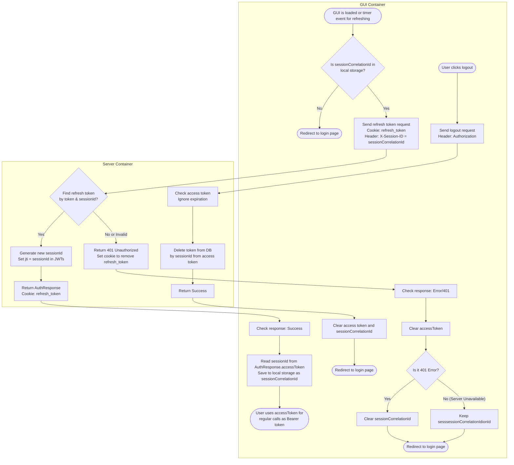

# Authentication & Token Refresh Algorithm

This document provides a detailed block algorithm mapping out the authentication, token refreshing, and logout flows.

For a high-level overview of the user identification process, refer to [2.1 Authentication & Identity (Token Validation Flow)](../ARCHITECTURE.md#21-authentication--identity-token-validation-flow).

## Token Storage Strategy
- **Access Token:** Not stored persistently anywhere (kept only in application memory).
- **Session ID (`sessionId`):** Stored in local storage.
- **Refresh Token:** Stored securely as an `HttpOnly` cookie.

## Edge Cases & Concurrency (ToDo)
- **Strict Rotation & Grace Period:** Currently, strict rotation is enforced (only one active refresh token per session is valid at a time). In rare multi-tab scenarios, concurrent refresh requests might lead to a 401 Unauthorized for the slower tab, which is acceptable from a strict security standpoint. However, for a better User Experience, a short **grace period** may be implemented on the backend to temporarily accept a recently invalidated refresh token to gracefully handle concurrent multi-tab refreshes.
- **Database Cleanup:** Orphaned session entries (e.g., created during concurrent multi-tab refreshes or missed logouts) are not permanently leaked. A backend scheduled job automatically cleans up expired refresh tokens from the database.
- **XSS & Session ID Manipulation:** If an attacker executes a Cross-Site Scripting (XSS) attack and alters the `sessionId` stored in local storage, the next token refresh attempt will fail. The server will reject the request due to a mismatch between the `HttpOnly` refresh token cookie and the altered `sessionId`. This causes an automatic logout (a targeted Denial of Service), but successfully prevents session hijacking, as the attacker cannot access the `HttpOnly` cookie.

## Block Algorithm

Below is the flowchart illustrating the step-by-step logic executed by the GUI and Server containers.

## Single-Active-Device Policy

Phase 1 enforces **one active device (session) per user**. A device is "active" exactly while its refresh token is valid.

- **Fresh login revokes the other sessions.** On a non-refresh login (`POST /auth/{provider}`), after validating the OAuth token the Server **revokes all of the user's existing refresh tokens** and then issues the new session. So signing in on a new device silently invalidates the previous one.

  > **Note:** the `refresh_tokens` table can hold **multiple rows per `user_id`** (one per session), so it is structurally multi-session capable; single-active-device is enforced here as a **policy** by revoking the user's other rows on fresh login. (`session_id` is just a client-side correlation handle — the GUI drops it to neutralize the cookie when a logout gets no response — not the multi-session mechanism.) Revisit if a multi-session policy (keep N devices) is ever wanted.

- **Revoked is a distinct signal from expired.** A refresh request whose token was revoked by a newer login returns `401` with body `{ "reason": "revoked" }`, as opposed to a plain `401` for an expired/missing token. The client uses this to decide whether to **wipe E2E keys** (see below), not merely to re-authenticate.

- **Client reaction to `revoked`.** On a `revoked` refresh response the client **deletes only the identity/encryption key pairs** (it keeps the messages, conversations, and the DB master key, so local history stays readable) and returns to login. On the subsequent login it finds no key pair, regenerates one, and re-uploads the public keys (`PUT /keys`). See [MESSAGE_SECURITY.md §2.1](../MESSAGE_SECURITY.md#21-key-lifecycle-logout--single-active-device-policy).

- **Explicit logout keeps keys.** A user-initiated logout only deletes the server-side refresh token (by `sessionId`) and clears the client's access token + `sessionId`; the identity/encryption keys remain so re-login on the same device is seamless and does not rotate the directory.