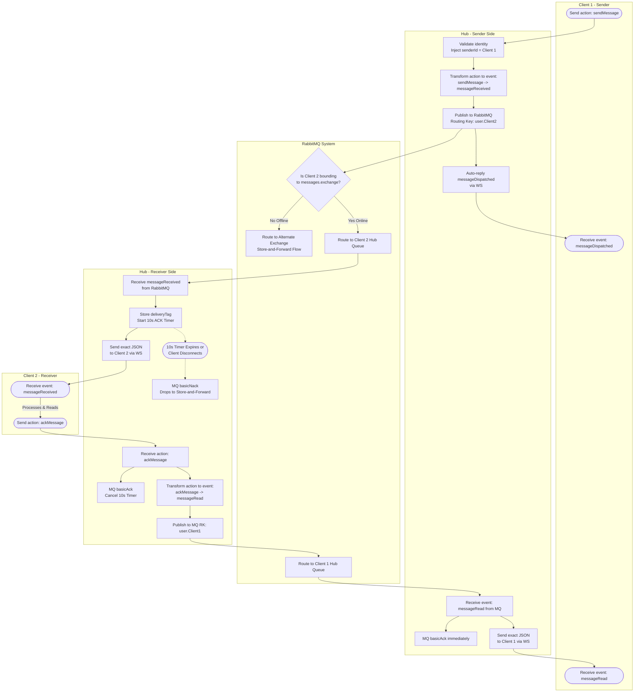

# Hub WebSocket Handler Logic

This document maps out the specific execution logic inside the `HubWebSocketHandler`, detailing the responsibilities of the Hub as an intermediary between the Angular PWA Client and the RabbitMQ Broker.

It illustrates how the Hub handles incoming WebSocket messages from the client (`sendMessage`, `ackMessage`), how it handles incoming RabbitMQ payloads, event transformations, manual acknowledgements, and failure-scenario timeouts.

## Core Responsibilities
1. **Security / Identity:** Validates the JWT (via Principal) and strictly overrides the `senderId` on outgoing messages to prevent spoofing.
2. **Event Transformation:** Translates client "Actions" (intentions) into "Events" (notifications) for the receiving client.
   - `action: sendMessage` ➔ `event: messageReceived`
   - `action: ackMessage` ➔ `event: messageRead`
3. **Guaranteed Delivery:** Employs Manual ACKs and Timeout Timers to ensure messages are not deleted from RabbitMQ until the PWA definitively acknowledges them.

## Handling Missing DTO Data (The `senderId` Issue)
*Note:* For read-receipts (`messageRead`) to be successfully forwarded back to the original sender via RabbitMQ, the Hub needs to know the original target `senderId`. Since the Hub operates statelessly (reconnections wipe memory map caches), the `AckMessagePayload` / `ClientMessageAck` DTO passed from the client *must* contain the target `senderId` (the user who sent the original message). Once the Hub uses this target routing key to securely inject the message into RabbitMQ, it **transforms the data natively into the `EventMessageReceipt` DTO schema**, which naturally ignores the sender and structures the payload correctly for the WebSocket client mapping!

---

## Block Algorithm

Below is the step-by-step sequential flowchart illustrating a message flying from Client 1, passing through the backend logic, reaching Client 2, and generating a Read Receipt back to Client 1.

