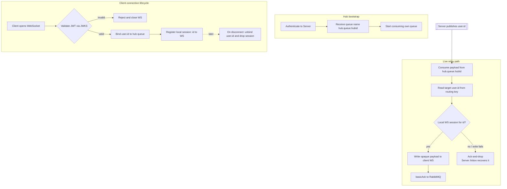

# Hub WebSocket Handler Logic

This document maps out the execution logic inside the `HubWebSocketHandler`. In the fourletters architecture the Hub is a **receive-only live relay**: it pushes already-accepted, E2E-encrypted payloads from RabbitMQ to the recipient's WebSocket. It never accepts message sends, never owns durability, and never inspects or transforms payloads.

For the surrounding context see [2.4 Message Sending & Receiving](../ARCHITECTURE.md#24-message-sending--receiving-server-owned-inbox) and [2.5 Delivery Guarantee](../ARCHITECTURE.md#25-delivery-guarantee-server-retained-copy--signed-receipt) in the architecture document, and the [RabbitMQ topology](rabbitmq-exchange.md) for object ownership.

## Core Responsibilities
1. **Registration:** on boot the Hub authenticates to the Server and receives its queue name `hub.queue.{hubId}`, then begins consuming. The Hub has **no permission to declare queues** — the Server provisions the queue (see [RabbitMQ topology](rabbitmq-exchange.md#object-ownership--lifecycle)).
2. **Connection authorization & presence:** on a client WebSocket connect, the Hub validates the client's **Access JWT** (the short-lived access token, verified cryptographically via the Server's JWKS — no DB lookup) and then **binds `user.{id}`** to its queue. On disconnect it **unbinds**. A binding therefore *is* live presence.
3. **Live relay:** the Hub consumes a payload from its queue, looks up the local WebSocket session for the target user, and pushes the **opaque** payload over the socket.

## What the Hub does NOT do

The Hub is intentionally a dumb pipe. The following responsibilities live elsewhere:

- **It does not accept `sendMessage`.** Clients send by `POST`ing to the **Server** over HTTPS; sending never transits a Hub.
- **It does not handle delivery/read receipts.** The recipient sends **signed** receipts **directly to the Server** over HTTPS, out of band from the Hub.
- **It does not inject `senderId` or guard against spoofing.** Sender identity is bound by the **Server** at send time, and payloads are **signed end-to-end** by the sender's identity key (verified by the recipient against the key directory).
- **It does not transform actions into events.** Payloads are opaque; any event semantics (e.g. a "read" notification) are produced by the **Server** before it publishes.
- **It does not provide durability.** RabbitMQ is non-durable live fan-out. A missed live delivery is recovered by the Server's `GET /api/inbox?since=<seq>` sync — there is **no 10s ACK timer and no store-and-forward**.

## Identity & Forwarding

The Hub treats every consumed payload as an **opaque envelope** addressed by routing key `user.{id}`. It maintains a local map `{id} → WebSocket session`, and on consume it writes the frame to the matching session without reading or modifying the ciphertext. Because the Hub **never publishes** to `messages.exchange`, it cannot inject or alter sender identity at all; spoofing is prevented upstream (Server identity binding) and end-to-end (sender signature).

## Acknowledgement Model

The Hub consumes with **manual ack** and acks RabbitMQ once the payload has been written to the client's WebSocket. If the target user has **no live session** (e.g. it just disconnected) or the write fails, the Hub simply **discards the delivery (ack-and-drop)**. Nothing is lost: the Server retains the copy until it receives a signed receipt, otherwise flushes it to the durable inbox, and the client pulls it on reconnect via `GET /api/inbox?since=<seq>`. There are no timers and no nack-to-store-and-forward, because the delivery guarantee lives entirely in the Server, not in the Hub or the broker.

## Example: Read Receipts Are Server-Driven

To illustrate the Hub's content-agnostic role: when Bob reads a message, Bob's client `POST`s a **signed `read` receipt to the Server** (HTTPS, *not* the Hub). The Server records it and **publishes `user.alice`** carrying the read event. Alice's Hub consumes `user.alice` and pushes it to Alice's WebSocket exactly like any other payload — the Hub neither generated nor understood the event.

---

## Block Algorithm

Below is the flowchart of the Hub's logic: bootstrap, per-connection authorization/presence, and the live relay path. Sending and receipts (dotted) bypass the Hub entirely.

