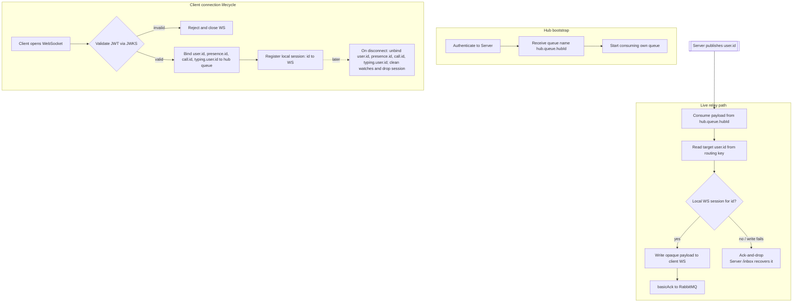

# Hub WebSocket Handler Logic

This document maps out the execution logic inside the `HubWebSocketHandler`. In the fourletters architecture the Hub is a **live relay**: it pushes already-accepted, E2E-encrypted payloads from RabbitMQ to the recipient's WebSocket, and relays a small set of ephemeral control frames (presence, typing, call signaling). It never accepts message sends, never owns durability, and never inspects or transforms payloads.

For the surrounding context see [2.4 Message Sending & Receiving](../ARCHITECTURE.md#24-message-sending--receiving-server-owned-inbox) and [2.5 Delivery Guarantee](../ARCHITECTURE.md#25-delivery-guarantee-server-retained-copy--signed-receipt) in the architecture document, and the [RabbitMQ topology](rabbitmq-exchange.md) for object ownership.

## Core Responsibilities
1. **Registration:** on boot the Hub authenticates to the Server and receives its queue name `hub.queue.{hubId}`, then begins consuming. The Hub has **no permission to declare queues** — the Server provisions the queue (see [RabbitMQ topology](rabbitmq-exchange.md#object-ownership--lifecycle)).
2. **Connection authorization & presence:** on a client WebSocket connect, the Hub validates the client's **Access JWT** (verified via JWKS, no DB lookup) and binds `user.{id}`, `presence.{id}`, `call.{id}`, and `typing.user.{id}` to its queue. Disconnect releases those bindings and the user's presence/group subscriptions.
3. **Live relay:** the Hub consumes a payload from its queue, looks up the local WebSocket session for the target user, and pushes the **opaque** payload over the socket.

## What the Hub does NOT do

The Hub is intentionally a dumb pipe. The following responsibilities live elsewhere:

- **It does not accept `sendMessage`.** Clients send by `POST`ing to the **Server** over HTTPS; sending never transits a Hub.
- **It does not handle delivery/read receipts.** The recipient sends **signed** receipts **directly to the Server** over HTTPS, out of band from the Hub.
- **It does not inject `senderId` into messages or guard against spoofing.** Sender identity of a message is bound by the **Server** at send time, and payloads are **signed end-to-end** by the sender's identity key (verified by the recipient against the key directory). For its own ephemeral frames (typing, call signals) the Hub stamps the sender from the validated JWT.
- **It does not transform actions into events.** Payloads are opaque; any event semantics (e.g. a "read" notification) are produced by the **Server** before it publishes.
- **It does not provide durability.** RabbitMQ is non-durable live fan-out. A missed live delivery is recovered by the Server's `GET /api/inbox` sync — there is **no 10s ACK timer and no store-and-forward**.

## Identity & Forwarding

The Hub treats every consumed payload as an **opaque envelope** addressed by routing key `user.{id}`. It maintains a local map `{id} → WebSocket session`, and on consume it writes the frame to the matching session without reading or modifying the ciphertext. Because the Hub **never publishes** to `messages.exchange`, it cannot inject or alter sender identity at all; spoofing is prevented upstream (Server identity binding) and end-to-end (sender signature).

## Acknowledgement Model

The Hub consumes with **manual ack** and acks RabbitMQ once the payload has been written to the client's WebSocket. If the target user has **no live session** (e.g. it just disconnected) or the write fails, the Hub simply **discards the delivery (ack-and-drop)**. Nothing is lost: the Server retains the copy until it receives a signed receipt, otherwise flushes it to the durable inbox, and the client pulls it on reconnect via `GET /api/inbox`. There are no timers and no nack-to-store-and-forward, because the delivery guarantee lives entirely in the Server, not in the Hub or the broker.

## Example: Read Receipts Are Server-Driven

To illustrate the Hub's content-agnostic role: when Bob reads a message, Bob's client `POST`s a **signed `read` receipt to the Server** (HTTPS, *not* the Hub). The Server records it and **publishes `user.alice`** carrying the read event. Alice's Hub consumes `user.alice` and pushes it to Alice's WebSocket exactly like any other payload — the Hub neither generated nor understood the event.

## Presence & Typing (inbound frames)

Presence and typing are exceptions to receive-only message delivery, like
[call signaling](#call-signaling-inbound-frames). They use `presence.exchange`, no Server lookup,
and no storage. Persistent last seen is [deferred](../FUTURE_EXTENSIONS.md#151-persistent-last-seen).

- **Presence:** `presence_subscribe` / `presence_unsubscribe` carry a contact `userId` and control
    online/offline events on `watch.{id}`. A local session answers the initial snapshot immediately;
    otherwise a mandatory probe to `presence.{id}` triggers an online re-announce or an offline return.
- **Direct typing:** `typing` with `recipientId` publishes to `typing.user.{recipientId}`.
    That route is bound automatically while the recipient is connected. The event contains
    `type: typing` and the authenticated sender's `userId`; it has no `groupId`.
- **Group typing:** `typing` with `groupId` publishes once to `typing.group.{groupId}`.
    `typing_group_subscribe` / `typing_group_unsubscribe` carry `groupId`. The first local watcher
    binds the route; the last watcher leaving unbinds it. Group events also contain `groupId`.
- **Validation and lifetime:** typing commands require exactly one destination and a valid UUID.
    Sender identity comes from the JWT. Publications are non-persistent with a 3-second expiry;
    missing recipients/watchers cause a drop, not storage, push notification, or replay.
- **Shared bookkeeping:** `PresenceService` indexes `watchers` by full routing key and keeps
    `watchedBy` for disconnect cleanup. Presence and group typing reuse the same maps and lock.
    Disconnect removes all watches; clients must re-send active subscriptions after reconnect.
- **Consume:** `watch.*` goes to local presence watchers, `presence.*` triggers a probe response,
    `typing.user.*` goes only to the recipient's session, and `typing.group.*` goes to local group
    watchers. These deliveries are always acked-and-dropped, using the existing Hub queue.
- **Privacy:** group typing subscriptions and publications have no membership checks. Indicators
    are advisory, and metadata is visible to relays; see
    [known limitations](../ARCHITECTURE.md#51-presence-and-typing-metadata).

The full frame set, topic payloads, probe/snapshot mechanism, and security analysis live in [rabbitmq-exchange.md § Presence & Typing](rabbitmq-exchange.md#presence--typing-presenceexchange).

## Call Signaling (inbound frames)

After a call offer has arrived over the normal message path, every further call signal (`ringing`, `answer`, `ice`, `hangup`, `decline`, `busy`) travels as a `call_signal` frame through the Hubs over `calls.exchange` (see [ARCHITECTURE.md §2.9](../ARCHITECTURE.md#29-11-audiovideo-calls-webrtc)). The Hub stays a blind relay: the payload is E2E-encrypted over the pairwise Double Ratchet, and nothing is stored.

- **Inbound frame:** `{ "type": "call_signal", "recipientId": "Y", "payload": "..." }`. The Hub validates the recipient id and rejects payloads over **64 KiB**.
- **Publish:** the Hub builds `{ "type": "call_signal", "senderId": "<from JWT>", "payload": "..." }` and publishes it to `calls.exchange` with routing key `call.{Y}` — non-persistent, 30 s expiry. An unroutable signal (Y not connected) is dropped.
- **Consume:** a delivery from `calls.exchange` with key `call.{X}` is forwarded verbatim to X's local session, then acked (ack-and-drop when X has no local session).
- **On connect/disconnect** the Hub binds/unbinds `call.{id}` together with `user.{id}`.

Topology, permissions and the security analysis live in [rabbitmq-exchange.md § Call Signaling](rabbitmq-exchange.md#call-signaling-callsexchange).

---

## Block Algorithm

Below is the flowchart of the Hub's logic: bootstrap, per-connection authorization/presence, and the live relay path. Sending and receipts (dotted) bypass the Hub entirely.

```mermaid
flowchart TD
    subgraph Boot [Hub bootstrap]
        B1[Authenticate to Server]
        B2[Receive queue name hub.queue.hubId]
        B3[Start consuming own queue]
    end

    subgraph ClientConn [Client connection lifecycle]
        L1[Client opens WebSocket]
        L2{Validate JWT via JWKS}
        LX[Reject and close WS]
        L3[Bind user.id, presence.id, call.id, typing.user.id to hub queue]
        L4[Register local session: id to WS]
        L5[On disconnect: unbind user.id, presence.id, call.id, typing.user.id; clean watches and drop session]
    end

    subgraph Relay [Live relay path]
        R1[Consume payload from hub.queue.hubId]
        R2[Read target user.id from routing key]
        R3{Local WS session for id?}
        R4[Write opaque payload to client WS]
        R5[basicAck to RabbitMQ]
        R6[Ack-and-drop<br/>Server /inbox recovers it]
    end

    ServerPub[[Server publishes user.id]]

    %% Bootstrap
    B1 --> B2 --> B3

    %% Connection lifecycle
    L1 --> L2
    L2 -- invalid --> LX
    L2 -- valid --> L3 --> L4
    L4 -.->|later| L5

    %% Relay
    ServerPub --> R1
    R1 --> R2 --> R3
    R3 -- yes --> R4 --> R5
    R3 -- no / write fails --> R6

```

