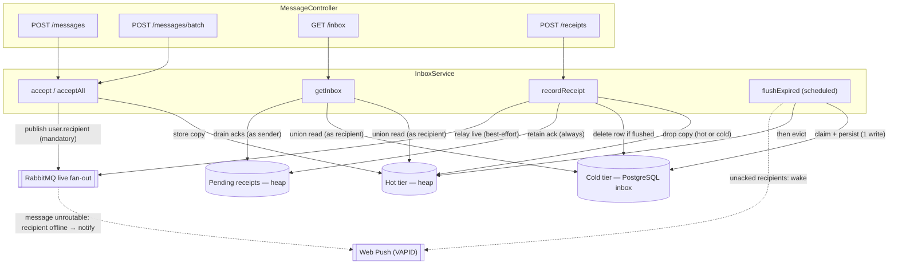
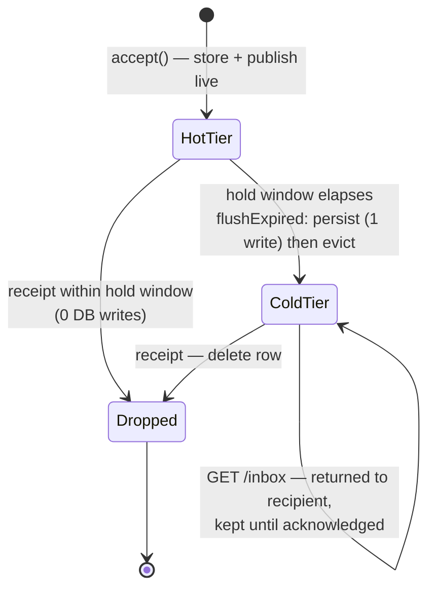
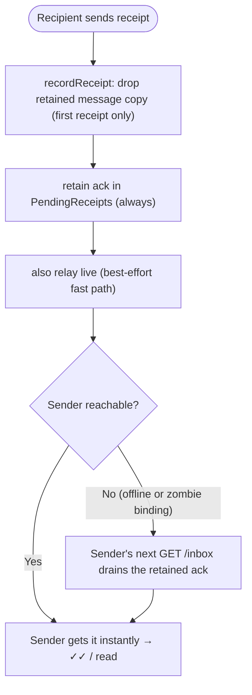
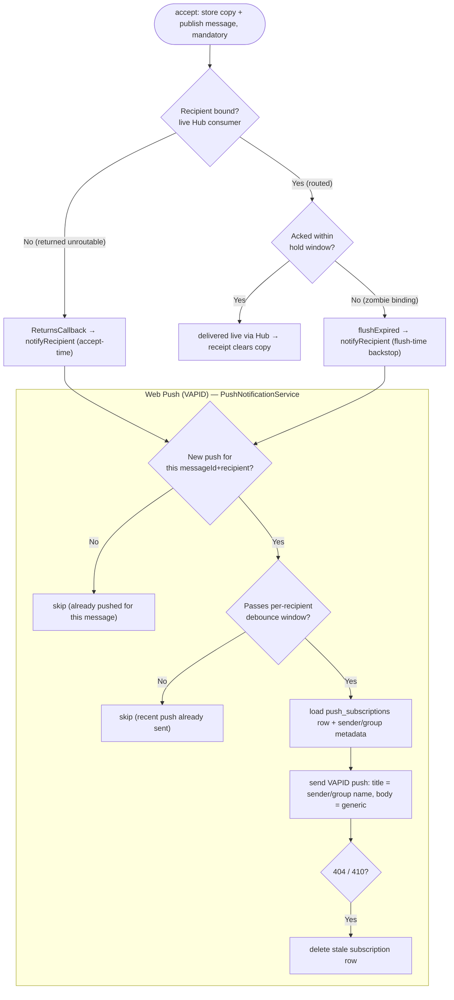

# MessageController ↔ InboxService — Message & Receipt Lifecycle

This document maps the server-side control flow of the message path: how the four `MessageController` endpoints delegate to `InboxService`, and how a message moves through the **hot tier** (heap), the **cold tier** (PostgreSQL `inbox`), and the in-memory **pending-receipts** backstop.

For the high-level model see [2.4 Message Sending & Receiving](../ARCHITECTURE.md#24-message-sending--receiving-server-owned-inbox), [2.5 Delivery Guarantee](../ARCHITECTURE.md#25-delivery-guarantee-server-retained-copy--signed-receipt), and [2.6 Send-Side Reconciliation](../ARCHITECTURE.md#26-send-side-reconciliation-outbox-resync).

## Components

| Store | Where | Durable | Holds |
| --- | --- | --- | --- |
| **Hot tier** (`HotTierStorage`) | JVM heap | No (sender's outbox backs it) | Accepted messages during the post-accept hold window |
| **Cold tier** (`inbox` + `inbox_pending`) | PostgreSQL | Yes | Messages not confirmed within the hold window — single-copy for both 1:1 and group |
| **Pending receipts** (`PendingReceipts`) | JVM heap | No (resync re-drives) | Delivery/read/undecryptable acks owed to a sender — every receipt retained, pulled via `/inbox` |

> **Single-copy storage.** A 1:1 message and a **group** message use the **same** single-copy storage. `accept` keeps one payload plus the set of recipients still owed delivery (hot tier `HotTierStorage.Entry`, cold tier one `inbox` row keyed by `message_id` + one `inbox_pending` row per pending recipient) and publishes a copy to each recipient — a group message (`groupId` set, no `recipientId`) fans out to every `user.<memberId>`, a 1:1 message (no `groupId`) to its single recipient. Each receipt clears **only that recipient** from the pending set; the shared `inbox` payload is dropped by a database trigger once its last `inbox_pending` row is gone. An `undecryptable` NACK drops that member's pending entry and relays the NACK so the sender re-delivers that one message over the pairwise ratchet (a 1:1 message carrying the `groupId`) and redistributes its Sender Key for future messages.

## Endpoints → InboxService

| Endpoint | Service call | Effect |
| --- | --- | --- |
| `POST /messages` | `accept` | Stamp sender; store **once** in the hot tier with the set of recipients still owed delivery, then publish live to each (a 1:1 to its recipient, a group fanned out to every member); return `accepted` + `serverStartedAt` |
| `POST /messages/batch` | `acceptAll` | Same as `accept` per item (idempotent by `messageId`); used by client resync |
| `GET /inbox` | `getInbox` | Return **hot ∪ cold** messages (as recipient) **+ drained pending receipts** (as sender) |
| `POST /receipts` | `recordReceipt` | Drop the retained copy, **record the ack**, and relay it live to the sender |
| *(scheduled)* | `flushExpired` | Persist-then-evict messages whose hold window elapsed, then **push-wake** each still-pending recipient (cold-tier backstop) |

## Control-flow block diagram

## Message-copy state machine

The server-retained copy of one message:

- **Confirmed fast (both online):** `HotTier → Dropped`, **zero** DB writes.
- **Recipient offline:** `HotTier → ColdTier` (one write), delivered later via `GET /inbox`, then `ColdTier → Dropped` on the signed receipt. The message is published **`mandatory`**, so the broker returns it as unroutable the instant the recipient has no live binding — that return fires a **Web Push** notification (see [Push notifications](#push-notifications)) while the copy is still in the hot tier, preserving the zero-write fast path. If the recipient's Hub binding is a **zombie** (an OS-suspended mobile tab whose socket died silently, so the live publish routes to a queue that is briefly still bound), the accept-time return never fires; the **flush-time backstop** (below) wakes the recipient instead when the copy reaches the cold tier.
- A message in transit during flush is briefly in **both** tiers (harmless duplicate, de-duped by `messageId`) and **never in neither** (persist-then-evict).

## Receipt path (delivered / read / undecryptable)

A receipt carries `originalSenderId`, so relaying it does **not** depend on the retained copy still existing — this is what lets a second receipt (`read` after `delivered`, in any order) still reach the sender. Every receipt is **retained** in `PendingReceipts` (keyed per `messageId`, per sender) and **also** published live as a best-effort fast path. The sender applies acks idempotently — live and/or on its next `GET /inbox` — so a receipt survives a **zombie sender binding** (a live publish routed to a silently-dropped connection). The Server does not distinguish a routable from an unroutable sender for receipts.

The Server authenticates the **submitter** of `POST /receipts` via JWT (transport auth) and then relays the recipient's **`signature` unaltered** — live as `ReceiptData.signature` and in `GET /inbox` as `MessageReceipt.signature`. Receipts travel outside the Double Ratchet, so each carries an explicit identity-key signature: it is the end-to-end proof the **original sender** verifies against the key directory; server-side verification is optional (reject-early) and never the load-bearing check.

- **Durable against zombie bindings:** because every ack is retained (not only when the sender is offline), a receipt relayed to a routable-but-dead sender binding is still delivered on the sender's next `GET /inbox`.
- **Cost:** acks accumulate per message until drained, so a busy conversation grows `PendingReceipts` and enlarges the `/inbox` response — a per-conversation **watermark** would bound this (see [FUTURE_EXTENSIONS.md §14](../FUTURE_EXTENSIONS.md#14-receipt-delivery--watermark-model)).
- **Non-durable on purpose:** a Server restart clears `PendingReceipts`; the sender then detects the restart (`serverStartedAt` changed) and resyncs, which re-drives the receipt.
- `read` supersedes `delivered` for the same message, so only the latest status per message is retained.
- Requires `spring.rabbitmq.publisher-returns: true` for **messages**: an unroutable message triggers a Web Push notification (see [Push notifications](#push-notifications)). Receipts are retained at record time, so a returned (unroutable) receipt needs no action.

### `undecryptable` — the negative ack

An `undecryptable` receipt travels the **same `recordReceipt` path** — drop the retained copy, retain and relay the NACK to the sender — but means the opposite of `delivered`: the recipient got the bytes yet could **not** decrypt them, because the payload was sealed to a **stale Signal identity / pre-key** (the recipient has since logged in on a new device and rotated keys, so the Double Ratchet has no matching session). Dropping the copy is still correct: *no key in existence can decrypt it*, so re-delivery is futile. The repair happens **end-to-end at the sender**, not on the Server:

1. Recipient's ratchet decrypt fails (no session / stale pre-key) → it returns a signed `undecryptable` receipt instead of `delivered`, then discards the message locally.
2. Server drops the retained copy and relays the NACK (retained in `PendingReceipts` and relayed live) — identical machinery to a `delivered`, and the real `undecryptable` type is preserved through `/inbox` so the sender still re-keys.
3. Sender receives `undecryptable` → re-fetches the recipient's current pre-key bundle (which also re-pins the identity, surfacing *“security code changed”*, see [MESSAGE_SECURITY.md §3.1](../MESSAGE_SECURITY.md#31-key-change-detection-security-code-changed)) → opens a fresh session and **resends the same `messageId` once**.
4. The resend is a brand-new copy through the normal hot/cold path; it now decrypts and is cleared by an ordinary `delivered`.

- **Loop-safe:** the sender resends **once per `messageId`**. If the resend is *also* returned `undecryptable`, the payload is treated as undeliverable — the sender stops and surfaces it locally (it is not a key-rotation problem). Without this NACK an undecryptable message would otherwise sit in the cold tier and be re-pulled on every `GET /inbox` forever, since it can never earn a `delivered`.
- **Server-blind:** the Server never learns *why* — `undecryptable` is just another opaque receipt type it drops-and-relays. No new endpoint, no inbox bookkeeping.

## Push notifications

Because messages are published **`mandatory`**, the broker returns any envelope it cannot route to a live consumer. A background **Web Push** wake-up is fired from **two** places, deduplicated per `(messageId, recipientId)` so a message never pushes twice:

1. **Accept-time (fast path):** an unroutable return means the recipient has **no Hub binding** at all — the app is not connected — so the push fires within milliseconds, while the retained copy is still in the hot tier.
2. **Flush-time (backstop):** when a copy reaches the **cold tier** it went unacknowledged for the whole hold window. That covers the case a live publish *did* route — to a **zombie Hub binding** — but was never delivered: an OS-suspended mobile tab (notably iOS) whose socket died silently while its auto-delete queue lingers until the Hub's heartbeat evicts it. No unroutable return fires in that window, so without this backstop the recipient would get nothing until their next `GET /inbox`.

- **Trigger, not content:** the push payload carries only `senderId` / `groupId` (identity the Server already knows) plus a generic body — **never** E2E message content. The client resolves the local conversation on click and navigates to it.
- **Fast path preserved:** the accept-time notification fires from the `ReturnsCallback` while the copy is still in the **hot tier**, so a normal offline delivery still costs a single DB write at flush time and nothing extra here.
- **Two triggers, deduped per message:** a `(messageId, recipientId)` marker collapses the accept-time and flush-time pushes for the same message into one, so a genuinely-offline recipient (woken at accept) is not pushed again at flush. The marker's lifetime equals the message's **hot-tier residency**: it is cleared on whichever exit ends that residency — a **receipt** (recipient read/acked the copy) or the **flush** to cold — so the marker set stays bounded to messages currently held, needing no TTL or scheduled cleanup.
- **Flush-time cost:** the backstop can push a recipient who was reachable but simply had not acked within the hold window; this is a rare false wake-up the client dampens (it suppresses a notification for an already-open conversation), accepted as the cost of covering silently-dropped Hub bindings.
- **Debounced per recipient:** rapid bursts to the same offline recipient collapse into one notification within a short window (`push.debounce-seconds`), so a chatty sender does not fan out a storm of notifications.
- **Single device:** one subscription per user (`push_subscriptions` keyed by `user_id`, upserted on `POST /push/subscribe`). A stale endpoint returning `404`/`410` is pruned on send; a new login on another device replaces the row.

