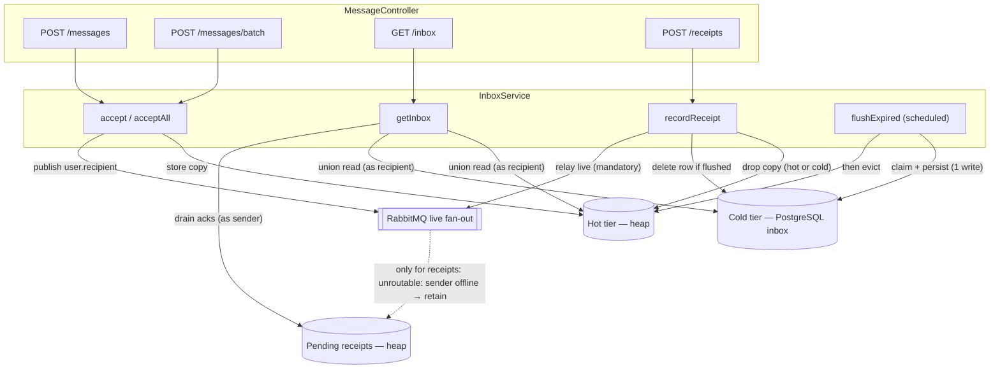
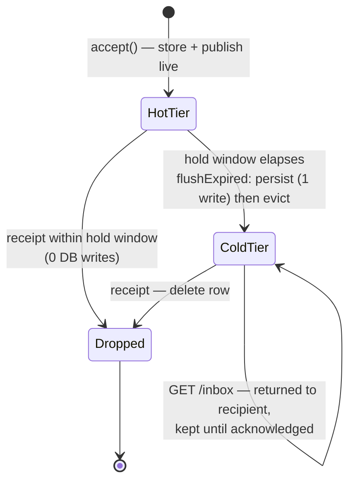
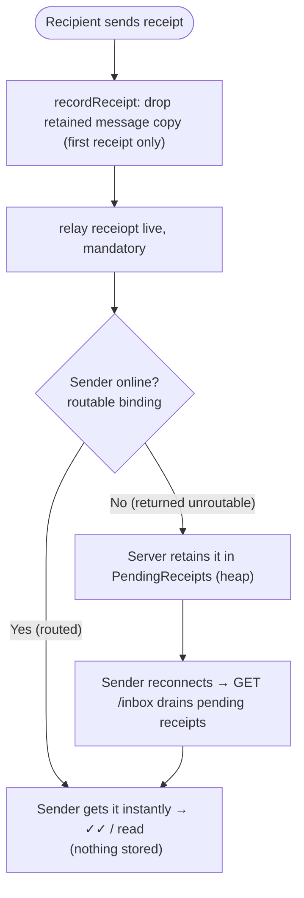

# MessageController ↔ InboxService — Message & Receipt Lifecycle

This document maps the server-side control flow of the message path: how the four `MessageController` endpoints delegate to `InboxService`, and how a message moves through the **hot tier** (heap), the **cold tier** (PostgreSQL `inbox`), and the in-memory **pending-receipts** backstop.

For the high-level model see [2.4 Message Sending & Receiving](../ARCHITECTURE.md#24-message-sending--receiving-server-owned-inbox), [2.5 Delivery Guarantee](../ARCHITECTURE.md#25-delivery-guarantee-server-retained-copy--signed-receipt), and [2.6 Send-Side Reconciliation](../ARCHITECTURE.md#26-send-side-reconciliation-outbox-resync).

## Components

| Store | Where | Durable | Holds |
| --- | --- | --- | --- |
| **Hot tier** (`HotTierStorage`) | JVM heap | No (sender's outbox backs it) | Accepted messages during the post-accept hold window |
| **Cold tier** (`inbox` table) | PostgreSQL | Yes | Messages not confirmed within the hold window |
| **Pending receipts** (`PendingReceipts`) | JVM heap | No (resync re-drives) | Delivery/read acks owed to an offline sender |

## Endpoints → InboxService

| Endpoint | Service call | Effect |
| --- | --- | --- |
| `POST /messages` | `accept` | Stamp sender, **store in hot tier**, publish live, return `accepted` + `serverStartedAt` |
| `POST /messages/batch` | `acceptAll` | Same as `accept` per item (idempotent by `messageId`); used by client resync |
| `GET /inbox` | `getInbox` | Return **hot ∪ cold** messages (as recipient) **+ drained pending receipts** (as sender) |
| `POST /receipts` | `recordReceipt` | Drop the retained copy, **record the ack**, and relay it live to the sender |
| *(scheduled)* | `flushExpired` | Persist-then-evict messages whose hold window elapsed |

## Control-flow block diagram

## Message-copy state machine

The server-retained copy of one message:

- **Confirmed fast (both online):** `HotTier → Dropped`, **zero** DB writes.
- **Recipient offline:** `HotTier → ColdTier` (one write), delivered later via `GET /inbox`, then `ColdTier → Dropped` on the signed receipt.
- A message in transit during flush is briefly in **both** tiers (harmless duplicate, de-duped by `messageId`) and **never in neither** (persist-then-evict).

## Receipt path (delivered / read)

A receipt carries `originalSenderId`, so relaying it does **not** depend on the retained copy still existing — this is what lets a second receipt (`read` after `delivered`, in any order) still reach the sender. The receipt is published **`mandatory`**: if the sender is **online** it is routed and delivered live (and *nothing* is stored); if the sender is **offline** the broker returns it as unroutable and the Server retains it in `PendingReceipts` for the sender's next `GET /inbox`. This way an online sender never piles up duplicate acks.

The Server authenticates the **submitter** of `POST /receipts` via JWT (transport auth) and then relays the recipient's **`signature` unaltered** — live as `ReceiptData.signature` and in `GET /inbox` as `MessageReceipt.signature`. The signature is the end-to-end proof the **original sender** verifies against the public-key directory; server-side verification is optional (reject-early) and never the load-bearing check.

- **Online senders cost nothing extra:** routable receipts are never stored, so a busy conversation does not accumulate thousands of acks to re-send.
- **Non-durable on purpose:** a Server restart clears `PendingReceipts`; the sender then detects the restart (`serverStartedAt` changed) and resyncs, which re-drives the receipt.
- `read` supersedes `delivered` for the same message, so only the latest status per message is retained.
- Requires `spring.rabbitmq.publisher-returns: true`; only **receipts** are published mandatory (messages stay best-effort, unchanged).

