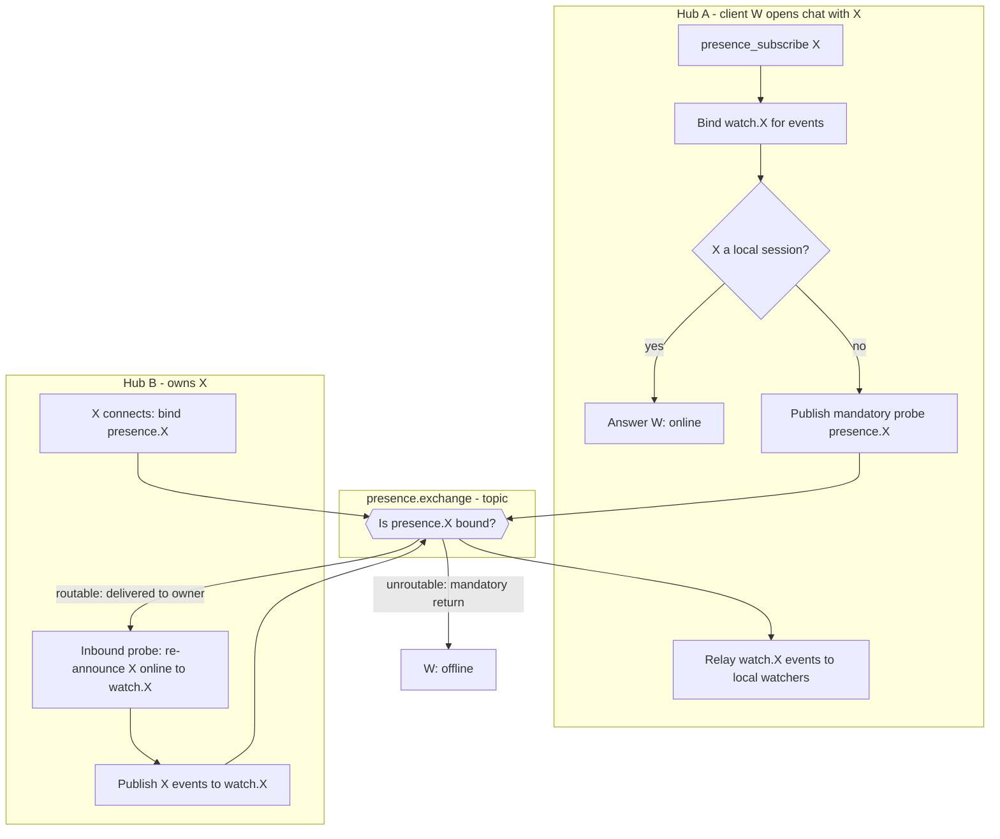
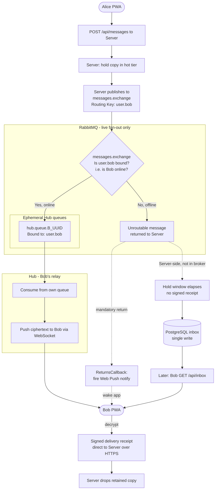

# RabbitMQ Topology & Live Fan-Out

This document maps the RabbitMQ objects used by **fourletters**, makes explicit **which component declares each object** and **at which lifecycle moment**, and shows the Phase 1 message-routing algorithm.

For the high-level send/receive flow, see [2.4 Message Sending & Receiving (Server-Owned Inbox)](../ARCHITECTURE.md#24-message-sending--receiving-server-owned-inbox) and [2.5 Delivery Guarantee](../ARCHITECTURE.md#25-delivery-guarantee-server-retained-copy--signed-receipt) in the architecture document.

> **Scope — Phase 1.** In Phase 1, RabbitMQ is a **non-durable live fan-out bus**: it only carries already-accepted messages to recipients that are online *right now*. It holds **no durability responsibility** — the Server retains the source of truth (hot tier → PostgreSQL inbox), so an unrouted or lost message in RabbitMQ is harmless. Objects that only appear once untrusted volunteer Hubs are introduced are listed under [Deferred to later phases](#deferred-to-later-phases) and detailed in [FUTURE_EXTENSIONS.md](../FUTURE_EXTENSIONS.md).

## Object Ownership & Lifecycle

| Object | Type | Declared by | Created when | Removed when | Durability |
| --- | --- | --- | --- | --- | --- |
| `messages.exchange` | Topic exchange | **Broker definitions** (static, `definitions.json`) | Broker boot | Never (long-lived definition) | Durable *definition*; carries **transient** (non-persistent) messages |
| `hub.queue.{hubId}` | Queue (`auto-delete`) | **Server** | When a Hub authenticates/registers with the Server | Auto-deletes when the Hub's consumer disconnects | Durable *definition*, `auto-delete` (carries transient messages) |
| Binding `user.{id}` → `hub.queue.{hubId}` | Binding | **Hub** | A user's WebSocket **connects** to that Hub | That user **disconnects** (binding removed immediately) | n/a |
| `presence.exchange` | Topic exchange | **Broker definitions** (static, `definitions.json`) | Broker boot | Never (long-lived definition) | Durable *definition*; carries **transient** presence/typing metadata |
| Binding `presence.{id}` → `hub.queue.{hubId}` | Binding (online marker) | **Hub** that *holds* the user (owner) | That user's WebSocket **connects** | That user **disconnects** | n/a |
| Binding `watch.{id}` → `hub.queue.{hubId}` | Binding (watch interest) | **Hub** with a local *watcher* | A local client **opens a chat** with that user | The **last** local watcher closes the chat | n/a |

That is the **entire** Phase 1 message topology: one exchange, one ephemeral queue per Hub, and one binding per online user. The **presence** rows above layer on top for the live online/typing signal (see [Presence & Typing](#presence--typing-presenceexchange)); they add **no new queue** — every Hub reuses its existing `hub.queue.{hubId}` — and the exchange is declared **statically in the broker definitions**, never by the Hub (which still has zero `configure` rights).

### Who declares what, and why

- **Long-lived exchanges are declared once, statically, in the broker's `definitions.json`; only *dynamic* objects are declared programmatically by their owner.** Both `messages.exchange` and `presence.exchange` are permanent, so they live in the broker definitions — a single source of topology truth — rather than being created from application code. This also lets the Server keep **`configure` denied on the exchanges** (it only needs `write` to publish), tightening least-privilege.
- **The Server declares only the dynamic per-Hub queues.** The Hub itself has **no permission to create or delete queues or exchanges** — it can only *bind* and *consume*. This is deliberate: a Hub that could declare queues could flood the broker with thousands of them (a resource-exhaustion DoS), which matters once Hubs are untrusted. By keeping queue creation on the Server (and exchanges static in definitions), the number of queues is capped at exactly **one per authenticated Hub**.
- **One queue per Hub, provisioned on registration.** When a Hub starts it authenticates to the Server; the Server (idempotently) declares that Hub's `hub.queue.{hubId}` as `auto-delete` and returns the queue name to the Hub. Because the queue is `auto-delete`, it disappears automatically once the Hub's consumer disconnects, so a crashed or restarted Hub still cleans up with no central bookkeeping. The queue is declared **durable** (definition only) rather than transient: RabbitMQ deprecated transient non-exclusive queues, and the queue cannot be exclusive because an exclusive queue is bound to the declaring (Server) connection while the Hub is the consumer. Durability of the *definition* does not make messages persistent — the bus stays transient.
- **The Hub manages only bindings, per connection.** When Bob's WebSocket connects to Hub A, Hub A binds `user.bob` to its own queue; when Bob disconnects, Hub A unbinds it. Binding is the **only** topology operation a Hub performs. Bindings are therefore **live presence**: a routing key is bound **if** that user currently has an open WebSocket somewhere. (Restricting *which* `user.{id}` a Hub may bind is the separate per-identity enforcement deferred to [FUTURE_EXTENSIONS.md](../FUTURE_EXTENSIONS.md#4-route-scoping--scoped-transport-tokens).)

### Direction of traffic (Phase 1)

- **Server → RabbitMQ:** publish-only. The Server publishes accepted payloads to `messages.exchange` with routing key `user.{recipientId}`, marked **`mandatory`** so the broker returns any envelope it cannot route to a live binding. The Server never consumes from RabbitMQ in Phase 1.
- **RabbitMQ → Hub:** consume-only. A Hub only consumes from its own `hub.queue.{hubId}`. A Hub **never publishes** to `messages.exchange` (clients never send through a Hub — sending always goes PWA → Server).
- **Signed delivery receipts do not transit RabbitMQ.** They travel from the recipient's client **directly to the Server over HTTPS**, out of band from the live bus. RabbitMQ carries forward delivery only.

## Routing Behaviour

- **Recipient online (binding exists):** `messages.exchange` routes `user.bob` to the bound `hub.queue.{hubId}`; the Hub consumes it and pushes it over Bob's WebSocket.
- **Recipient offline (no binding):** the message is **unroutable**, so — because it is published **`mandatory`** — the broker **returns** it to the Server instead of silently discarding it. Correctness still does **not** depend on this feedback: the Server already holds the copy (hot tier) and, after the hold window, performs a single write to the PostgreSQL inbox, and Bob receives it later via `GET /api/inbox`. The return is used only as an **offline tripwire**: the Server's `ReturnsCallback` fires a **Web Push** notification to wake Bob's app (sender identity only, never ciphertext; debounced per recipient). See [messages-lifecycle.md § Push notifications](messages-lifecycle.md#push-notifications).
- **No live ack — no re-publish.** A published message is a *best-effort live* attempt only. If no signed `delivered` receipt arrives within the hold window, the Server does **not** re-publish; it simply lets the copy flush from the hot tier to the DB. The message is then delivered when Bob's client next **pulls** via `GET /api/inbox` (the `/inbox` read returns the union of the hot and cold tiers, so it covers messages still in memory as well as those already written to the DB).

## Permissions (Phase 1 baseline)

Even though Phase 1 Hubs run in the trusted environment, the Hub's RabbitMQ credential is **minimally scoped from the start** so the same artifact is already safe to run untrusted later:

- **`configure` (declare/delete) on all queues and exchanges: denied** — a Hub cannot create or delete any topology. This is what prevents a malicious Hub from flooding the broker with queues; the Server is the only component that declares queues and exchanges.
- **`write` on `messages.exchange`: denied** — Hubs can never publish/inject messages.
- **`write` on `hub.queue.{hubId}`: allowed** — required so the Hub can add `user.{id}` bindings to its own queue (binding a queue needs *write* on the queue).
- **`read` on `hub.queue.{hubId}`: allowed** — so the Hub can consume its own queue.
- **`read` on `messages.exchange`: allowed** — required so a Hub can bind routing keys (binding a queue to an exchange needs *read* on the exchange).

The remaining gap, deferred to a later phase: with a **shared** credential across many Hubs, the `{hubId}` scoping above and the choice of which `user.{id}` to bind cannot be enforced by a static name regex. Both fold into the same **per-identity enforcement** (RabbitMQ OAuth2 scoped tokens or Server-mediated bindings); see [FUTURE_EXTENSIONS.md](../FUTURE_EXTENSIONS.md#4-route-scoping--scoped-transport-tokens). Queue **creation** is *not* part of this gap — denying `configure` prevents it in every phase.

### Presence additions to the baseline (Phase 1)

The live presence/typing signal adds exactly two grants to the Hub credential and **preserves every existing deny**:

- **`write` on `presence.exchange`: allowed** — required so a Hub can publish presence/typing events (a user on this Hub came online/went offline, or is typing).
- **`read` on `presence.exchange`: allowed** — required so a Hub can bind its own `hub.queue.{hubId}` to the topic exchange (`presence.{id}` / `watch.{id}` keys) to consume presence events and receive probes (binding a queue to an exchange needs *read* on the exchange).
- **`configure` still `^$`** — the Hub still **cannot declare or delete** `presence.exchange` (or anything else); the exchange is provisioned statically in `definitions.json`. The queue-flooding DoS ceiling is unchanged.
- **`write` on `messages.exchange` still denied** — presence lives on a **separate** exchange, so granting presence-publish does **not** let a Hub inject or forge real messages.

What a rogue Hub *can* do with the presence grant is bounded to **non-sensitive metadata**: forge "user X is online / typing" (publish or bind `presence.{X}`) and observe presence of users it **watches**. It cannot read message content (E2E), inject messages (`messages.exchange` write denied), alter topology (`configure` denied), or affect durability (Server-owned). Because presence is a **topic** exchange routed per-user, a Hub only receives presence for users its own clients are chatting with. Tightening presence for **untrusted** Hubs (anti-forge binding scoping + probe rate-limiting) is deferred alongside the existing per-identity enforcement — see [FUTURE_EXTENSIONS.md §15](../FUTURE_EXTENSIONS.md#15-presence--last-seen-persistence--untrusted-hub-hardening).

## Presence & Typing (`presence.exchange`)

Online status and "is typing" are delivered **entirely through the Hub layer** — no Server involvement and no new storage. The Hub stays a pure relay: it holds only **transient subscription-routing state** (which local client is watching which contact) and **persists nothing** — no presence values, no timestamps. "Last seen" is intentionally **not** part of this and is deferred to [FUTURE_EXTENSIONS.md §15](../FUTURE_EXTENSIONS.md#15-presence--last-seen-persistence--untrusted-hub-hardening).

### Presence = routability, exactly like messages

The design reuses the one primitive the message path already relies on: **a routing key is bound if and only if the user is online.** On `messages.exchange`, `user.{id}` is bound iff the user has a live socket, and the Server learns "offline" from a `mandatory` publish being **returned**. Presence applies the same idea on its own exchange. Two things a Hub cannot do shape the design:

- A Hub **may not publish to `messages.exchange`** (the no-injection invariant), so it cannot probe the `user.{id}` bindings directly.
- Therefore each Hub **mirrors** its online users onto `presence.exchange` as `presence.{id}` bindings — which it *is* allowed to manage — and probes those instead.

`presence.exchange` is a **topic** exchange with two routing-key namespaces, both bound on the Hub's existing `hub.queue.{hubId}` (no new queue, no `configure`):

| Routing key | Bound by | Meaning | Removed when |
| --- | --- | --- | --- |
| `presence.{id}` | the Hub that **holds** user `id` (owner) | "id is online here" — the **probe target** | id's session closes — graceful close **or** ≤70 s pong-timeout eviction |
| `watch.{id}` | a Hub with a local client **watching** `id` | "deliver id's events here" — the **event sink** | id's **last** local watcher's session closes — chat closed, **or** app dropped (≤70 s eviction) |

Both unbinds are driven by **session teardown**, not by a client message: `afterConnectionClosed` fires on a graceful close *and* on the ≤70 s pong-timeout eviction, so a dropped app is cleaned up on the same timer as everything else. If a whole Hub dies, its `auto-delete` `hub.queue.{hubId}` disappears and takes **all** its `presence.*` / `watch.*` bindings with it — the broker-level backstop. (A briefly-stale `watch.{id}` is harmless anyway: events arrive with no local watcher and are acked-and-dropped.)

### Snapshot without a query: `mandatory` probe + owner re-announce

When a client opens a chat with X, its Hub binds `watch.{X}` (for future events) and resolves the **initial** online/offline by publishing a `mandatory`, no-op **probe** to routing key `presence.{X}`:

- **Routable** (some Hub has `presence.{X}` bound ⇒ X online): the broker delivers the probe to X's owner Hub, which **re-announces** `presence(X, online)` to `watch.{X}`; the prober, now bound to `watch.{X}`, receives it ⇒ **online**.
- **Unroutable** (no `presence.{X}` binding ⇒ X offline): the broker **returns** the probe; the prober's returns-callback reads X from the routing key and answers **offline**.

This reuses the same **mandatory-return** primitive the Server already uses as its offline tripwire — no publisher-confirm bookkeeping and no bespoke query type; the routing key *is* the correlation. At a single Hub the snapshot is taken straight from the local session map, so no probe is published.

### Wire protocol

**Client ↔ Hub (WebSocket JSON frames).** These are the first inbound frames the Hub acts on beyond the existing `{"type":"ping"}` liveness probe. The Hub derives the *sender's* own id from the connection's validated JWT, so a client never asserts its own id.

| Direction | Frame | Meaning |
| --- | --- | --- |
| Client → Hub | `{ "type": "presence_subscribe", "userId": "X" }` | "I opened a chat with X — start telling me X's online/typing state." |
| Client → Hub | `{ "type": "presence_unsubscribe", "userId": "X" }` | "I closed the chat — stop." |
| Client → Hub | `{ "type": "typing" }` | "I am typing (in my active chat)." Sender id comes from the session. |
| Hub → Client | `{ "type": "presence", "userId": "X", "status": "online" \| "offline" }` | Current/updated state of a watched contact. |
| Hub → Client | `{ "type": "typing", "userId": "X" }` | Watched contact X is typing. |

**Hub → `presence.exchange` (topic) payloads.** Carry a single `userId`, **never a conversation pair**:

- **Event** (owner → watchers), routing key `watch.{id}`: the body is the **client frame verbatim** — `{ "type": "presence", "userId": "X", "status": "online" | "offline" }` or `{ "type": "typing", "userId": "X" }` — so a receiving Hub forwards it to local watchers unmodified, exactly like a message.
- **Probe** (watcher → owner), routing key `presence.{id}`, published `mandatory`: empty body — its **routability** is the signal, not its content.

### Hub behaviour (relay only)

- **Local user X connects** (`afterConnectionEstablished`): bind `presence.{X}`; publish `presence(X, online)` to `watch.{X}` (notifies anyone already watching).
- **Local session closes** (`afterConnectionClosed` — graceful **or** the ≤70 s pong-timeout eviction, so an app drop needs no client message): for that session's user X, unbind `presence.{X}` and publish `presence(X, offline)` to `watch.{X}`; and remove the session from every watch-set, unbinding each `watch.{id}` that just lost its last local watcher.
- **Client `typing`** (session-user X): publish `typing(X)` to `watch.{X}`.
- **Client `presence_subscribe(X)`**: bind `watch.{X}` (if the first local watcher); take the snapshot — a **local** session answers `online` immediately, otherwise publish the `mandatory` probe `presence.{X}` (owner re-announces online, or the return answers offline).
- **Client `presence_unsubscribe(X)`**: drop the local watcher; unbind `watch.{X}` if it was the last. (This is only the *chat-closed-but-app-open* path; a dropped app is handled by the session-close rule above.)
- **Consume from `hub.queue.{hubId}`** — routed by `receivedExchange` and key:
  - `messages.exchange` → the existing opaque message relay.
  - `presence.exchange`, key `watch.{X}` → a presence/typing event for a user this Hub watches → forward the body to local watchers of X.
  - `presence.exchange`, key `presence.{X}` → an inbound **probe** (routed here because this Hub owns X) → re-announce `presence(X, online)` to `watch.{X}`, then ack.

### Properties

- **Online/offline is pure routability**; ongoing typing and transitions are ordinary routed events to `watch.{id}`.
- **Scoped metadata** — events for X reach **only** Hubs that watch X, and probes for X reach **only** X's owner Hub, so a Hub sees presence only for users its own clients chat with.
- **Same permissions, same queue** — still `write`+`read` on `presence.exchange`, bindings on the Hub's own `hub.queue.{hubId}`; no `configure`, no `messages.exchange` write.

## Block Algorithm (Phase 1)

Below is the flowchart illustrating the step-by-step logic executed by the Server, the internal RabbitMQ topology, and the Hub.

## Deferred to later phases

The Phase 1 topology above is unchanged by the following; they layer on top without altering the exchange, queues, or send path. See [FUTURE_EXTENSIONS.md](../FUTURE_EXTENSIONS.md):

- **Per-identity binding enforcement** — restricting *which* `user.{id}` a connection may bind, via the RabbitMQ OAuth2 backend (scoped transport tokens) or Server-mediated bindings. Required before any untrusted **volunteer Hub** is deployed.
- **Presence anti-forge & probe rate-limiting** — restricting *which* `presence.{id}`/`watch.{id}` keys a Hub may bind and publish, and capping probe/publish rate. Non-sensitive metadata only, but required before untrusted Hubs. See [FUTURE_EXTENSIONS.md §15](../FUTURE_EXTENSIONS.md#15-presence--last-seen-persistence--untrusted-hub-hardening).
- **Persistent "last seen"** — a durable last-online timestamp, which the Phase 1 relay-only presence intentionally omits. See [FUTURE_EXTENSIONS.md §15](../FUTURE_EXTENSIONS.md#15-presence--last-seen-persistence--untrusted-hub-hardening).
- **RabbitMQ clustering** — running the broker as a cluster for availability once Server/Hub fleets grow.

