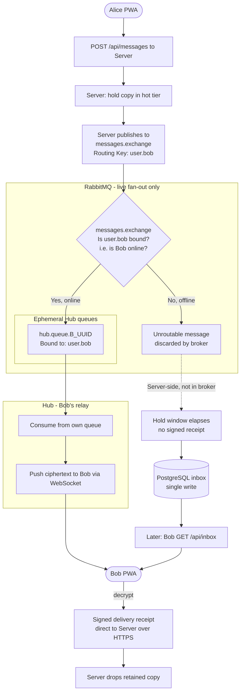

# RabbitMQ Topology & Live Fan-Out

This document maps the RabbitMQ objects used by **fourletters**, makes explicit **which component declares each object** and **at which lifecycle moment**, and shows the Phase 1 message-routing algorithm.

For the high-level send/receive flow, see [2.4 Message Sending & Receiving (Server-Owned Inbox)](../ARCHITECTURE.md#24-message-sending--receiving-server-owned-inbox) and [2.5 Delivery Guarantee](../ARCHITECTURE.md#25-delivery-guarantee-server-retained-copy--signed-receipt) in the architecture document.

> **Scope — Phase 1.** In Phase 1, RabbitMQ is a **non-durable live fan-out bus**: it only carries already-accepted messages to recipients that are online *right now*. It holds **no durability responsibility** — the Server retains the source of truth (hot tier → PostgreSQL inbox), so an unrouted or lost message in RabbitMQ is harmless. Objects that only appear once untrusted volunteer Hubs are introduced are listed under [Deferred to later phases](#deferred-to-later-phases) and detailed in [FUTURE_EXTENSIONS.md](../FUTURE_EXTENSIONS.md).

## Object Ownership & Lifecycle

| Object | Type | Declared by | Created when | Removed when | Durability |
| --- | --- | --- | --- | --- | --- |
| `messages.exchange` | Topic exchange | **Server** | Server boot | Never (long-lived definition) | Durable *definition*; carries **transient** (non-persistent) messages |
| `hub.queue.{hubId}` | Queue (`auto-delete`) | **Server** | When a Hub authenticates/registers with the Server | Auto-deletes when the Hub's consumer disconnects | Durable *definition*, `auto-delete` (carries transient messages) |
| Binding `user.{id}` → `hub.queue.{hubId}` | Binding | **Hub** | A user's WebSocket **connects** to that Hub | That user **disconnects** (binding removed immediately) | n/a |

That is the **entire** Phase 1 topology: one exchange, one ephemeral queue per Hub, and one binding per online user.

### Who declares what, and why

- **The Server declares all durable structure: the exchange and every Hub queue.** The Hub itself has **no permission to create or delete queues or exchanges** — it can only *bind* and *consume*. This is deliberate: a Hub that could declare queues could flood the broker with thousands of them (a resource-exhaustion DoS), which matters once Hubs are untrusted. By keeping queue creation on the Server, the number of queues is capped at exactly **one per authenticated Hub**.
- **One queue per Hub, provisioned on registration.** When a Hub starts it authenticates to the Server; the Server (idempotently) declares that Hub's `hub.queue.{hubId}` as `auto-delete` and returns the queue name to the Hub. Because the queue is `auto-delete`, it disappears automatically once the Hub's consumer disconnects, so a crashed or restarted Hub still cleans up with no central bookkeeping. The queue is declared **durable** (definition only) rather than transient: RabbitMQ deprecated transient non-exclusive queues, and the queue cannot be exclusive because an exclusive queue is bound to the declaring (Server) connection while the Hub is the consumer. Durability of the *definition* does not make messages persistent — the bus stays transient.
- **The Hub manages only bindings, per connection.** When Bob's WebSocket connects to Hub A, Hub A binds `user.bob` to its own queue; when Bob disconnects, Hub A unbinds it. Binding is the **only** topology operation a Hub performs. Bindings are therefore **live presence**: a routing key is bound **if** that user currently has an open WebSocket somewhere. (Restricting *which* `user.{id}` a Hub may bind is the separate per-identity enforcement deferred to [FUTURE_EXTENSIONS.md](../FUTURE_EXTENSIONS.md#4-route-scoping--scoped-transport-tokens).)

### Direction of traffic (Phase 1)

- **Server → RabbitMQ:** publish-only. The Server publishes accepted payloads to `messages.exchange` with routing key `user.{recipientId}`. The Server never consumes from RabbitMQ in Phase 1.
- **RabbitMQ → Hub:** consume-only. A Hub only consumes from its own `hub.queue.{hubId}`. A Hub **never publishes** to `messages.exchange` (clients never send through a Hub — sending always goes PWA → Server).
- **Signed delivery receipts do not transit RabbitMQ.** They travel from the recipient's client **directly to the Server over HTTPS**, out of band from the live bus. RabbitMQ carries forward delivery only.

## Routing Behaviour

- **Recipient online (binding exists):** `messages.exchange` routes `user.bob` to the bound `hub.queue.{hubId}`; the Hub consumes it and pushes it over Bob's WebSocket.
- **Recipient offline (no binding):** the message is **unroutable** and is simply **discarded by the broker**. This is safe and intentional — the Server still holds the copy (hot tier), and after the hold window it performs a single write to the PostgreSQL inbox. Bob receives it later via the Server's `GET /api/inbox` sync. The Server does **not** rely on broker routability feedback (no `mandatory`/return handling is required for correctness).
- **No live ack — no re-publish.** A published message is a *best-effort live* attempt only. If no signed `delivered` receipt arrives within the hold window, the Server does **not** re-publish; it simply lets the copy flush from the hot tier to the DB. The message is then delivered when Bob's client next **pulls** via `GET /api/inbox` (the `/inbox` read returns the union of the hot and cold tiers, so it covers messages still in memory as well as those already written to the DB).

## Permissions (Phase 1 baseline)

Even though Phase 1 Hubs run in the trusted environment, the Hub's RabbitMQ credential is **minimally scoped from the start** so the same artifact is already safe to run untrusted later:

- **`configure` (declare/delete) on all queues and exchanges: denied** — a Hub cannot create or delete any topology. This is what prevents a malicious Hub from flooding the broker with queues; the Server is the only component that declares queues and exchanges.
- **`write` on `messages.exchange`: denied** — Hubs can never publish/inject messages.
- **`write` on `hub.queue.{hubId}`: allowed** — required so the Hub can add `user.{id}` bindings to its own queue (binding a queue needs *write* on the queue).
- **`read` on `hub.queue.{hubId}`: allowed** — so the Hub can consume its own queue.
- **`read` on `messages.exchange`: allowed** — required so a Hub can bind routing keys (binding a queue to an exchange needs *read* on the exchange).

The remaining gap, deferred to a later phase: with a **shared** credential across many Hubs, the `{hubId}` scoping above and the choice of which `user.{id}` to bind cannot be enforced by a static name regex. Both fold into the same **per-identity enforcement** (RabbitMQ OAuth2 scoped tokens or Server-mediated bindings); see [FUTURE_EXTENSIONS.md](../FUTURE_EXTENSIONS.md#4-route-scoping--scoped-transport-tokens). Queue **creation** is *not* part of this gap — denying `configure` prevents it in every phase.

## Block Algorithm (Phase 1)

Below is the flowchart illustrating the step-by-step logic executed by the Server, the internal RabbitMQ topology, and the Hub.

## Deferred to later phases

The Phase 1 topology above is unchanged by the following; they layer on top without altering the exchange, queues, or send path. See [FUTURE_EXTENSIONS.md](../FUTURE_EXTENSIONS.md):

- **Per-identity binding enforcement** — restricting *which* `user.{id}` a connection may bind, via the RabbitMQ OAuth2 backend (scoped transport tokens) or Server-mediated bindings. Required before any untrusted **volunteer Hub** is deployed.
- **RabbitMQ clustering** — running the broker as a cluster for availability once Server/Hub fleets grow.

