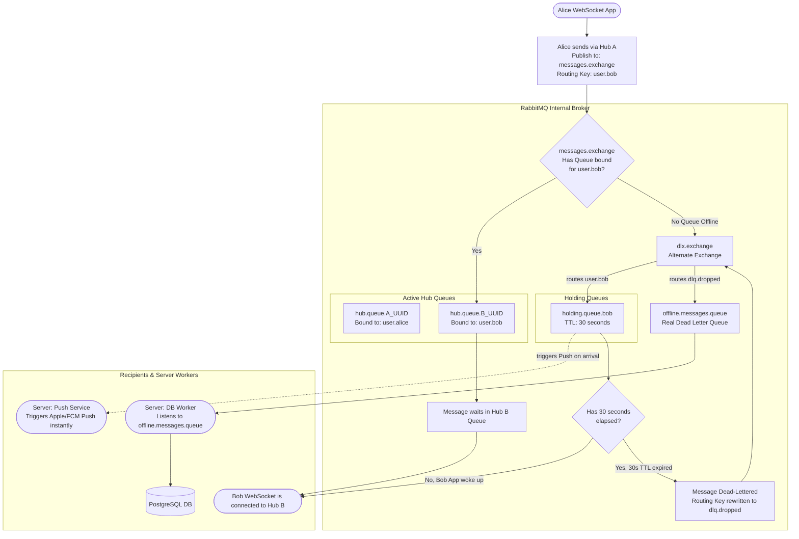

# RabbitMQ Exchange & Store-and-Forward Algorithm

This document provides a detailed block algorithm mapping out the RabbitMQ message routing, the alternate-exchange fallback, and the Dead Letter Queue (DLQ) persistent storage mechanisms.

For a high-level sequence diagram of the Store-and-Forward process from the perspective of the application nodes, refer to [2.4 Message Sending & Receiving (Store-and-Forward)](../ARCHITECTURE.md#24-message-sending--receiving-store-and-forward).

## Routing Strategy
- **Core Exchange (`messages.exchange`):** The primary Topic Exchange. It acts as a central router for all E2E encrypted payloads.
- **Hub Queues (`hub.queue.{uuid}`):** When a Hub boots up, it automatically creates a single, exclusive, auto-deleting queue for itself. 
  - When *Bob* connects his WebSocket to *Hub A*, Hub A dynamically binds `user.bob` to *Hub A's temp queue*.
  - When *Alice* connects her WebSocket to *Hub B*, Hub B dynamically binds `user.alice` to *Hub B's temp queue*.
  - When a user disconnects, their binding is instantly removed, freeing up topological overhead.
- **Alternate Exchange (`dlx.exchange`):** The fallback safety net. If `messages.exchange` receives a message for a user who does not have an active Queue bound (meaning they are completely offline and disconnected from all Hubs), it instantly forwards the message here to avoid dropping it into the void.
- **User Holding Queues (`holding.queue.{userId}`):** Buffers messages dropped by the alternate exchange for up to 30 seconds (TTL) without database interaction. Each user has their own dedicated holding queue that self-deletes after 5 minutes of inactivity (`x-expires`). This isolates fallback traffic per user and gives the recipient's mobile push notifications a brief window to wake up the app and retrieve the data in-memory without impacting other users.
- **Dead Letter Queue (`offline.messages.queue`):** The final resting place for expired Holding Queue messages. The Server Worker consumes from this queue and persists messages to PostgreSQL.

## Edge Cases
- **Cold Booting the Environment:** Because the Hub strictly uses the Data Plane, all architecture declarations (Exchanges and Holding/DLQ Queues) are structurally defined by the Server module on boot to enforce `PRECONDITION_FAILED` immutability limits and prevent message drops.
- **Instant Client Wake-up:** If the Holding queue receives a message, a Push Notification worker on the server instantly fires an alert to the user's phone. If the app opens within 30 seconds, it fetches the message from the Holding Queue before it drops into the DLQ, achieving zero database writes.

## Block Algorithm

Below is the flowchart illustrating the step-by-step logic executed by the Hub, Server, and internal RabbitMQ topology.

