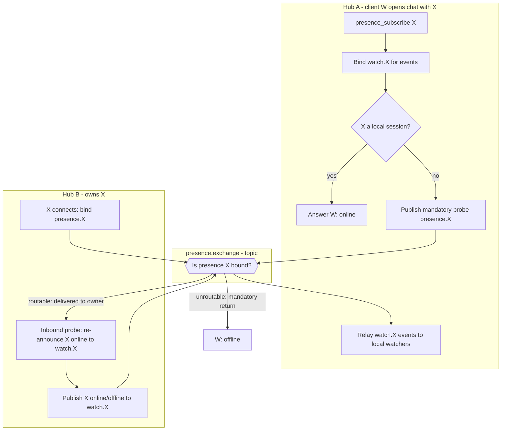
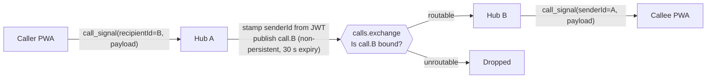
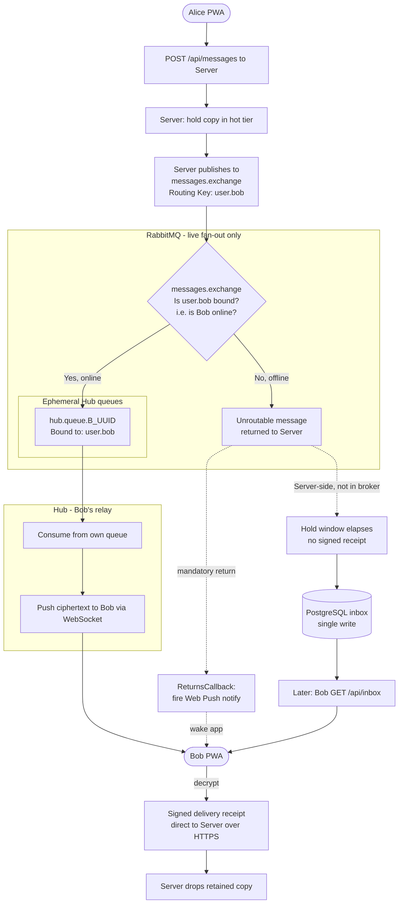

# RabbitMQ Topology & Live Fan-Out

This document maps the RabbitMQ objects used by **fourletters**, makes explicit **which component declares each object** and **at which lifecycle moment**, and shows the Phase 1 message-routing algorithm.

For the high-level send/receive flow, see [2.4 Message Sending & Receiving (Server-Owned Inbox)](../ARCHITECTURE.md#24-message-sending--receiving-server-owned-inbox) and [2.5 Delivery Guarantee](../ARCHITECTURE.md#25-delivery-guarantee-server-retained-copy--signed-receipt) in the architecture document.

> **Scope — Phase 1.** In Phase 1, RabbitMQ is a **non-durable live fan-out bus**: it only carries already-accepted messages to recipients that are online *right now*. It holds **no durability responsibility** — the Server retains the source of truth (hot tier → PostgreSQL inbox), so an unrouted or lost message in RabbitMQ is harmless. Objects that only appear once untrusted volunteer Hubs are introduced are listed under [Deferred to later phases](#deferred-to-later-phases) and detailed in [FUTURE_EXTENSIONS.md](../FUTURE_EXTENSIONS.md).

## Object Ownership & Lifecycle

| Object | Type | Declared by | Created when | Removed when | Durability |
| --- | --- | --- | --- | --- | --- |
| `messages.exchange` | Topic exchange | **Broker definitions** (static, `definitions.json`) | Broker boot | Never (long-lived definition) | Durable *definition*; carries **transient** (non-persistent) messages |
| `hub.queue.{hubId}` | Queue (`auto-delete`) | **Server** | When a Hub authenticates/registers with the Server | Auto-deletes when the Hub's consumer disconnects | Durable *definition*, `auto-delete` (carries transient messages) |
| Binding `user.{id}` → `hub.queue.{hubId}` | Binding | **Hub** | A user's WebSocket **connects** to that Hub | That user **disconnects** (binding removed immediately) | n/a |
| `presence.exchange` | Topic exchange | **Broker definitions** (static, `definitions.json`) | Broker boot | Never (long-lived definition) | Durable *definition*; carries **transient** presence/typing metadata |
| Binding `presence.{id}` → `hub.queue.{hubId}` | Binding (online marker) | **Hub** that *holds* the user (owner) | That user's WebSocket **connects** | That user **disconnects** | n/a |
| Binding `watch.{id}` → `hub.queue.{hubId}` | Binding (watch interest) | **Hub** with a local *watcher* | A local client **opens a chat** with that user | The **last** local watcher closes the chat | n/a |
| Binding `typing.user.{id}` → `hub.queue.{hubId}` | Binding (direct typing sink) | **Hub** holding the recipient | Recipient's WebSocket connects | Recipient disconnects | n/a |
| Binding `typing.group.{id}` → `hub.queue.{hubId}` | Binding (group typing interest) | **Hub** with local group watchers | First local group typing subscription | Last watcher unsubscribes or disconnects | n/a |
| `calls.exchange` | Topic exchange | **Broker definitions** (static, `definitions.json`) | Broker boot | Never (long-lived definition) | Durable *definition*; carries **transient** call signals with a short per-message expiry |
| Binding `call.{id}` → `hub.queue.{hubId}` | Binding (call-signal sink) | **Hub** that *holds* the user | That user's WebSocket **connects** | That user **disconnects** | n/a |

That is the **entire** Phase 1 message topology: one exchange, one ephemeral queue per Hub, and one binding per online user. The **presence** rows above layer on top for the live online/typing signal (see [Presence & Typing](#presence--typing-presenceexchange)), and the **calls** rows for ephemeral call signaling (see [Call Signaling](#call-signaling-callsexchange)); they add **no new queue** — every Hub reuses its existing `hub.queue.{hubId}` — and the exchanges are declared **statically in the broker definitions**, never by the Hub (which still has zero `configure` rights).

### Who declares what, and why

- **Long-lived exchanges are declared once, statically, in the broker's `definitions.json`; only *dynamic* objects are declared programmatically by their owner.** `messages.exchange`, `presence.exchange` and `calls.exchange` are all permanent, so they live in the broker definitions — a single source of topology truth — rather than being created from application code. This also lets the Server keep **`configure` denied on the exchanges** (it only needs `write` to publish), tightening least-privilege.
- **The Server declares only the dynamic per-Hub queues.** The Hub itself has **no permission to create or delete queues or exchanges** — it can only *bind* and *consume*. This is deliberate: a Hub that could declare queues could flood the broker with thousands of them (a resource-exhaustion DoS), which matters once Hubs are untrusted. By keeping queue creation on the Server (and exchanges static in definitions), the number of queues is capped at exactly **one per authenticated Hub**.
- **One queue per Hub, provisioned on registration.** When a Hub starts it authenticates to the Server; the Server (idempotently) declares that Hub's `hub.queue.{hubId}` as `auto-delete` and returns the queue name to the Hub. Because the queue is `auto-delete`, it disappears automatically once the Hub's consumer disconnects, so a crashed or restarted Hub still cleans up with no central bookkeeping. The queue is declared **durable** (definition only) rather than transient: RabbitMQ deprecated transient non-exclusive queues, and the queue cannot be exclusive because an exclusive queue is bound to the declaring (Server) connection while the Hub is the consumer. Durability of the *definition* does not make messages persistent — the bus stays transient.
- **The Hub manages only bindings, per connection.** When Bob's WebSocket connects to Hub A, Hub A binds `user.bob` to its own queue; when Bob disconnects, Hub A unbinds it. Binding is the **only** topology operation a Hub performs. Bindings are therefore **live presence**: a routing key is bound **if** that user currently has an open WebSocket somewhere. (Restricting *which* `user.{id}` a Hub may bind is the separate per-identity enforcement deferred to [FUTURE_EXTENSIONS.md](../FUTURE_EXTENSIONS.md#4-route-scoping--scoped-transport-tokens).)

### Direction of traffic (Phase 1)

- **Server → RabbitMQ:** publish-only. The Server publishes accepted payloads to `messages.exchange` with routing key `user.{recipientId}`, marked **`mandatory`** so the broker returns any envelope it cannot route to a live binding. The Server never consumes from RabbitMQ in Phase 1.
- **RabbitMQ → Hub:** consume-only. A Hub only consumes from its own `hub.queue.{hubId}`. A Hub **never publishes** to `messages.exchange` (clients never send messages through a Hub — sending always goes PWA → Server).
- **Hub → `presence.exchange` / `calls.exchange`:** a Hub publishes only ephemeral metadata and call signals on these separate exchanges (see [Presence & Typing](#presence--typing-presenceexchange) and [Call Signaling](#call-signaling-callsexchange)).
- **Signed delivery receipts do not transit RabbitMQ.** They travel from the recipient's client **directly to the Server over HTTPS**, out of band from the live bus. RabbitMQ carries forward delivery only.

## Routing Behaviour

- **Recipient online (binding exists):** `messages.exchange` routes `user.bob` to the bound `hub.queue.{hubId}`; the Hub consumes it and pushes it over Bob's WebSocket.
- **Recipient offline (no binding):** the message is **unroutable**, so — because it is published **`mandatory`** — the broker **returns** it to the Server instead of silently discarding it. Correctness still does **not** depend on this feedback: the Server already holds the copy (hot tier) and, after the hold window, performs a single write to the PostgreSQL inbox, and Bob receives it later via `GET /api/inbox`. The return is used only as an **offline tripwire**: the Server's `ReturnsCallback` fires a **Web Push** notification to wake Bob's app (sender identity only, never ciphertext; debounced per recipient). See [messages-lifecycle.md § Push notifications](messages-lifecycle.md#push-notifications).
- **No live ack — no re-publish.** A published message is a *best-effort live* attempt only. If no signed `delivered` receipt arrives within the hold window, the Server does **not** re-publish; it simply lets the copy flush from the hot tier to the DB. The message is then delivered when Bob's client next **pulls** via `GET /api/inbox` (the `/inbox` read returns the union of the hot and cold tiers, so it covers messages still in memory as well as those already written to the DB).

## Permissions (Phase 1 baseline)

Even though Phase 1 Hubs run in the trusted environment, the Hub's RabbitMQ credential is **minimally scoped from the start** so the same artifact is already safe to run untrusted later:

- **`configure` (declare/delete) on all queues and exchanges: denied** — a Hub cannot create or delete any topology. This is what prevents a malicious Hub from flooding the broker with queues; the Server is the only component that declares queues and exchanges.
- **`write` on `messages.exchange`: denied** — Hubs can never publish/inject messages.
- **`write` on `hub.queue.{hubId}`: allowed** — required so the Hub can add `user.{id}` bindings to its own queue (binding a queue needs *write* on the queue).
- **`read` on `hub.queue.{hubId}`: allowed** — so the Hub can consume its own queue.
- **`read` on `messages.exchange`: allowed** — required so a Hub can bind routing keys (binding a queue to an exchange needs *read* on the exchange).

The remaining gap, deferred to a later phase: with a **shared** credential across many Hubs, the `{hubId}` scoping above and the choice of which `user.{id}` to bind cannot be enforced by a static name regex. Both fold into the same **per-identity enforcement** (RabbitMQ OAuth2 scoped tokens or Server-mediated bindings); see [FUTURE_EXTENSIONS.md](../FUTURE_EXTENSIONS.md#4-route-scoping--scoped-transport-tokens). Queue **creation** is *not* part of this gap — denying `configure` prevents it in every phase.

### Presence additions to the baseline (Phase 1)

The live presence/typing signal adds exactly two grants to the Hub credential and **preserves every existing deny**:

- **`write` on `presence.exchange`: allowed** — required so a Hub can publish presence/typing events (a user on this Hub came online/went offline, or is typing).
- **`read` on `presence.exchange`: allowed** — required for `presence.{id}`, `watch.{id}`, `typing.user.{id}`, and `typing.group.{id}` bindings on the existing Hub queue.
- **`configure` still `^$`** — the Hub still **cannot declare or delete** `presence.exchange` (or anything else); the exchange is provisioned statically in `definitions.json`. The queue-flooding DoS ceiling is unchanged.
- **`write` on `messages.exchange` still denied** — presence lives on a **separate** exchange, so granting presence-publish does **not** let a Hub inject or forge real messages.

Presence/typing metadata is not confidential from relays, and indicators can be forged, delayed,
or suppressed by a malicious Hub. Group typing
has no membership checks. These accepted limitations do not grant message-publish rights or
expose E2E content; see [known metadata limitations](../ARCHITECTURE.md#51-presence-and-typing-metadata).

### Call-signaling additions to the baseline (Phase 1)

Call signaling adds the same two grants on its own exchange and again **preserves every existing deny**:

- **`write` on `calls.exchange`: allowed** — so a Hub can publish a client's call signal to `call.{recipientId}`.
- **`read` on `calls.exchange`: allowed** — so a Hub can bind `call.{id}` to its own `hub.queue.{hubId}` for each user it holds.
- **`configure` still `^$`** and **`write` on `messages.exchange` still denied** — call signals live on a separate exchange and can never be mistaken for, or used to inject, messages.

What a rogue Hub *can* do with this grant is bounded: drop or delay call signals (the call fails to connect), observe call **metadata** (who signals whom, when) for users it holds, or bind `call.{X}` for another user to receive their signals. It cannot read or forge signal content — every payload is E2E-encrypted and authenticated over the pairwise Double Ratchet, a forged `senderId` fails to decrypt, and the DTLS fingerprints inside are authenticated the same way, so it cannot insert itself into the media path. Scoping *which* `call.{id}` a Hub may bind folds into the same deferred per-identity enforcement as `user.{id}`.

## Presence & Typing (`presence.exchange`)

Online status and typing use the Hub layer, without Server lookups or storage. The Hub holds only
transient routing state for contact presence and group typing. Persistent last seen is
[deferred](../FUTURE_EXTENSIONS.md#151-persistent-last-seen).

### Presence = routability, exactly like messages

The design reuses the one primitive the message path already relies on: **a routing key is bound if and only if the user is online.** On `messages.exchange`, `user.{id}` is bound iff the user has a live socket, and the Server learns "offline" from a `mandatory` publish being **returned**. Presence applies the same idea on its own exchange. Two things a Hub cannot do shape the design:

- A Hub **may not publish to `messages.exchange`** (the no-injection invariant), so it cannot probe the `user.{id}` bindings directly.
- Therefore each Hub **mirrors** its online users onto `presence.exchange` as `presence.{id}` bindings — which it *is* allowed to manage — and probes those instead.

`presence.exchange` has four routing-key namespaces, all on the existing Hub queue (no new queue
or exchange, no `configure`):

| Routing key | Bound by | Meaning | Removed when |
| --- | --- | --- | --- |
| `presence.{id}` | the Hub that **holds** user `id` (owner) | "id is online here" — the **probe target** | id's session closes — graceful close **or** ≤70 s pong-timeout eviction |
| `watch.{id}` | a Hub with a local client **watching** `id` | "deliver id's events here" — the **event sink** | id's **last** local watcher's session closes — chat closed, **or** app dropped (≤70 s eviction) |
| `typing.user.{id}` | Hub holding recipient `id` | Deliver direct typing only to that recipient | Recipient disconnects |
| `typing.group.{id}` | Hub with local watchers of group `id` | Deliver group typing to those watchers | Last local watcher unsubscribes or disconnects |

Subscription routes unbind when their last local watcher unsubscribes or disconnects. Session
teardown also releases the user's automatic routes, including heartbeat eviction of dropped apps.
If a Hub dies, its auto-delete queue removes all bindings. Deliveries without local targets are
acked-and-dropped. Active subscriptions must be re-sent after reconnect.

### Snapshot without a query: `mandatory` probe + owner re-announce

When a client opens a chat with X, its Hub binds `watch.{X}` (for future events) and resolves the **initial** online/offline by publishing a `mandatory`, no-op **probe** to routing key `presence.{X}`:

- **Routable** (some Hub has `presence.{X}` bound ⇒ X online): the broker delivers the probe to X's owner Hub, which **re-announces** `presence(X, online)` to `watch.{X}`; the prober, now bound to `watch.{X}`, receives it ⇒ **online**.
- **Unroutable** (no `presence.{X}` binding ⇒ X offline): the broker **returns** the probe; the prober's returns-callback reads X from the routing key and answers **offline**.

This reuses the same **mandatory-return** primitive the Server already uses as its offline tripwire — no publisher-confirm bookkeeping and no bespoke query type; the routing key *is* the correlation. At a single Hub the snapshot is taken straight from the local session map, so no probe is published.

### Wire protocol

**Client ↔ Hub (WebSocket JSON frames).** These are the first inbound frames the Hub acts on beyond the existing `{"type":"ping"}` liveness probe. The Hub derives the *sender's* own id from the connection's validated JWT, so a client never asserts its own id.

| Direction | Frame | Meaning |
| --- | --- | --- |
| Client → Hub | `{ "type": "presence_subscribe", "userId": "X" }` | Watch X's online/offline state, not typing. |
| Client → Hub | `{ "type": "presence_unsubscribe", "userId": "X" }` | "I closed the chat — stop." |
| Client → Hub | `{ "type": "typing", "recipientId": "Y" }` | Typing to direct recipient Y. Sender comes from authentication. |
| Client → Hub | `{ "type": "typing", "groupId": "G" }` | Typing in group G. |
| Client → Hub | `{ "type": "typing_group_subscribe", "groupId": "G" }` | Start watching group G's typing. |
| Client → Hub | `{ "type": "typing_group_unsubscribe", "groupId": "G" }` | Stop watching group G's typing. |
| Hub → Client | `{ "type": "presence", "userId": "X", "status": "online" \| "offline" }` | Current/updated state of a watched contact. |
| Hub → Client | `{ "type": "typing", "userId": "X" }` | X is typing to this recipient; groupId is absent. |
| Hub → Client | `{ "type": "typing", "userId": "X", "groupId": "G" }` | X is typing in watched group G; clients ignore self-events. |

**Client → Hub validation:** typing commands require exactly one valid UUID destination
(`recipientId` or `groupId`). Commands with neither or both destinations are ignored.
Group typing commands and subscriptions have no membership checks.

**Hub → `presence.exchange` payloads:**

- **Presence event**, `watch.{id}`: the online/offline client frame, forwarded unchanged to watchers.
- **Direct typing**, `typing.user.{recipientId}`: `{ "type": "typing", "userId": "X" }`.
- **Group typing**, `typing.group.{groupId}`: `{ "type": "typing", "userId": "X", "groupId": "G" }`.
- Typing publications are non-persistent with a **3000 ms expiry**. Unroutable typing returns are
    ignored; there is no inbox, push notification, or replay. Sender identity is stamped from JWT.
- **Probe** (watcher → owner), routing key `presence.{id}`, published `mandatory`: empty body — its **routability** is the signal, not its content.

### Hub behaviour (relay only)

- **Local user X connects:** bind `presence.{X}` and `typing.user.{X}`; announce online to `watch.{X}`.
- **Local session closes:** release automatic bindings, announce offline, and use `watchedBy`
    to remove all presence/group watches. Unbind routes losing their last local watcher.
- **Client `typing`:** publish to the direct recipient or group route, never to `watch.{senderId}`.
- **Group subscribe/unsubscribe:** add/remove a local watcher of `typing.group.{G}`, binding
    for the first and unbinding for the last.
- **Client `presence_subscribe(X)`**: bind `watch.{X}` (if the first local watcher); take the snapshot — a **local** session answers `online` immediately, otherwise publish the `mandatory` probe `presence.{X}` (owner re-announces online, or the return answers offline).
- **Client `presence_unsubscribe(X)`**: drop the local watcher; unbind `watch.{X}` if it was the last. (This is only the *chat-closed-but-app-open* path; a dropped app is handled by the session-close rule above.)
- **Consume from `hub.queue.{hubId}`** — routed by `receivedExchange` and key:
  - `messages.exchange` → the existing opaque message relay.
    - `presence.exchange`, key `watch.{X}` → forward presence to local contact watchers.
    - `presence.exchange`, key `typing.user.{X}` → forward only to X's local session.
    - `presence.exchange`, key `typing.group.{G}` → forward only to local group watchers.
  - `presence.exchange`, key `presence.{X}` → an inbound **probe** (routed here because this Hub owns X) → re-announce `presence(X, online)` to `watch.{X}`, then ack.

### Properties

- **Online/offline is routability**; transitions use `watch.{id}`, typing uses destination routes.
- **Routing is not authorization:** only bound queues receive events, but relays can observe
    metadata on their routes. No group membership or metadata-confidentiality guarantee is made.
- **Same permissions, same queue** — still `write`+`read` on `presence.exchange`, bindings on the Hub's own `hub.queue.{hubId}`; no `configure`, no `messages.exchange` write.

```mermaid
flowchart TD
    subgraph HubA [Hub A - client W opens chat with X]
        Sub[presence_subscribe X]
        BindWatch[Bind watch.X for events]
        Local{X a local session?}
        FastOnline[Answer W: online]
        Probe[Publish mandatory probe presence.X]
        RelayEv[Relay watch.X events to local watchers]
    end
    subgraph MQ [presence.exchange - topic]
        PX{{Is presence.X bound?}}
    end
    subgraph HubB [Hub B - owns X]
        BindPres[X connects: bind presence.X]
        Pub[Publish X online/offline to watch.X]
        Reann[Inbound probe: re-announce X online to watch.X]
    end

    Sub --> BindWatch --> Local
    Local -- yes --> FastOnline
    Local -- no --> Probe --> PX
    PX -- routable: delivered to owner --> Reann --> Pub
    PX -- unroutable: mandatory return --> Offline[W: offline]
    BindPres --> PX
    Pub --> PX --> RelayEv
```

## Call Signaling (`calls.exchange`)

A 1:1 call is set up with a handful of small signals (see [ARCHITECTURE.md §2.9](../ARCHITECTURE.md#29-11-audiovideo-calls-webrtc)). The **offer** travels the normal message path (`POST /messages` → `messages.exchange`) so it can wake an offline callee. Every later signal — `ringing`, `answer`, `ice`, `hangup`, `decline`, `busy` — travels **Hub → Hub** over `calls.exchange` and is never stored. Media never transits RabbitMQ.

| Routing key | Bound by | Meaning | Removed when |
| --- | --- | --- | --- |
| `call.{id}` | the Hub that **holds** user `id` | "deliver call signals for id here" | id's session closes (graceful close or ≤70 s pong-timeout eviction) |

### Wire protocol

| Direction | Frame | Meaning |
| --- | --- | --- |
| Client → Hub | `{ "type": "call_signal", "recipientId": "Y", "payload": "<E2E ciphertext>" }` | Relay this call signal to Y. |
| Hub → Client | `{ "type": "call_signal", "senderId": "X", "payload": "<E2E ciphertext>" }` | A call signal from X. |

The **sender's Hub** builds the `Hub → Client` frame — `senderId` taken from the connection's validated JWT, never from the client frame — and publishes it **verbatim** to `calls.exchange` with routing key `call.{recipientId}`. The recipient's Hub forwards the body to the local session unmodified, exactly like a presence event.

### Publish properties

- **Non-persistent** delivery mode and a per-message **expiration of 30 s**: a signal that is stuck in a queue longer than that is useless and is discarded by the broker.
- **No reliance on returns.** A signal for a recipient without a `call.{id}` binding is unroutable and simply dropped; the Hub's returns-callback ignores returned `call.*` envelopes. The caller learns about an unreachable callee from its own ring timeout.

### Hub behaviour

- **Local user X connects:** bind `call.{X}` (alongside `user.{X}` and `presence.{X}`).
- **Local session closes:** unbind `call.{X}`.
- **Client `call_signal(recipientId, payload)`:** validate the recipient id and the payload size (≤ 64 KiB), then publish as above.
- **Consume `calls.exchange`, key `call.{X}`:** forward the body to X's local session, then ack (ack-and-drop if X has no local session).

```mermaid
flowchart LR
    A[Caller PWA] -- "call_signal(recipientId=B, payload)" --> HA[Hub A]
    HA -- "stamp senderId from JWT<br/>publish call.B (non-persistent, 30 s expiry)" --> CX{{calls.exchange<br/>Is call.B bound?}}
    CX -- routable --> HB[Hub B]
    CX -- unroutable --> Drop[Dropped]
    HB -- "call_signal(senderId=A, payload)" --> B[Callee PWA]
```

## Block Algorithm (Phase 1)

Below is the flowchart illustrating the step-by-step logic executed by the Server, the internal RabbitMQ topology, and the Hub.

```mermaid
flowchart TD
    Start([Alice PWA])
    Send[POST /api/messages to Server]
    ServerAccept[Server: hold copy in hot tier]
    Publish[Server publishes to<br/>messages.exchange<br/>Routing Key: user.bob]

    subgraph RabbitMQ [RabbitMQ - live fan-out only]
        direction TB
        MainExchange{messages.exchange<br/>Is user.bob bound?<br/>i.e. is Bob online?}
        subgraph HubQueues [Ephemeral Hub queues]
            HubBQueue[hub.queue.B_UUID<br/>Bound to: user.bob]
        end
        Discard[Unroutable message<br/>returned to Server]
    end

    subgraph Hub [Hub - Bob's relay]
        Consume[Consume from own queue]
        PushWS[Push ciphertext to Bob via WebSocket]
    end

    Bob([Bob PWA])
    Receipt[Signed delivery receipt<br/>direct to Server over HTTPS]
    ServerDrop[Server drops retained copy]
    ReturnCb[ReturnsCallback:<br/>fire Web Push notify]
    HoldExpire[Hold window elapses<br/>no signed receipt]
    DB[(PostgreSQL inbox<br/>single write)]
    Sync[Later: Bob GET /api/inbox]

    Start --> Send --> ServerAccept --> Publish --> MainExchange

    %% Online path
    MainExchange -- Yes, online --> HubBQueue --> Consume --> PushWS --> Bob
    Bob -- decrypt --> Receipt --> ServerDrop

    %% Offline path
    MainExchange -- No, offline --> Discard
    Discard -. mandatory return .-> ReturnCb
    ReturnCb -. wake app .-> Bob
    Discard -. Server-side, not in broker .-> HoldExpire
    HoldExpire --> DB
    DB --> Sync --> Bob
```

## Deferred to later phases

The Phase 1 topology above is unchanged by the following; they layer on top without altering the exchange, queues, or send path. See [FUTURE_EXTENSIONS.md](../FUTURE_EXTENSIONS.md):

- **Per-identity binding enforcement** — restricting *which* `user.{id}` a connection may bind, via the RabbitMQ OAuth2 backend (scoped transport tokens) or Server-mediated bindings. Required before any untrusted **volunteer Hub** is deployed.
- **Call-signal binding scoping** — restricting *which* `call.{id}` a Hub may bind, as part of the same per-identity enforcement. Signal content is already E2E-protected; this only limits metadata exposure and signal dropping.
- **Persistent "last seen"** — a durable last-online timestamp, intentionally omitted from live
    presence. See [deferred last-seen persistence](../FUTURE_EXTENSIONS.md#151-persistent-last-seen).
- **RabbitMQ clustering** — running the broker as a cluster for availability once Server/Hub fleets grow.

